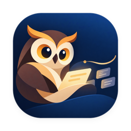

<p align="center">
  
</p>

<p align="center">
  <a href="https://github.com/Jwz-git/Daygo/releases"></a>
  
  
  <a href="LICENSE"></a>
  
</p>

<p align="center">
  <a href="https://github.com/Jwz-git/Daygo/releases"><b>下载</b></a> ·
  <a href="https://awayc.github.io/daygo-website/"><b>官网</b></a> ·
  <a href="docs/README.md">设计文档</a> ·
  <a href="README.en.md">English</a>
</p>

Daygo 是 [Dayflow](https://dayflow.so) 的跨平台版本，同时支持 macOS 与 Windows。

Daygo 在后台默默替你记录工作，用你自己的 AI 把零散的一天整理成清晰的时间线、每日回顾和每周总结。写代码、查资料、开会、沟通、思考——都不再随着窗口关闭而消失。

它本地优先、隐私优先：屏幕内容默认只留在这台电脑上，唯一的出网路径是你亲手配置的 AI 服务。后台记录用的是**离散截图**而不是连续录屏——这是刻意的产品决策，好处是系统那颗屏幕录制指示灯不会一直亮着。

## 为什么用 Daygo

复盘的时候，工具往往帮不上忙：

| | 它记下的 | 它漏掉的 |
|---|---|---|
| ⏱ 手动计时器 | 你记得按下开始的那段 | 一专注就忘了启停 |
| 📊 应用统计 | 「VS Code 三小时」 | 你在里面到底做了什么 |
| 📅 日历 | 计划 | 真正发生的事 |

Daygo 记录的是工作本身的上下文：你在构建什么、排查什么、和谁讨论、评审了什么。等到写站会、做复盘、回答「这周时间到底去哪了」的时候，答案已经替你整理好了。

## Daygo 能做什么

### 自动时间线


- 后台按间隔截取系统主显示器，AI 把活动整理成一张张卡片：时间、标题、摘要、分类一应俱全。
- 每张卡片都关联当时的原始画面，展开即可查看帧条。

### 每日回顾


- 按日历日聚合出当天的亮点、完成项和阻塞项，写站会直接拿来就用。

### 每周回顾


- 一周的跟踪时长、专注时长与各分类占比（合计不计入 System 分类），看清时间究竟花在了哪里。

### 完全的编辑控制权

- 分类错了能改，标题和摘要能调，不需要的卡片能删（软删除）。
- 某个时段整理得不理想，可以重新处理——重处理不会产生重复卡片。

### 接入你自己的 AI

- 支持 OpenAI Chat Completions、OpenAI Responses、Anthropic Messages 三种协议。
- 单个供应商可配多个模型，多个供应商可排成有序的回退链；也能指向兼容协议的本地模型，让分析全程不出网。
- 没有自有后端，不提供也不替你预设 provider——数据流向由你做主。

### 贴合你的工作方式


- 截图间隔（1 / 5 / 10 / 20 / 30 / 60 秒，默认 10 秒）、分辨率（720 / 1080，默认 1080）、屏蔽应用、磁盘占用上限都可调。
- 分类可增删改、可调顺序与配色；开机自启、Dock 图标显隐随你设定。
- 界面支持简体中文、繁体中文、英文、日文、韩文、德文、法文、西班牙文与巴西葡萄牙文，浅色 / 深色 / 跟随系统三态主题。

<sub>截图使用匿名示例数据。</sub>

## 它一直在

Daygo 是一个安静待在后台的常驻助手，而不是「关掉窗口就退出」的普通应用：

- 关掉窗口，记录照常进行；需要时从状态栏叫回窗口、快速暂停或查看状态。
- 暂停可以定时（15 / 30 / 60 分钟或无限期），到点自动恢复——开会、结对时临时关掉，事后不会忘记打开。
- 睡眠、锁屏、屏保期间自动停止捕获，事件结束后自动恢复；而你要是主动关掉了记录，系统事件不会擅自替你重开。

## 你的数据，你做主

Daygo 处理的是高度私密的屏幕信息，所以隐私是它的产品边界，而不是一个可有可无的开关：

| 🔒 本地优先 | ✨ 自带模型 | 🙈 屏蔽应用 | 🔑 密钥进钥匙串 |
|---|---|---|---|
| 没有服务器、账号与同步 | 接本地模型可全程不出网 | 敏感应用只留脱敏占位帧 | 前端只写不读 |

- 截图、时间线、日记和数据库默认只留在你的电脑上。没有服务器，没有账号，没有同步。
- 屏幕数据从不离开这台电脑，除非你亲手把它交给你明确配置的那个 AI provider；接本地模型，就能一步都不出网。
- 可按 bundle id 屏蔽指定应用。被屏蔽的应用在前台时，Daygo 写入一帧「脱敏占位帧」而不是直接跳过——时间线上仍看得到「这段时间有活动」，只是没有内容。屏蔽名单 + 占位帧，两层保护缺一不可。
- API Key 只存进系统凭据存储（macOS 钥匙串 / Windows Credential Manager），对前端**只写不读**；后端仅为调用 Provider 读取。密钥绝不进入前端 localStorage 或项目数据库，也绝不出现在任何错误信息里。
- 使用分析与崩溃上报的设置默认关闭，实际上报消费者尚未接入；隐私契约禁止上报屏幕内容、窗口标题、文件路径、API Key 或发给 AI 的请求内容。

完整的隐私与安全设计见 [docs/07-privacy-security.md](docs/07-privacy-security.md)。

## 下载

前往 [Releases 页面](https://github.com/Jwz-git/Daygo/releases) 下载适合你平台的最新安装包：

| 平台 | 系统与架构 | 安装包 |
|---|---|---|
| macOS | macOS 14+，Apple Silicon（arm64） | `Daygo-<版本>-arm64.dmg` |
| Windows | Windows 11 24H2（build 26100+），x64（amd64） | `Daygo-<版本>-amd64.exe` |

macOS 是当前主线平台；Windows 也提供安装包。其他架构与 Linux 暂无可下载版本。
安装包是否存在与功能 / 分发验收分别记录，当前范围见 [模块总表](docs/09-roadmap.md#91-模块总表)。
Windows 卸载保留用户数据与凭据；macOS 移除应用也不等于删除应用支持目录与钥匙串条目。

## 首次使用

1. 安装并启动 Daygo。
2. 在 macOS 上按系统提示授予「屏幕录制」权限，授权后可能需要重启一次 Daygo。
3. 到设置里添加你的 AI Provider、API Key 和模型，跑一次连接测试。
4. 设定截图间隔、屏蔽应用和磁盘上限，然后开始记录。
5. 第一批分析完成后，到时间线里看看结果，按需调整分类和摘要。

> [!NOTE]
> Daygo 不附带任何 AI 服务或 API 额度，你需要自备 provider 与额度。数据发送到第三方 provider 后如何被处理，取决于你选择的服务及其隐私政策。

## 与 Dayflow 的关系

<p>
   Daygo 是 <a href="https://dayflow.so">Dayflow</a>（<a href="https://github.com/JerryZLiu/Dayflow">源码</a>）的跨平台版本。
</p>


| | Dayflow | Daygo |
|---|---|---|
| 技术栈 | Swift · SwiftUI | Go · Wails · Vue 3 · SQLite |
| 平台 | macOS | macOS · Windows |
| 许可证 | MIT | MIT |

Daygo 沿用 Dayflow 的产品设计，基于 Go 与 Web 前端实现，让它同时运行在 macOS 与 Windows 上。部分界面图标与图表算法移植自 Dayflow（MIT，© 2025 Jerry Liu）。

## 参与开发

Daygo 用 Go、Wails、Vue 3 与 SQLite 构建：Go 持有业务逻辑与唯一的数据库写入权，系统能力通过平台端口隔离，前端只通过生成的 Wails 绑定访问 Go。

```bash
git clone https://github.com/Jwz-git/Daygo.git
cd Daygo
./scripts/gate.sh   # 一次跑完提交门禁（引导 + 构建 + 测试 + 前端）
```

更多设计规格、架构分层与贡献约束见 [docs/README.md](docs/README.md) 与 [AGENTS.md](AGENTS.md)。

遇到问题欢迎提 [Issue](https://github.com/Jwz-git/Daygo/issues)——请不要附带真实截图、API Key、数据库或其他敏感信息。你的创意会被重视。

## 许可证

本项目基于 [MIT License](LICENSE) 开源。
