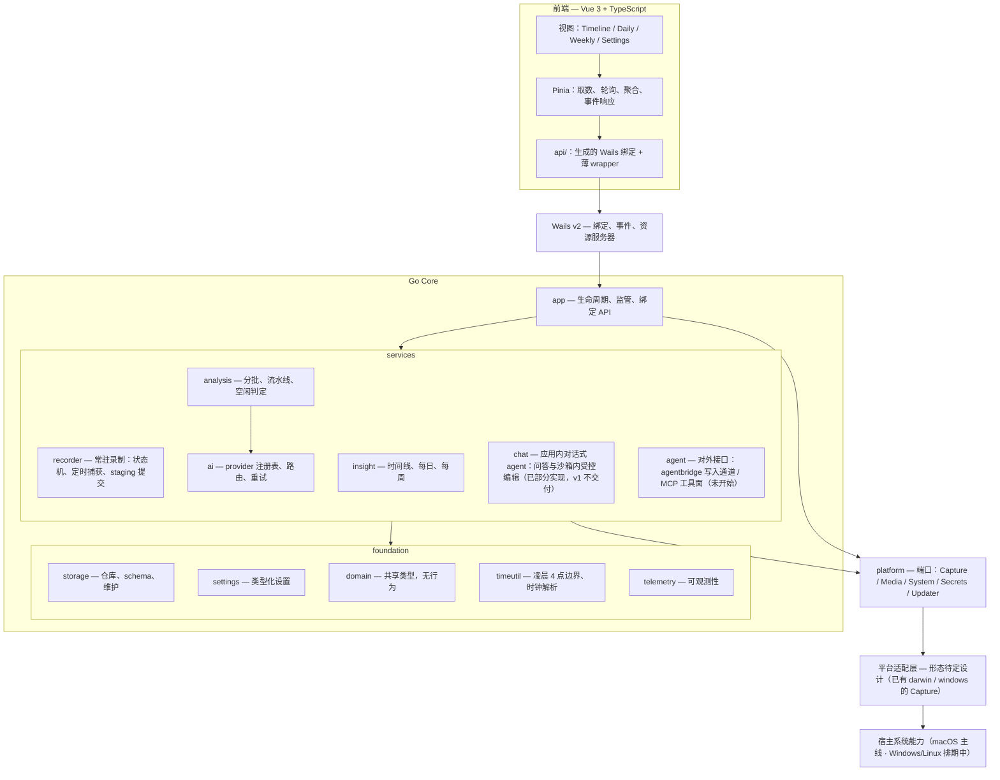

# 02 架构设计

> 本文定义模块边界、依赖方向和目录结构。**接口的字段级细节以
> [05 接口契约](05-interface-contract.md) 为准**；两者冲突时以 05 为规范并同步修正本文。

开发执行按 [功能模块](09-roadmap.md#91-模块总表) 组织；本页的模块图描述技术依赖。
功能模块各自交付必要的 service、storage、app 与 UI 切片，不为匹配执行册移动现有目录。
共享能力归属与独立验收见 [09 §9.3](09-roadmap.md#93-能力接入表)。

## 2.1 模块图



## 2.2 依赖规则

六条目标规则；CI 导入检查尚未落盘，由实现与评审遵守，后续纳入 08 的门禁：

1. **`foundation` 不依赖其上层。** `storage`、`settings`、`domain`、`timeutil`、`telemetry`
   只能相互导入以及导入标准库。
2. **`services` 依赖 `foundation` 和 `platform`，不依赖彼此的内部实现。** 跨服务需求
   通过**消费者侧声明的接口**满足。
3. **只有 `internal/app` 可以导入 Wails。** 服务层返回普通 Go 值，因此整个核心无需 GUI
   和 WebView 即可测试。
4. **只有 `internal/platform` 接触平台适配实现。** 任何服务都不构造 IPC 消息、不拼接
   socket 路径、不直接调用系统 API。服务需要像素时调用 `platform.Media`；适配层最终是
   进程内桥接、独立进程还是原生宿主，对它不可见。
   本条约束的是**系统级路径与 IPC**（socket、钥匙串、TCC 等）；在应用自有的录制目录内
   组织数据文件（如 recorder 生成 `staging/` 相对段路径并交给 Capture 端口的
   `OutputPath`）不在此列，因为路径根由 Go 侧配置下发，不接触系统位置。
5. **`internal/storage` 是 Go 侧唯一包含 SQL、唯一打开业务数据库连接的包。** 其它包看不到
   `*sql.DB`。
6. **前端只通过生成的绑定和薄 wrapper 访问 Go。** 不直接访问数据库、文件系统或适配层。

规则 3 的收益最大：它让 `CGO_ENABLED=0 go test ./internal/...` 能在 Linux CI 上无头运行，
[08 测试策略](08-testing-strategy.md)的整套夹具方案才成立。

## 2.3 各层职责

| 层 | 拥有什么 | 明确不拥有什么 |
|----|----------|----------------|
| `frontend/` | 呈现、交互、本地 UI 偏好 | 业务聚合、轮询策略、时间边界推算 |
| `internal/app` | 绑定方法、DTO、事件、生命周期编排、资源处理器 | 业务规则；它只做编排与形状转换 |
| `analysis` | 分批、流水线状态机、空闲判定、重处理 | provider 细节、SQL |
| `recorder` | 录制状态机、定时捕获、staging 提交与对账 | 分析、insight、SQL |
| `ai` | provider 抽象、路由、重试与回退装饰器、提示词 | 批次状态、负载准备（由流水线按 `InputKind` 准备） |
| `insight` | 由卡片派生的只读视图（时间线段、每日、每周） | 写入 |
| `storage` | schema、仓库、事务边界、维护任务 | 业务判断 |
| `settings` | 类型化设置读写、规范化与夹取 | 设置的**语义**（谁在什么时候能改，由 `app` 判断） |
| `timeutil` | 凌晨 4 点逻辑日、时钟串解析与格式化、周边界（已定：周一起始、4 点对齐，[decisions/weekly-boundary-monday](decisions/weekly-boundary-monday.md)） | 其它一切 |
| `platform` | 端口接口定义 | 任何实现细节 |

## 2.4 目录结构

★ 已落盘，☐ 目标状态。**不要把 ☐ 的路径描述成现状**，也不要为了匹配这张图去搬动已验证的
代码；目录调整应独立提交并保持可构建。树按包粒度组织；实现 / 验证状态以
[09 §9.1](09-roadmap.md#91-模块总表) 为准，不在此逐文件维护。

```text
Daygo/
├── cmd/
│   ├── daygo/                       ★ Wails 入口 + wails.json
│   └── daygo-cli/                   ☐ 只读 CLI（推迟到 v1.1）
│
├── internal/
│   ├── app/                         ★ 生命周期、绑定 API、事件、资源处理器；唯一知道 Wails 的层
│   │   ├── apperr/                  ★ 跨界错误类型与封闭码表
│   │   ├── …binding.go / ….go       ★ 按功能拆分的绑定与 DTO（settings / providers /
│   │   │                               timeline / daily / weekly / chat / media / recording / 诊断）
│   │   ├── events.go                ★ 事件名常量；emitter_wails.go 事件发布（接口化）
│   │   ├── backend.go               ★ 绑定对象与启动装配（含生命周期编排）
│   │   └── lifecycle.go             ☐ 优雅关闭等长驻宿主细节
│   │
│   ├── storage/                     ★ 唯一 SQLite 写入方与 schema owner
│   │   ├── open.go store.go pragma.go     连接、模式、可观测读写封装
│   │   ├── lock_unix.go lock_windows.go   实例锁（flock / LockFileEx）
│   │   ├── migrate.go               ★ 版本化迁移链（版本号见 03 §3.1）
│   │   ├── …go + …_test.go          ★ 各业务 repository：settings / cards / categories /
│   │   │                               batches / captures / aggregate / providers / chat /
│   │   │                               journal / goals / standup / llm_calls，及维护、
│   │   │                               备份恢复、诊断、清理
│   │   └── testdata/                ★ 匿名夹具与其生成器
│   │
│   ├── settings/                    ★ app_settings 之上的类型化访问与规范化
│   ├── ai/                          ★ provider 抽象、重试 / 回退、结构化输出、连接探针
│   │   ├── openai/ anthropic/       ★ 三协议客户端（Chat Completions / Responses / Messages）
│   │   ├── factory/                 ★ 按协议构造客户端
│   │   ├── prompts/                 ☐（提示词骨架当前在 consumers 侧）
│   │   └── jsonrepair/              ☐ 畸形 JSON 恢复（当前在 structured.go 内）
│   ├── platform/                    ★ 端口：只有接口与值类型
│   │   ├── ports.go types.go enums.go application.go
│   │   ├── fake/                    ★ Capture / System 的确定性实现，全平台可跑
│   │   ├── platformtest/            ★ fake 与真实适配层共用的契约套件
│   │   ├── secrets/                 ★ Secrets 端口实现：fake、macOS Keychain、Linux Secret Service
│   │   ├── mediafile/               ★ Media 实现：从录制目录读单帧 JPEG
│   │   ├── factory/                 ★ 按平台组装适配器
│   │   ├── darwin/                  ★ cgo → ScreenCaptureKit（+ System / 状态栏 ABI）
│   │   └── windows/                 ★ cgo → DXGI / WGC、应用身份、系统事件与通知区（有限真机 smoke）
│   ├── timeutil/                    ★ 凌晨 4 点逻辑日、时钟串派生、周边界（周一 4 点对齐）
│   ├── domain/                      ★ 共享类型（cards），无行为
│   ├── analysis/                    ★ 两阶段分析流水线：分批、提示词、schema、空闲判定、重处理
│   ├── insight/                     ★ 卡片派生的只读视图：weekly / weekly_detail / standup
│   ├── chat/                        ★ 应用内对话 agent：回合状态机、工具沙箱与预算（v1 不交付；契约见 05 §5.12）
│   ├── recorder/                    ★ 常驻录制：四状态机、定时捕获、staging 提交与对账
│   ├── media/                       ☐ 已解码帧的有界 LRU（字节，不是图像对象）
│   ├── agentbridge/                 ☐ 外部写入通道（agent 模块，推迟到 v1.1）
│   ├── mcp/                         ☐ MCP 工具面（agent 模块，推迟；传输与进程模型见 05 §5.9.3）
│   └── telemetry/                   ☐
│
├── native/                          ★ 原生实现，两平台共用一份 C ABI
│   ├── include/daygo_capture.h      ABI v1 的唯一事实来源
│   ├── darwin/Sources/ + build.sh   Swift + ScreenCaptureKit（+ 状态栏 / 应用枚举）
│   └── windows/Sources/ + build.ps1 C++ + DXGI / WGC，另有 smoke.cpp
│
├── scripts/                         ★ 构建与门禁脚本；含 Windows NSIS 模板与验收入口（清单见 scripts/README.md）
├── frontend/                        ★ Vue 3 + TypeScript（内部结构见 05 §5.5.5）
├── build/                           Wails 构建资源；bin/ 与 native/ 产物不入库
└── docs/                            本目录
```

三处值得单独说明。

`internal/platform/fake/` **不是事后补充**。正是它让分析流水线、AI 层和每个 insight
构建器能在没有 Mac、没有授权弹窗、没有真实帧的环境里测试。各功能模块随所用平台能力
交付 fake 和真实契约；无需先实现全部端口才能开发消费者。

`internal/<pkg>/testdata/` 保存匿名夹具，按 Go 的标准约定放在使用它的包旁边，
而不是仓库根目录的单一 `testdata/`。`internal/storage/testdata/` 是已落盘的样板：
夹具与其生成器一起入库，因为"由上一版本写出的数据库"无法用本版本的 DDL 重建。
参考数据库至少要覆盖三个变体：典型安装、含边界数据的安装（跨午夜卡片、DST 当天、
空闲整天、脱敏帧）、空数据库。

`native/` 下两个平台实现同一个 `dg_capture_once`，共用 `native/include/daygo_capture.h`。
**ABI 只有一份**：任何一侧新增字段都要同时满足头文件里的 `static_assert` 布局断言。

## 2.5 前端约定

- **组件不直接 import 生成绑定，也不订阅事件。** 取数与事件响应只发生在 store 或 `api/`；
  组件只消费 store。
- **DTO 类型的唯一来源是生成的 `models.ts`。** 不手写重复 `interface`——手抄一份等于制造
  两个会各自漂移的定义。视图模型可以另建类型，但必须由 DTO 类型派生。
- **生成产物不入库**（`frontend/wailsjs/` 已在 `.gitignore` 中），因此 CI 必须先生成绑定
  再跑 `vue-tsc`。
- **禁止 `any` 跨越 Wails 边界。** 需要逃逸时用显式 `unknown` + 解析函数。
- **写操作后不做乐观更新**（卡片、设置、分类），等对应事件后重新拉取。
- **所有用户可见文案经 `vue-i18n`**，`zh-CN` 默认且是 key 结构的类型来源，`en` 为回退。
- **localStorage 只能经 `storage/`**，用带版本信封的记录存放，key 表集中在
  `storage/keys.ts`，分组与 `SettingsDTO` 对齐。**密钥不得进入该层。**

### 2.5.1 i18n 规格

- 库与模式：`vue-i18n`，Composition 模式（`legacy: false` + `globalInjection: true`）。
- 语言包：`src/locales/<locale>/<domain>.ts`，域划分 `common / nav / timeline / daily /
  weekly / chat / settings / native / errors`，与 `views/` 一一对应（`native` 是例外：
  它装的是原生表面文案，见 [05 §5.5.1](05-interface-contract.md#551-绑定方法目录)）。
  key 命名 `<domain>.<区块>.<语义>`，
  camelCase，禁止用英文原文当 key。
  已发布语言包：`zh-CN`（默认）、`zh-Hant`、`en`（回退）、`ja`、`ko`、`de`、`fr`、`es`、`pt-BR`。
- 类型：语言包映射为 `Record<AppLocale, LocaleSchema>`，某个语言包缺 key 时 `vue-tsc`
  直接失败，而不是运行时静默回退。
- 加载：**只有默认语言 `zh-CN` 进初始 chunk**，其余语言包各自是惰性 chunk，切到该语言时才拉取。
  加载器映射类型为 `Record<AppLocale, () => Promise<{ default: LocaleSchema }>>`，因此"新增语言
  却忘了写加载器"和"语言包结构相对 zh-CN 漂移"仍然是编译错误。切语言是异步的，
  `setLocale` 必须先完成加载再改 `<html>` 标记；`bootstrap()` 因此在首次挂载前 await 它。
  加载失败时保持当前语言不变——默认语言始终在内存里，总有一个可回退的完整消息表，
  不会把一个空表交给渲染层。
- 语言解析：已保存设置 → 跟随系统（`navigator.languages`）→ `zh-CN`。BCP 47 先经规范化：
  `zh` / `zh-Hans*` / `zh-CN` / `zh-SG` → `zh-CN`；`zh-Hant*` / `zh-TW` / `zh-HK` / `zh-MO`
  → `zh-Hant`（**书写系统优先于地区**：`zh-Hant-CN` 按繁体处理）；`en*` → `en`；`ja*` → `ja`；
  `ko*` → `ko`；`de*` → `de`；`fr*` → `fr`；`es*` → `es`；`pt*` → `pt-BR`；其余 → 未识别，
  由调用方回退到默认语言。空串是"跟随系统"的哨兵值，且只有空串是——未识别与"跟随系统"必须可区分。
  葡语是唯一按地区取标签的语言：巴西与欧洲葡语在普通 UI 用词上就分叉（`tela` / `ecrã`、
  `salvar` / `guardar`），而德/法/西的地区变体没有这一层差异，因此折叠到单一语言包。
  这张折叠表在 Go 侧有一份镜像（`settings.normalizeLanguage`），两侧必须逐项一致：界面渲染的是
  折叠结果，而设置的权威存储是 Go 那一份，不一致就会出现"界面显示一种语言、设置里存的是另一种"。
- `<html>` 标记：切语言时同步更新 `lang` 与 `data-dg-lang-script`（`hans` / `hant` / `jpan` /
  `kore` / `latn`），后者驱动字体分栈与展示字距。
- 日期：逻辑日 `day` 与日历日 `standupDay` 只能来自后端；卡片时钟串 `start`/`end` 原样
  渲染，不解析不重排（[05 §5.3.2](05-interface-contract.md#532-时间与日期)）。

### 2.5.2 主题

三态偏好（`system` / `light` / `dark`）在写入 DOM 前**解析为两态**，写作
`<html data-dg-appearance="light|dark">`。这样样式表只需要一个属性选择器块，不需要
`prefers-color-scheme` 的重复定义，并且"系统是深色但用户显式选了浅色"能被正确尊重。
`color-scheme` 在 CSS 里声明而不是从 JS 写入。

## 2.6 生命周期

### 2.6.1 启动顺序

1. 打开数据库，执行迁移，失败则进入"数据库不可用"错误态（UI 可见，不静默退出）。
2. 装配 foundation → services → platform 端口。
3. 启动 Wails 宿主，注册绑定与资源处理器。
4. 恢复上次的录制意愿：若用户上次是开启状态且授权仍在，则启动捕获。
5. 启动分析调度器与维护任务。

启动顺序的硬约束：**在第 1 步成功前不得启动捕获**，否则会产生无处落库的帧。

第 1、2、3 步已落盘（`app.Run` 先 `storage.Open`，同时申请写入锁与捕获
所有者锁，再启动由同一个 `ctx` 拥有的维护 goroutine，最后才创建窗口）；
第 4 步由 `maybeAutoStartRecording` 按设置恢复录制意愿；第 5 步的分析调度随
timeline 批次驱动，维护任务已在第 3 步前启动。
**打开失败不是致命错误**——第二个实例拿不到写入锁是预期状态，损坏的库也应该让用户看到
界面而不是一个静默退出的进程，因此失败原因被记下并经 `GetDiagnostics` 暴露。

### 2.6.2 关闭

关闭窗口、Cmd+Q / Dock「退出」、状态栏「退出」、更新重启、系统关机是**五个不同事件**，
必须分别建模。**只有状态栏「退出」真正终止进程**；Cmd+Q 与 Dock 的「退出」被降级为
「软退出」——留在后台继续录制，只是把窗口藏起来、并摘掉 Dock 图标让它看起来已退出。
决策与 Wails 承载机制见 [生命周期退出模型](decisions/lifecycle-quit-model.md)。

| 事件 | 窗口 | Dock 图标 | 捕获 | 进程 |
|------|------|-----------|------|------|
| 关闭窗口 | 隐藏 | 保留 | **继续** | 存活 |
| Cmd+Q / Dock「退出」 | 隐藏 | 摘除（accessory） | **继续** | 存活 |
| 状态栏「退出」 | 关闭 | — | 收尾当前分段后停止 | 退出 |
| 更新重启 | 关闭 | — | 收尾当前分段后停止 | 退出并由更新器拉起 |
| 系统关机 | — | — | 尽力收尾 | 被系统终止 |

**不要假定退出 UI 等于用户要求停止录制。** 关闭窗口与 Cmd+Q/Dock 退出都只是把界面藏起来，
录制在后台继续，状态栏项始终是重新打开窗口与真正退出的入口。

### 2.6.3 后台 Agent 语义

关闭最后一个窗口后进程必须存活，状态栏项保留重新打开窗口的入口。Cmd+Q 或 Dock「退出」
触发软退出时，激活策略切换为 accessory（不占活动中的 Dock）；状态栏“打开 Daygo”或用户再次
点击保留在 Dock 的 Daygo 图标时恢复窗口并切回 regular。macOS 的应用激活通知只作为意图事件
经 `platform.System` 上送，窗口操作仍由 `internal/app` 调用 Wails runtime 完成。
**激活通知是泛化信号**（Dock、Cmd+Tab、调度中心、以及 `runtime.Show` 自身的
`activateIgnoringOtherApps` 都会触发），因此只有软退出留下的后台状态才需要恢复窗口；应用已在前台
时系统已经带回了窗口，再主动重开会在激活过渡中把窗口挤掉。判据与承载细节见
[生命周期退出模型](decisions/lifecycle-quit-model.md)。
**Wails 是否能承载这套语义是 G-host 硬门禁**，验证失败时停止大规模 UI 扩张
并重新评估宿主（[风险 C-1](10-risks.md#c-1宿主无法承载后台-agent)）；该门禁
**已于 2026-09-22 经用户实测验收（无逐项运行记录），大规模 UI 扩张解锁**。

### 2.6.4 适配层监管

平台适配层若以独立进程形态实现（待定设计），则需要监管：健康检查、退避重启；Go 在重启后
重新下发每次调用参数，并以 pending 记录对账已发布文件。无论何种形态，**崩溃、断连或宿主
重启都必须可恢复**。
