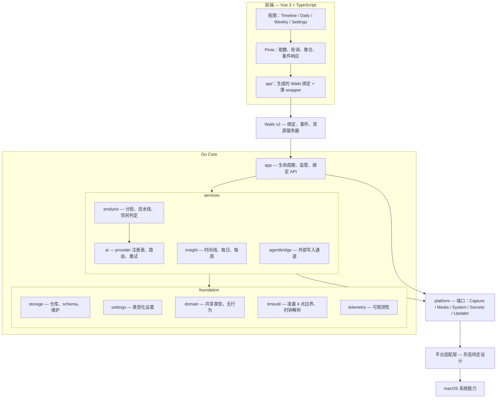

# 02 架构设计

> 本文定义模块边界、依赖方向和目录结构。**接口的字段级细节以
> [05 接口契约](05-interface-contract.md) 为准**；两者冲突时以 05 为规范并同步修正本文。

开发执行按 [功能模块](09-roadmap.md#91-模块总表) 组织；本页的模块图描述技术依赖。
功能模块各自交付必要的 service、storage、app 与 UI 切片，不为匹配执行册移动现有目录。
共享能力归属与独立验收见 [09 §9.3](09-roadmap.md#93-能力接入表)。

## 2.1 模块图



## 2.2 依赖规则

六条目标规则；CI 导入检查尚未落盘，由实现与评审遵守，后续纳入 08 的门禁：

1. **`foundation` 不依赖其上层。** `storage`、`settings`、`domain`、`timeutil`、`telemetry`
   只能相互导入以及导入标准库。
2. **`services` 依赖 `foundation` 和 `platform`，不依赖彼此的内部实现。** 跨服务需求
   通过**消费者侧声明的接口**满足。
3. **只有 `internal/app` 可以导入 Wails。** 服务层返回普通 Go 值，因此整个核心无需 GUI
   和 WebView 即可测试。
4. **只有 `internal/platform` 接触平台适配实现。** 任何服务都不构造 IPC 消息、不拼接
   socket 路径、不直接调用系统 API。服务需要像素时调用 `platform.Media`；适配层最终是
   进程内桥接、独立进程还是原生宿主，对它不可见。
5. **`internal/storage` 是 Go 侧唯一包含 SQL、唯一打开业务数据库连接的包。** 其它包看不到
   `*sql.DB`。
6. **前端只通过生成的绑定和薄 wrapper 访问 Go。** 不直接访问数据库、文件系统或适配层。

规则 3 的收益最大：它让 `CGO_ENABLED=0 go test ./internal/...` 能在 Linux CI 上无头运行，
[08 测试策略](08-testing-strategy.md)的整套夹具方案才成立。

## 2.3 各层职责

| 层 | 拥有什么 | 明确不拥有什么 |
|----|----------|----------------|
| `frontend/` | 呈现、交互、本地 UI 偏好 | 业务聚合、轮询策略、时间边界推算 |
| `internal/app` | 绑定方法、DTO、事件、生命周期编排、资源处理器 | 业务规则；它只做编排与形状转换 |
| `analysis` | 分批、流水线状态机、空闲判定、重处理 | provider 细节、SQL |
| `ai` | provider 抽象、路由、重试与回退装饰器、提示词 | 批次状态、负载准备（由流水线按 `InputKind` 准备） |
| `insight` | 由卡片派生的只读视图（时间线段、每日、每周） | 写入 |
| `storage` | schema、仓库、事务边界、维护任务 | 业务判断 |
| `settings` | 类型化设置读写、规范化与夹取 | 设置的**语义**（谁在什么时候能改，由 `app` 判断） |
| `timeutil` | 凌晨 4 点逻辑日、时钟串解析与格式化、周边界 | 其它一切 |
| `platform` | 端口接口定义 | 任何实现细节 |

## 2.4 目录结构

```text
Daygo/
├── cmd/
│   ├── daygo/                   Wails 入口 + wails.json
│   └── daygo-cli/               只读 CLI（推迟到 v1.1）
│
├── internal/
│   ├── app/                     生命周期、监管、绑定 API
│   │   ├── app.go               构造与装配
│   │   ├── lifecycle.go         启动顺序、优雅关闭
│   │   ├── api_timeline.go      绑定方法：时间线
│   │   ├── api_settings.go      绑定方法：设置与 provider
│   │   ├── api_insight.go       绑定方法：每日、每周、日记
│   │   ├── assets.go            帧与 timelapse 的 HTTP 资源处理器
│   │   ├── apperr/              跨界错误类型与码表
│   │   ├── events.go            事件名与负载
│   │   └── state.go             录制开关、暂停状态
│   │
│   ├── domain/                  共享类型，无行为
│   ├── storage/                 唯一 SQLite 写入方
│   │   ├── db.go                连接池、PRAGMA、打开与恢复
│   │   ├── migrate.go           版本化迁移链
│   │   ├── timeline.go          卡片，含 ReplaceCardsInRange
│   │   ├── screenshots.go
│   │   ├── batches.go
│   │   ├── observations.go
│   │   ├── journal.go / goals.go / standup.go / llmcalls.go
│   │   ├── maintenance.go       checkpoint、备份、清理
│   │   └── observe.go           慢查询与争用埋点
│   │
│   ├── settings/                app_settings 之上的类型化访问
│   ├── analysis/                scheduler / batcher / pipeline / idle / reprocess
│   ├── ai/                      provider / registry / routing / retry / fallback
│   │   ├── openai/              OpenAI 兼容协议
│   │   ├── anthropic/           Anthropic 协议
│   │   ├── prompts/
│   │   └── jsonrepair/          畸形 JSON 恢复
│   ├── insight/                 timeline / daily / weekly
│   ├── media/                   已解码帧的 LRU 缓存（字节，不是图像对象）
│   ├── platform/                端口，只有接口
│   │   ├── capture.go / media.go / system.go / secrets.go / updater.go
│   │   ├── darwin/              平台适配层实现（待定设计）
│   │   └── fake/                内存实现，供测试与 CI
│   ├── agentbridge/             外部写入通道（推迟）
│   ├── telemetry/
│   └── timeutil/
│       ├── dayboundary.go       凌晨 4 点逻辑日
│       ├── clock.go             时钟串解析与格式化
│       └── week.go
│
├── frontend/
│   └── src/
│       ├── views/               每个路由一个目录
│       ├── layout/              AppShell、SideRail
│       ├── components/
│       ├── router/              vue-router（hash 模式）
│       ├── i18n/                vue-i18n 实例、locale 解析与规范化
│       ├── locales/             <locale>/<domain>.ts
│       ├── theme/               主题解析与 <html data-dg-appearance> 写入
│       ├── storage/             本地偏好适配层，全应用唯一的 localStorage 调用方
│       ├── stores/              Pinia
│       ├── api/                 生成绑定 + 薄 wrapper
│       ├── styles/              设计令牌（CSS 自定义属性）
│       └── assets/
│
├── build/                       Wails 构建资源与产物
├── testdata/                    夹具与参考数据库
└── docs/                        本目录
```

两个目录值得单独说明。

`internal/platform/fake/` **不是事后补充**。正是它让分析流水线、AI 层和每个 insight
构建器能在没有 Mac、没有授权弹窗、没有真实帧的环境里测试。各功能模块随所用平台能力
交付 fake 和真实契约；无需先实现全部端口才能开发消费者。

`testdata/` 保存参考数据库，让"schema 变更后旧数据还能读吗"成为回归测试而非人工检查。
至少三个变体：典型安装、含边界数据的安装（跨午夜卡片、DST 当天、空闲整天）、空数据库。

## 2.5 前端约定

- **组件不直接 import 生成绑定，也不订阅事件。** 取数与事件响应只发生在 store 或 `api/`；
  组件只消费 store。
- **DTO 类型的唯一来源是生成的 `models.ts`。** 不手写重复 `interface`——手抄一份等于制造
  两个会各自漂移的定义。视图模型可以另建类型，但必须由 DTO 类型派生。
- **生成产物不入库**（`frontend/wailsjs/` 已在 `.gitignore` 中），因此 CI 必须先生成绑定
  再跑 `vue-tsc`。
- **禁止 `any` 跨越 Wails 边界。** 需要逃逸时用显式 `unknown` + 解析函数。
- **写操作后不做乐观更新**（卡片、设置、分类），等对应事件后重新拉取。
- **所有用户可见文案经 `vue-i18n`**，`zh-CN` 默认且是 key 结构的类型来源，`en` 为回退。
- **localStorage 只能经 `storage/`**，用带版本信封的记录存放，key 表集中在
  `storage/keys.ts`，分组与 `SettingsDTO` 对齐。**密钥不得进入该层。**

### 2.5.1 i18n 规格

- 库与模式：`vue-i18n`，Composition 模式（`legacy: false` + `globalInjection: true`）。
- 语言包：`src/locales/<locale>/<domain>.ts`，域划分 `common / nav / timeline / daily /
  weekly / settings / errors`，与 `views/` 一一对应。key 命名 `<domain>.<区块>.<语义>`，
  camelCase，禁止用英文原文当 key。
- 类型：语言包映射为 `Record<AppLocale, LocaleSchema>`，某个语言包缺 key 时 `vue-tsc`
  直接失败，而不是运行时静默回退。
- 语言解析：已保存设置 → 跟随系统（`navigator.languages`）→ `zh-CN`。BCP 47 先经规范化
  （`zh` / `zh-Hans*` → `zh-CN`，`en*` → `en`）。空串是"跟随系统"的哨兵值。
- `<html>` 标记：切语言时同步更新 `lang` 与 `data-dg-lang-script`，后者驱动展示字体切换。
- 日期：逻辑日 `day` 与日历日 `standupDay` 只能来自后端；卡片时钟串 `start`/`end` 原样
  渲染，不解析不重排（[05 §5.3.2](05-interface-contract.md#532-时间与日期)）。

### 2.5.2 主题

三态偏好（`system` / `light` / `dark`）在写入 DOM 前**解析为两态**，写作
`<html data-dg-appearance="light|dark">`。这样样式表只需要一个属性选择器块，不需要
`prefers-color-scheme` 的重复定义，并且"系统是深色但用户显式选了浅色"能被正确尊重。
`color-scheme` 在 CSS 里声明而不是从 JS 写入。

## 2.6 生命周期

### 2.6.1 启动顺序

1. 打开数据库，执行迁移，失败则进入"数据库不可用"错误态（UI 可见，不静默退出）。
2. 装配 foundation → services → platform 端口。
3. 启动 Wails 宿主，注册绑定与资源处理器。
4. 恢复上次的录制意愿：若用户上次是开启状态且授权仍在，则启动捕获。
5. 启动分析调度器与维护任务。

启动顺序的硬约束：**在第 1 步成功前不得启动捕获**，否则会产生无处落库的帧。

### 2.6.2 关闭

Cmd+Q、窗口关闭、更新重启、系统关机是**四个不同事件**，必须分别建模：

| 事件 | 窗口 | 捕获 | 进程 |
|------|------|------|------|
| 关闭窗口 | 隐藏 | **继续** | 存活 |
| 状态栏"退出" | 关闭 | 收尾当前分段后停止 | 退出 |
| Cmd+Q | 关闭 | 收尾当前分段后停止 | 退出 |
| 更新重启 | 关闭 | 收尾当前分段后停止 | 退出并由更新器拉起 |
| 系统关机 | — | 尽力收尾 | 被系统终止 |

**不要假定退出 UI 等于用户要求停止录制。** 关闭窗口只隐藏窗口。

### 2.6.3 后台 Agent 语义

关闭最后一个窗口后进程必须存活，激活策略切换为 accessory（不占 Dock），状态栏项保留
重新打开窗口的入口。**Wails 是否能承载这套语义是 G-host 硬门禁**，验证失败时停止大规模 UI 扩张
并重新评估宿主（[风险 C-1](10-risks.md#c-1宿主无法承载后台-agent)）。

### 2.6.4 适配层监管

平台适配层若以独立进程形态实现（待定设计），则需要监管：健康检查、退避重启；Go 在重启后
重新下发每次调用参数，并以 pending 记录对账已发布文件。无论何种形态，**崩溃、断连或宿主
重启都必须可恢复**。
