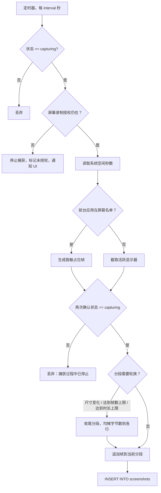
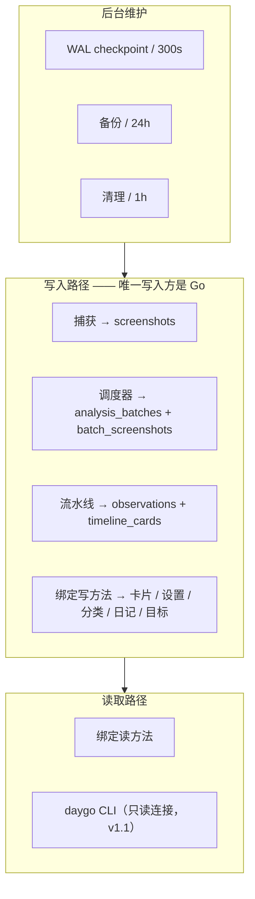
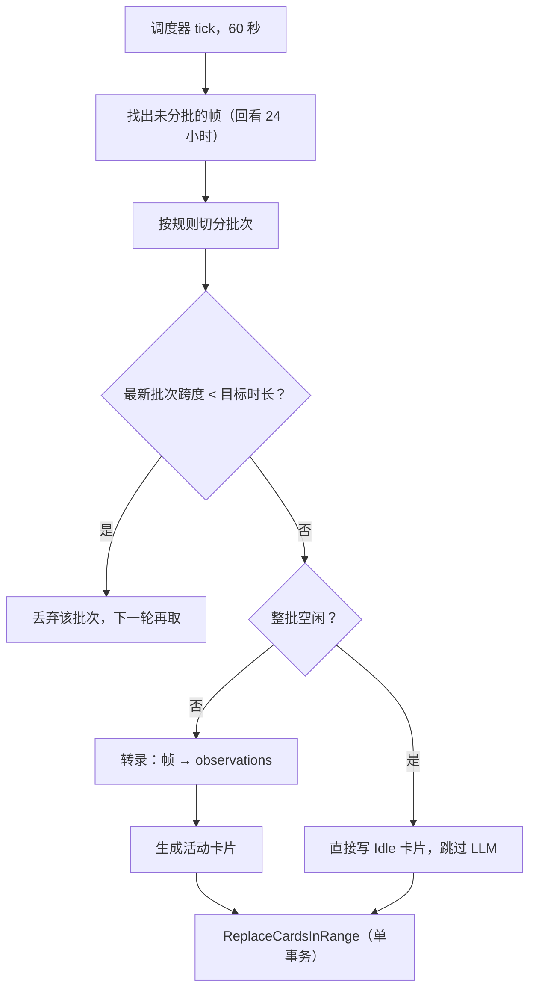
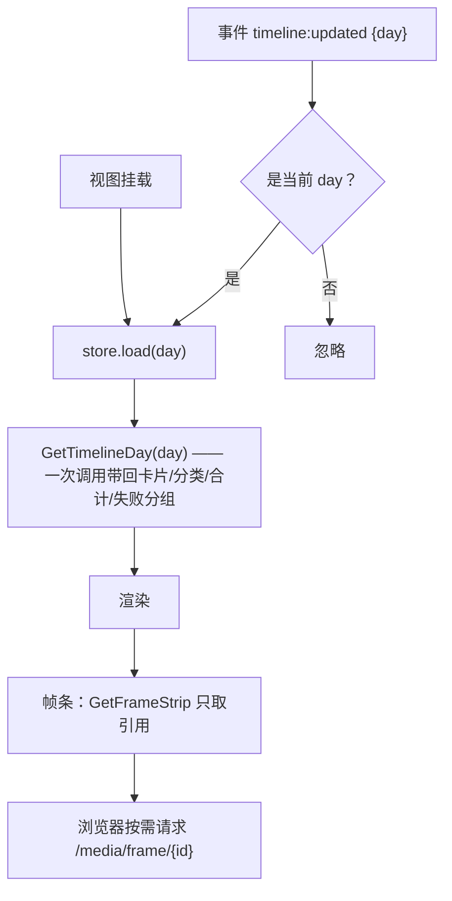

# 04 数据流

> 本文追踪四条流水线，并锁定行为测试必须固定的常量与启发式规则。所有涉及系统 API 的
> 步骤标注 **待定设计**——本文只定义*该步骤必须做到什么*，不定义用什么实现。

流水线的执行归属：recording 交付捕获与分段交接；data 交付连接 / 写入封装和维护；
timeline 交付分析与卡片；呈现由各功能的 app / store / UI 切片完成。
以下 SQL 表述代表 storage 内的操作，不授权服务或适配层直接写库。
各段按 [能力接入表](09-roadmap.md#93-能力接入表) 独立验证后集成，不等待完整模块。

## 4.1 捕获流水线



### 4.1.1 参数

| 设置 | 默认 | 取值 |
|------|------|------|
| 捕获间隔 | 10 秒 | 1 / 5 / 10 / 20 / 30 / 60 秒 |
| 捕获高度 | 1080 px | 720 / 1080 |
| 分段轮换 | — | 尺寸变化，或 600 帧，或 600 秒墙上时间 |

宽高按高度等比缩放，宽度向上取整为偶数。

### 4.1.2 只截活跃显示器

**每次只捕获一个显示器**——光标所在的那块。显示器选择需要滞后处理，否则光标擦过边缘
就会来回切换：

- 以低频（约 0.1 Hz）采样光标位置，避免高频唤醒带来的电量开销；
- 应用边缘内缩滞后（约 10 pt）；
- 要求状态稳定一小段时间（约 400 ms）后才切换。

显示器选择优先级：显式请求的显示器 → 跟踪到的活跃显示器 → 第一个可用显示器。
**首选显示器不在当前可用列表时，推迟切换而不是强制执行**——继续捕获当前显示器并重试。
这对合盖、外接显示器唤醒的竞态很重要。

系统 API：**待定设计**。

### 4.1.3 授权

在三处检查：配置捕获前、每次截屏前、任何失败之后。

授权丢失不是可忽略的失败：停止定时器、清理缓存内容、把运行时录制状态置为 false，
但**不覆盖用户保存的"希望录制"偏好**——否则用户重新授权后会发现开关莫名其妙关了。

### 4.1.4 空闲采样

在**捕获时刻**读取系统空闲秒数（距上次硬件输入的秒数），写入
`screenshots.idle_seconds_at_capture`。信号必须反映硬件输入而非合成事件。
不可用时写 NULL——`NULL` 与 `0` 语义完全不同，不得用 `0` 代替。

这与"UI 层的无操作提示"是两套无关机制，不要混用同一份数据。

系统 API：**待定设计**。

### 4.1.5 睡眠 / 唤醒 / 锁屏

四状态状态机：

```text
idle ──启动──> starting ──就绪──> capturing
  ▲                                  │
  │                          系统事件 │
  └──用户关闭────── paused <─────────┘
                      │
                 事件结束后自动恢复
```

`paused` 表示"因系统事件停止，将自动恢复"；`idle` 表示"用户关闭了它"。
**只有 `idle` 和 `paused` 能转入 `starting`，且系统事件不得把 `idle` 变成 `capturing`。**

| 事件 | 动作 | 恢复延迟 |
|------|------|---------:|
| 系统将睡眠 | → `paused`，停止 | — |
| 系统已唤醒 | 若为 `paused` 则恢复 | 5 秒 |
| 屏幕已锁定 | → `paused`，停止 | — |
| 屏幕已解锁 | 若为 `paused` 则恢复 | 0.5 秒 |
| 屏保开始 | → `paused`，停止 | — |
| 屏保结束 | 若为 `paused` 则恢复 | 0.5 秒 |
| 显示器配置变化 | 刷新显示器选择 | — |
| 进程将退出 | 收尾当前分段 | — |

每次停止都要收尾当前分段，**分段绝不跨越睡眠保持打开**。唤醒后延迟 5 秒是因为刚唤醒时
系统返回的显示器列表可能是过期的。

事件来源 API：**待定设计**。

### 4.1.6 崩溃恢复

启动时执行一次对账，三种故障模式（详见 [03 §3.4](03-data-model.md#34-帧与分段)）：

- 行在、文件缺失 → 软删除这些行；
- 文件在、不可读（写入中途崩溃）→ 删文件并软删除这些行；
- 文件可读、`file_size` 为 NULL（收尾与写尺寸之间崩溃）→ 回填尺寸。

## 4.2 存储流水线



三条不变量：

1. **恰好一个进程持有写入权。** 通过 `<appsupport>/Daygo/` 下的锁文件表达。第二个实例
   启动时检测到锁被占用，进入只读查看器模式而不是并发写。
2. **恰好一个进程持有捕获所有者锁。** 与写入锁分开，因为未来可能出现"UI 进程只读、
   后台进程捕获"的形态。
3. **所有 SQL 都在 `internal/storage`。** 慢查询与争用埋点在读写封装里，不出现在
   repository 接口签名上。

## 4.3 分析流水线



### 4.3.1 分批规则

| 规则 | 值 |
|------|---:|
| 目标批次时长 | 15 分钟 |
| 拆分前最大间隔 | 2 分钟 |
| 卡片生成回看范围 | 45 分钟 |
| 未分批帧回看范围 | 24 小时 |
| 最小分析时长 | 5 分钟 |

两条容易漏掉但至关重要的行为：

- **最新批次跨度小于目标时长时丢弃该批次。** 否则会对仍在填充的时段生成重复且不完整的卡片。
- **批次跨度按首帧到末帧的时间戳计算，不按帧数计算。** 10 秒间隔的 90 帧跨度是 890 秒
  而不是 900 秒，因此即便一个*完整的* 15 分钟批次，`跨度 < 目标时长` 仍成立，丢弃规则
  仍会触发；下一轮帧把跨度撑过阈值后才会真正处理。**这个差一个间隔的算术必须精确保留**，
  否则批次会重复处理或永久停滞。

### 4.3.2 并发

- 转录可并行，设**显式的 worker 上限**。
- **卡片的 读取 → 生成 → 改写 序列必须按重叠时间范围串行化**，否则两个批次会交错改写
  同一区间。用互斥区保护，不用全局布尔标志。
- `context` 取消必须能中止在途 provider 调用；被取消的批次保持 `processing`，下次启动
  重新拾取。

### 4.3.3 重试与回退

统一策略，不是每个 provider 各写一套：

```text
WithFallback( WithRetry(primary), WithRetry(secondary) )
```

顺序不能反：**先在主 provider 上按策略重试，仍失败才切到备用**。写反会把一次网络抖动
升级成 provider 切换。回退具有**粘性**——同一批次切换到备用后不再回切。

每次尝试都产出一条 `llm_calls` 记录（尝试序号、provider、模型、耗时、截断后的正文）。
这不是可选项：它是解析器黄金测试的输入来源。

失败分类映射到面向用户的类别，写入 `analysis_batches.failure_kind`，并通过
`batch:failed` 事件推给 UI。

### 4.3.4 提示词与输出解析

- 提示词按协议分组，允许用户覆盖，默认值随代码发布。
- **输出解析必须防御性实现。** 模型会输出畸形 JSON、正文前言和围栏代码块。
  `internal/ai/jsonrepair` 负责恢复，并且**每一种见过的畸形形态都要有夹具测试**。
- 分类必须是现有分类**名称**之一；模型给出未知分类时归入 `System` 并计入诊断，
  **不自动创建分类**。

## 4.4 空闲判定

纯函数，输入是一批帧的 `(captured_at, idle_seconds_at_capture)`，输出是"这批是否整体空闲"。

| 规则 | 值 |
|------|---:|
| 参与判定的最小批次时长 | 12 分钟 |
| 要求的空闲时间覆盖率 | 0.95 |
| 要求的合格空闲帧占比 | 0.90 |
| 要求的空闲样本可用率 | 0.90 |
| 单帧算"空闲"所需的空闲秒数 | 60 |
| 允许的最大未覆盖间隙 | 30 秒 |
| 与相邻空闲卡片合并的最大间隔 | 5 分钟 |

算法：把每帧的空闲秒数转成覆盖区间 `[capturedAt - idleSeconds, capturedAt]`，裁剪到批次
范围内，合并重叠区间，取反得到间隙，再套用上述比例。

命中时**直接写 `Idle` 卡片并完全跳过 LLM**。这是主要的成本节约点，不能退化成"也送一次
LLM 确认一下"。

## 4.5 呈现流水线



三条规则：

1. **每屏一次调用。** 一次跨界就是一次 JSON 往返；`GetTimelineDay` 一次带回卡片、合计、
   分类和失败分组，而不是让前端拼四次调用。
2. **事件不是数据源。** 任何界面都必须能只靠 `Get*` 完成首屏渲染；断开事件后功能降级为
   "不自动刷新"，而不是"报错"或"空白"。
3. **像素不走 JSON。** 帧和 timelapse 通过 HTTP 资源处理器提供，URL 只能由 Go 生成
   （[05 §5.5.4](05-interface-contract.md#554-资源契约)）。
