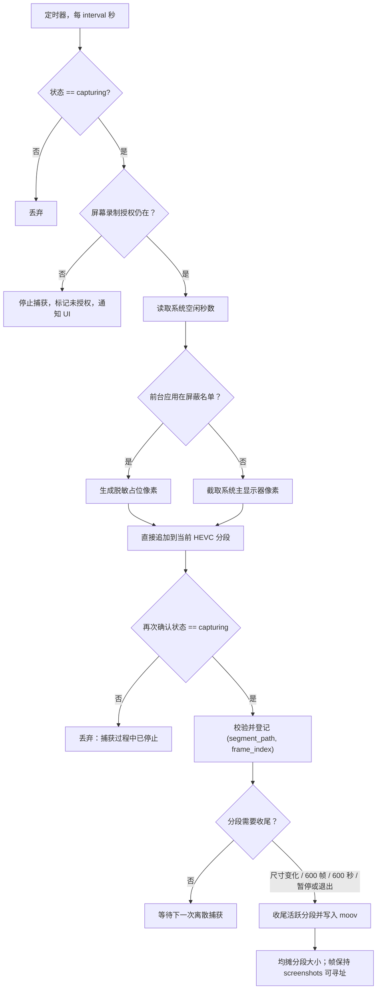
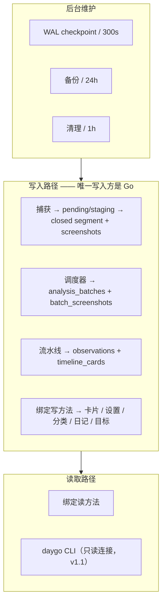
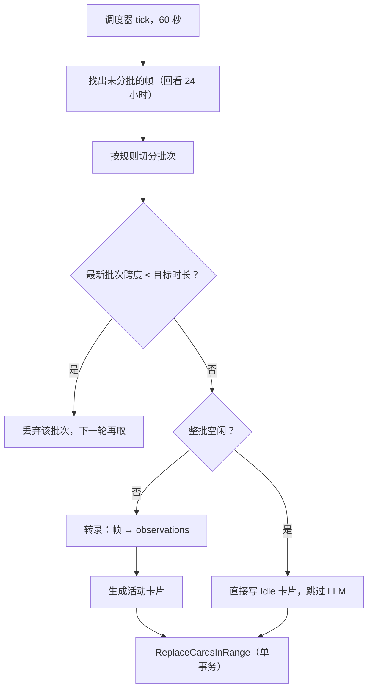

# 04 数据流

> 本文追踪四条流水线，并锁定行为测试必须固定的常量与启发式规则。所有涉及系统 API 的
> 步骤标注 **待定设计**——本文只定义*该步骤必须做到什么*，不定义用什么实现。

流水线的执行归属：recording 交付捕获与分段交接；data 交付连接 / 写入封装和维护；
timeline 交付分析与卡片；呈现由各功能的 app / store / UI 切片完成。
以下 SQL 表述代表 storage 内的操作，不授权服务或适配层直接写库。
各段按 [能力接入表](09-roadmap.md#93-能力接入表) 独立验证后集成，不等待完整模块。

## 4.1 捕获流水线



**这张图的 macOS 有限实现已落地。** 定时器、四状态机（`idle` / `starting` / `capturing` / `paused`）、
pending 对账、`screenshots` 提交、HEVC 直接追加、分段收尾、Media 解码与整段清理已经接线。
容器与参数由 [HEVC 分段决策](decisions/recording-frame-segments-hevc.md) 冻结；旧 JPEG 行只作为
兼容读路径保留。崩溃时未收尾段可能不可读，对账会放弃相应 pending，而不会把残段伪装成成功。
结构化提交、恢复和清理边界见[图片存储决策](decisions/recording-image-storage.md)；
任何数据库事务都不得跨越捕获、编码或文件删除等慢 I/O。

### 4.1.1 参数

| 设置 | 默认 | 取值 |
|------|------|------|
| 捕获间隔 | 10 秒 | 1 / 5 / 10 / 20 / 30 / 60 秒 |
| 捕获高度 | 1080 px | 720 / 1080 |
| 分段轮换 | — | 尺寸变化，或 600 帧，或 600 秒墙上时间 |

宽高按高度等比缩放，宽度向上取整为偶数。

### 4.1.2 只截一块显示器：系统主显示器

**每次只捕获一个显示器**，v1 取调用时的系统主显示器（macOS 为 `CGMainDisplayID()`，
Windows 为 `MONITORINFOF_PRIMARY`）。调用方不传显示器 ID，适配层也不跨调用缓存：
用户在系统设置里换了主显示器，下一次捕获自然跟随。

Windows 的非空屏蔽名单是同一调用契约内的能力分支，不是另一条数据流：build 26100+ 由 WGC
排除目标窗口并等待配置 iteration，旧 build 返回 `privacy_unsupported` 且不产生文件。空名单仍以
DXGI 为主路径。无论哪条原生路径，Go 侧都只接收一个 `CaptureResult`，pending/提交/分析流程不分叉。

这样做的理由是**保持截图原语无状态**。跟随光标需要显示器枚举、边缘滞后和跨调用的“当前
显示器”，而那正是 [单次调用契约](decisions/recording-screen-capture.md#1-决定) 要从原生层
移除的东西。代价是多显示器用户在 v1 只会记录到主显示器。

如果产品决定恢复“跟随光标”（[01 §1.7](01-product-requirements.md#17-待决的产品问题) 的待决项），
**选择逻辑归 Go**，适配层只接受一个显示器 ID，并且必须带上滞后处理，否则光标擦过边缘就会
来回切换：低频（约 0.1 Hz）采样光标位置、边缘内缩约 10 pt、状态稳定约 400 ms 才切换；
首选显示器不在当前可用列表时**推迟切换而不是强制执行**（合盖与外接显示器唤醒的竞态）。
这会给端口加一个字段和一条跨调用状态，属于契约变更，须先改 [05 §5.7](05-interface-contract.md#57-b4platform-端口契约)。

### 4.1.3 授权

在三处检查：配置捕获前、每次截屏前、任何失败之后。

授权丢失不是可忽略的失败：停止定时器、清理缓存内容、把运行时录制状态置为 false，
但**不覆盖用户保存的"希望录制"偏好**——否则用户重新授权后会发现开关莫名其妙关了。

### 4.1.4 空闲采样

在**捕获时刻**读取系统空闲秒数（距上次硬件输入的秒数），写入
`screenshots.idle_seconds_at_capture`。信号必须反映硬件输入而非合成事件。
不可用时写 NULL——`NULL` 与 `0` 语义完全不同，不得用 `0` 代替。

这与"UI 层的无操作提示"是两套无关机制，不要混用同一份数据。

系统 API：**待定设计**。

### 4.1.5 睡眠 / 唤醒 / 锁屏

四状态状态机：

```text
idle ──启动──> starting ──就绪──> capturing
  ▲                                  │
  │                          系统事件 │
  └──用户关闭────── paused <─────────┘
                      │
                 事件结束后自动恢复
```

`paused` 表示"因系统事件停止，将自动恢复"；`idle` 表示"用户关闭了它"。
**只有 `idle` 和 `paused` 能转入 `starting`，且系统事件不得把 `idle` 变成 `capturing`。**

| 事件 | 动作 | 恢复延迟 |
|------|------|---------:|
| 系统将睡眠 | → `paused`，停止 | — |
| 系统已唤醒 | 若为 `paused` 则恢复 | 5 秒 |
| 屏幕已锁定 | → `paused`，停止 | — |
| 屏幕已解锁 | 若为 `paused` 则恢复 | 0.5 秒 |
| 屏保开始 | → `paused`，停止 | — |
| 屏保结束 | 若为 `paused` 则恢复 | 0.5 秒 |
| 显示器配置变化 | 刷新显示器选择 | — |
| 进程将退出 | 收尾当前分段 | — |

每次停止都要收尾当前分段，**分段绝不跨越睡眠保持打开**。唤醒后延迟 5 秒是因为刚唤醒时
系统返回的显示器列表可能是过期的。

事件来源 API：**待定设计**。

### 4.1.6 崩溃恢复

启动时执行一次对账，三种故障模式（详见 [03 §3.4](03-data-model.md#34-帧与分段)）：

- 行在、文件缺失 → 软删除这些行；
- 文件在、不可读（写入中途崩溃）→ 删文件并软删除这些行；
- 文件可读、`file_size` 为 NULL（收尾与写尺寸之间崩溃）→ 回填尺寸。

## 4.2 存储流水线



三条不变量：

1. **恰好一个进程持有写入权。** 通过 `<appsupport>/Daygo/daygo.sqlite.lock` 上的内核文件锁
   （POSIX `flock` / Windows `LockFileEx`）
   表达。第二个实例启动时检测到锁被占用，进入只读查看器模式而不是并发写；只读由
   **连接层**保证（`mode=ro` + `PRAGMA query_only(1)`），不靠调用方自律。
2. **恰好一个进程持有捕获所有者锁**（`capture.lock`）。与写入锁分开，因为未来可能出现
   "UI 进程只读、后台进程捕获"的形态；两把锁都由内核在进程退出时释放，不存在陈旧锁。
3. **所有 SQL 都在 `internal/storage`。** 慢查询与争用埋点在读写封装里，不出现在
   repository 接口签名上。

## 4.3 分析流水线



### 4.3.1 分批规则

| 规则 | 值 |
|------|---:|
| 目标批次时长 | 15 分钟 |
| 拆分前最大间隔 | 2 分钟 |
| 卡片生成回看范围 | 45 分钟 |
| 未分批帧回看范围 | 24 小时 |
| 最小分析时长 | 5 分钟 |

两条容易漏掉但至关重要的行为：

- **最新批次跨度小于目标时长时丢弃该批次。** 否则会对仍在填充的时段生成重复且不完整的卡片。
- **批次跨度按首帧到末帧的时间戳计算，不按帧数计算。** 10 秒间隔的 90 帧跨度是 890 秒
  而不是 900 秒，因此即便一个*完整的* 15 分钟批次，`跨度 < 目标时长` 仍成立，丢弃规则
  仍会触发；下一轮帧把跨度撑过阈值后才会真正处理。**这个差一个间隔的算术必须精确保留**，
  否则批次会重复处理或永久停滞。

卡片阶段采用滑动窗口：新证据段第一次处理时先生成一张覆盖整段的临时卡，后续相邻批次进入
持续重写后，按有证据的活动 / 目标边界重新分卡。卡片时长是 15–60 分钟：**每张卡最短 15 分钟，
只有承载体改写窗口末端的那张卡可以更短**，因为证据到此为止，后面那段由下一轮滑窗拥有。
不足 15 分钟的片段因此不是一张卡，而是并入相邻卡的分钟——**跨分类也并**，合并卡取占该段
多数时间的活动分类。这条下限优先于跨分类不合并的偏好：宁可用少数分钟的分类归属换来一张
15 分钟的卡，也不留下一张读不出内容的短卡。下限只约束改写窗口**内部**的分卡，不放松窗口
左边界外的融合闸门（[§4.3.4](#434-提示词与输出解析)）：夹紧回窗口的结果覆盖到窗口末端，
末卡本来就享有豁免。

### 4.3.2 并发与步频

- 转录设显式的 worker 上限（默认 1，串行化请求避免并发瞬间击穿 TPM 速率限制）。
- **帧采样与单批 Token 控制**：每批转录均匀抽取至多 15 帧（等距采样 `DefaultSampledFrames = 15`，对齐 Dayflow 原版实现），保留起止边界。整批转录限制为单次 LLM 请求，使单批输入 Token 从 >130k 降至 ~20k，根本性消除多组截图连续爆炸问题。
- **批次间步频控制（Batch Pacing）**：排队处理积压批次时，批次间保留缓冲间隔（`DefaultBatchPacing = 10s`），平滑突发请求。
- **卡片的 读取 → 生成 → 改写 序列必须按重叠时间范围串行化**，否则两个批次会交错改写
  同一区间。用互斥区保护，不用全局布尔标志。
- `context` 取消必须能中止在途 provider 调用；被取消的批次保持 `processing`，下次启动
  重新拾取。
- **批次末帧仍在活跃分段时推迟处理，不算失败。** 分段冻结（[§4.1.1](#411-参数)：600 帧 /
  600 秒 / 尺寸变化）与批次封口（间隔或目标时长）是两条独立边界：因空闲间隔提前封口、
  或跨满 15 分钟的批次，其末帧可能仍落在录制器正在写、尚未收尾的分段里。该分段容器未
  最终化（macOS 上无 moov atom），此刻解码任一帧都会失败。调度器读取录制器当前活跃分段
  路径，若批次任一帧属于它，则**保持 `pending`、不置 `processing`、不计入尝试次数**，
  待下一轮分段轮换 / 暂停 / 停止收尾后自然处理——而非失败后空耗 `FailureRetryCooldown`
  重试冷却。活跃分段路径为空（空闲、暂停、停止或旧版 staging）时不推迟。

### 4.3.3 重试与回退

统一策略，不是每个 provider 各写一套。回退是**有序链**（`providers.routing.chain`，
`chain[0]` 为主），不是主备二元组：

```text
Chain: [ WithRetry(primary), WithRetry(fallback1), … WithRetry(fallbackN) ]
```

每个条目先按自己的重试策略耗尽，仍失败才走到链上下一个。链的语义
（[decisions/providers-fallback-chain.md](decisions/providers-fallback-chain.md)）：

- **回合内即时切换**：条目失败后本回合立即试下一个条目，环形遍历，一轮最多每条目一次。
- **跨回合粘滞降级**：某条目连续失败 3 次（阈值常量 `ai.DefaultChainThreshold`）后，
  后续回合从下一个存活条目开始，直到它再次成功。
- **成功提升**：任何条目成功即清零其计数并把游标指向它——降级的条目仍每轮被环形
  遍历到，恢复后自愈。
- 状态仅存内存（按 provider ID 计数），重启清零；取消不计失败；一轮全败返回最后一个
  错误。会话内编辑链（`Rebuild`）按 ID 保留计数。

每次真实 HTTP attempt 都产出一条 `llm_calls` 元数据记录：批次 / purpose、尝试序号、
provider / 协议 / 请求与实际模型、起止时间、耗时、结果 / 错误分类、HTTP 状态及可选 usage。
**不得保存 endpoint、请求 / 响应正文、图片、密钥或费用。** 解析器黄金测试只使用人工构造的
匿名固定夹具，不从用户调用记录还原 payload。

默认每个 provider 最多 3 次 attempt（首次 + 2 次重试），从 500 ms 开始指数退避、8 秒封顶并
带 full jitter；尊重 `Retry-After`，但单次等待不超过 30 秒。**未携带 `Retry-After` 的 429 速率限制采用 Long Backoff**（从 15 秒退避起算，封顶 30 秒），给供应商每分钟 Token 桶（TPM）留足泄漏与恢复时间，避免 500ms 内三次连撞 429 导致批次直接宣告失败。若某批次仍遭遇速率限制错误，调度器即刻熔断本轮排队，等待冷却或下一轮调度，不再盲目向后级联重试。**每次 attempt 自带
`RequestTimeout`（默认 2 分钟）兜底**：分析链的调用方 context 无 deadline，没有单次
attempt 超时的挂死连接会永远不产生可分类错误，从而卡死整条流水线。408、429、5xx、临时网络错误及
超时可重试；401 / 403、404、无效参数和取消不重试。结构化输出最终校验失败可额外重试一次，
但仍计入 3 次上限。调用方 `context` 是总时限，HTTP 和退避都必须传播取消。

失败分类映射到面向用户的类别，写入 `analysis_batches.failure_kind`，并通过
`batch:failed` 事件推给 UI。只有真正的 `ai.Error` 才映射为供应商侧类别；本地错误
（分段文件缺失、解码失败、storage 故障、`ai.ErrNoProvider`）分别归为 `internal` /
`no_provider`，不冒充"网络问题稍后自动重试"。失败 note 不携带分段路径等本地敏感串。

批失败后在 10 分钟冷却后重新入队，但**每批最多进入失败状态 `MaxBatchAttempts`（5）次**；
达到上限后该批保持失败终态，不再消耗 LLM 调用。auth / invalid_request / no_provider
类失败的 `Retryable` 标记为 false：它们不会自行恢复，UI 应提示需要用户处理而非"将自动
重试"。事件快照中的 `attempts` 与入库值一致（含本次自增），因此第 5 次失败的事件
`Retryable` 已为 false。

### 4.3.4 提示词与输出解析

- 提示词按协议分组，允许用户覆盖，默认值随代码发布。
- 统一输入由有序文本与内存图片 part 组成；媒体由 analysis 通过 `platform.Media` 准备，
  `internal/ai` 不读取分段路径。图片限 JPEG / PNG / WebP，默认每请求最多 20 张（`ai.MaxImages`）、
  单张 5 MiB、总量 20 MiB。**每供应商可配置单请求图片上限**（`providers.max_images`，0 = 默认）：
  分析分组取回退链上所有已配置上限的最小值，保证任何可能接手该请求的供应商都能容纳它；
  网关限制更低（如 429/`terminal_error_too_many_images`）或开启识别增强时按需调整。
- **识别增强**（`llm.recognitionEnhancementEnabled`，默认关）：开启时识别用途的每张图片
  先在内存中切成 2×2 四张重叠分片（每片约半幅、中线两侧各 20 px 交叉覆盖），四片之后
  再附上未改动的原图一起发送——分片保小字识别，原图保整屏布局。分片只存在于单次请求
  生命周期，调用返回后清零，不落盘、不入库；四片与原图合计仍受图片数量与总量上限约束
  （即每帧 5 张图，上限 20 张时每请求最多 4 帧），超限返回明确错误，不静默降质。
- JSON Schema 同时发送到协议原生结构化输出字段，返回后仍执行本地提取 / 修复与 schema 验证；
  兼容端不支持时明确返回 `unsupported_feature`，不静默退化。
- **输出解析必须防御性实现。** 模型会输出畸形 JSON、正文前言和围栏代码块。
  `internal/ai/jsonrepair` 负责恢复，并且**每一种见过的畸形形态都要有夹具测试**。
- 分类必须是现有分类**名称**之一；模型给出未知分类时归入 `System` 并计入诊断，
  **不自动创建分类**。提示词的分类列表**不含内置分类**（`System` / `Idle`），校验亦
  拒绝二者：`System` 是未知分类兜底目标，`Idle` 只由空闲快速路径写入，模型从屏幕
  内容不得赋予这两个语义。
- **融合有确定性闸门，不依赖模型自律。** 模型声明的融合（输出卡 start 早于批次窗口）
  仅当将被吸收的前卡分类全部与输出卡一致时成立；`System` 前卡豁免（其分类本就未知）。
  分类不一致时融合被拒绝：卡片 start 夹紧回批次窗口起点、窗口前的 `activityPoints`
  丢弃，前卡保留在旁。提示词同步告知该规则，但闸门本身在 Go 侧强制执行。
  **横跨批次起点的那张前卡不受闸门约束**：批次证据与它重叠，它以 start 无条件成为
  `rewriteStart`（[03 §3.5](03-data-model.md#35-时钟串派生)）。闸门同时决定校验与存储
  共用的左边界，被拒的声明因此不会被校正循环重新要求融合。**15 分钟下限不放松这道闸门**：
  被拒的融合夹紧回窗口后，那张卡恰好承载体改写窗口的末端，本就享有下限豁免；下限要求
  的跨分类合并只发生在窗口内部（见 [§4.3.1](#431-分批规则)）。
- **融合卡片继承被吸收前卡的图标。** 合并卡的 `appSites` 只来自模型对合并后整段的新输出，
  而被吸收的那张卡随即被软删除；模型若未点名任何应用，卡片就失去了原来显示的图标。
  未点名时由流水线回填最近一张被吸收前卡的 `appSites`（模型给出了应用则尊重模型），
  `appSites`、`activityPoints` 也一并随 `<previous_cards>` 交给模型，避免它被要求
  搬运自己从未拿到的内容。

## 4.4 空闲判定

纯函数，输入是一批帧的 `(captured_at, idle_seconds_at_capture)`，输出是"这批是否整体空闲"。

| 规则 | 值 |
|------|---:|
| 参与判定的最小批次时长 | 12 分钟 |
| 要求的空闲时间覆盖率 | 0.95 |
| 要求的合格空闲帧占比 | 0.90 |
| 要求的空闲样本可用率 | 0.90 |
| 单帧算"空闲"所需的空闲秒数 | 60 |
| 允许的最大未覆盖间隙 | 30 秒 |
| 与相邻空闲卡片合并的最大间隔 | 5 分钟 |

算法：把每帧的空闲秒数转成覆盖区间 `[capturedAt - idleSeconds, capturedAt]`，裁剪到批次
范围内，合并重叠区间，取反得到间隙，再套用上述比例。

命中时**直接写 `Idle` 卡片并完全跳过 LLM**。这是主要的成本节约点，不能退化成"也送一次
LLM 确认一下"。

## 4.5 呈现流水线


三条规则：

1. **每屏一次调用。** 一次跨界就是一次 JSON 往返；`GetTimelineDay` 一次带回卡片、合计、
   分类和失败分组，而不是让前端拼四次调用。
2. **事件不是数据源。** 任何界面都必须能只靠 `Get*` 完成首屏渲染；断开事件后功能降级为
   "不自动刷新"，而不是"报错"或"空白"。
3. **像素不走 JSON。** 帧和 timelapse 通过 HTTP 资源处理器提供，前端以数字 ID 按固定
   URL 约定寻址（[05 §5.5.4](05-interface-contract.md#554-资源契约)）。
