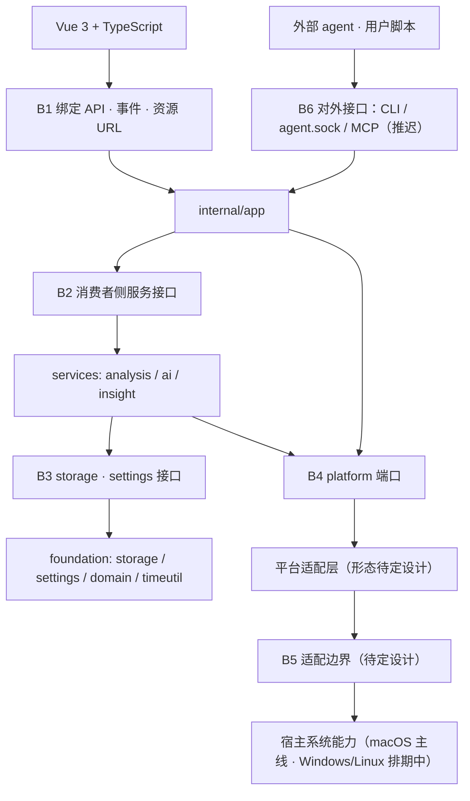

# 05 接口契约

> **状态：规范草案。** 本文把 [02 §2.1](02-architecture.md#21-模块图) 的模块边界收敛为可实现、
> 可测试的契约：方法签名、字段级 DTO、错误码、事件语义、版本与兼容性规则。
>
> 本文把正式绑定、临时联调绑定和端口形状分开描述。**实现与验证的当前状态以
> [09 §9.1](09-roadmap.md#91-模块总表) 的模块总表为唯一权威**，本文不维护状态快照，
> 只在必要处标注「规划中」以区分已交付契约与目标契约。
> 平台适配边界（§5.8）仍为 **待定设计**：只定义任何实现都必须满足的要求，不定义协议本身。

## 5.1 本文的定位

| 文档 | 回答的问题 | 与本文的关系 |
|------|-----------|-------------|
| [02](02-architecture.md) | 有哪些模块、依赖方向、目录结构 | 本文的接口必须落在这些边界上 |
| [03](03-data-model.md) | 数据长什么样 | DTO 字段注释用 `→ 列名` 指向来源 |
| [04](04-data-flow.md) | 行为规则与常量 | 本文只定义*形状*，行为以 04 为准 |
| [08](08-testing-strategy.md) | 如何证明行为正确 | 本文每条契约都指向 §5.10 的测试门禁 |
| **本文** | **签名、字段、错误、事件、版本** | 实现与评审时的接口唯一出处 |

规则同 [AGENTS.md](../AGENTS.md)：若实现发现契约与代码事实冲突，**以可复现实验和当前代码
为准，并在同一个 commit 内修正本文**。不要让文档和绑定层各自漂移。

## 5.2 边界总览



| 边界 | 参与方 | 形态 | 状态 | 规范位置 |
|------|--------|------|------|----------|
| B1 | Vue ↔ `internal/app` | 生成的 Wails 绑定 + 事件 + HTTP 资源 | 形态已定，方法随功能能力接入 | §5.5 |
| B2 | `app` ↔ services | Go 方法调用，接口定义在消费者侧 | 已定 | §5.6 |
| B3 | services ↔ foundation | Go 接口，纯值语义 | 已定 | §5.6 |
| B4 | Go ↔ `platform` | Go 接口 + channel | 已定 | §5.7 |
| B5 | 适配层 ↔ 系统能力 | — | **待定设计** | §5.8 |
| B6 | 外部 ↔ Daygo | CLI JSON / NDJSON socket / MCP 工具面 | 推迟到 v1.1 | §5.9 |

### 5.2.1 按功能能力的可用性

绑定随具体能力接入。负责模块与依赖见 [09](09-roadmap.md#93-能力接入表)，不等待该模块
所有功能同时完成。模块标识不是新的 CapabilitiesDTO.Features 值，现有字段与版本语义保持。

| 负责模块 | 绑定能力 | 真实接入条件 |
|---|---|---|
| preferences | GetCapabilities、GetSettings / UpdateSettings、公共前端 wrapper | 功能 / 锁状态真实提供；设置需 settings-store / settings-access |
| recording | 录制开关 / 暂停 / 状态、权限与系统入口 | System / Capture、G-host / G-native / G-data |
| providers | Provider 配置、路由、密钥与连接测试 | db-core、settings-access、Secrets、真实协议客户端 |
| timeline | GetDayContext、时间线 / 分类 / 搜索、媒体、重试和重处理 | 各自需要的 time / cards / capture / media-read / provider-client |
| daily | 每日摘要、日记、目标 | time / cards、持久化；生成需文本客户端，提醒需 notifications |
| weekly | 每周聚合 | time 周边界 / cards，不依赖 daily 完成 |
| data | GetDiagnostics | 可观测封装及各功能真实诊断来源 |
| delivery | 更新状态和检查 | Updater、安全重启与身份 / 分发验证 |

当前挂在 `Backend` 上、属于正式契约的绑定方法仍按 §5.2.1 计数；另有明确标注为临时用途的
`CaptureTest` 与 `OpenCaptureTestFolder` 联调绑定，用于隔离验证真实 Capture ABI。它们不读写
数据库、不读取正式配置，且不应被正式产品页面依赖。录制联调面板与设置页共用
`PickApplication`（正式绑定）打开原生应用选择器。
Windows 联调面板另通过正式 recording bindings 驱动共享 recorder，以验证文件与数据库提交闭环。

| 模块 | 已实现的绑定 | 真实程度 |
|---|---|---|
| agent | `GetAgentConnection` | 读写实例启动时监听 `agent.sock`（0600），写入经与 chat 同源的共享执行器（同校验、同事件），每次请求服务端校验 `agentEditsEnabled`，成功写入追加 `agent-writes.log`；绑定只报告可执行路径与 socket 是否在监听 |
| preferences | `GetCapabilities`、`GetSettings / UpdateSettings`、`SetWindowBackground` | 真实读写 `app_settings`；`canWrite` / `isCaptureOwner` 来自真实实例锁；`SetWindowBackground` 把 `#rrggbb` 颜色刷到原生窗口背景，供前端跟随主题过渡 |
| timeline | `GetDayContext`、`GetTimelineDay`、`GetCardMedia`、卡片写操作、`SaveCategories`、`RetryBatches`、`StopRetries`、`DeleteBatches`、`ReprocessDay`、`ReprocessCard`、`SaveCardReview`、`ClearCardReview`、`GetCardVerdict`、`GetReviewTotals`、`SaveCardRating`、`ClearCardRating`、`GetCardRating` | 真实 4 点边界与周边界计算；卡片查询 / 写操作走 `timeline_cards`，写后发合并的 `timeline:updated`；失败批次可手动重试、停止自动重试或软删除，整日按批次重处理，单张卡片重写其自己的时间窗；审阅判定持久化在 `card_reviews` 并可按卡片读回 / 按日聚合，摘要拇指评分持久化在 `card_ratings` 并可按卡片读回（两者都不改写卡片，因此都不发事件）；`GetCardMedia` 返回卡片时间窗内的帧引用（上限 600，经 `/media/frame` 资源回放，§5.5.4）；搜索未实现。`ClearHistoryData` 是开发测试入口，详见下文 |
| daily | `GetDailyRecap`、`GenerateDailyRecap`、`SaveDailyRecap`、`GetJournalDay`、`SaveJournalDay`、`GetDayGoal`、`SaveDayGoal` | 真实读写 `journal_entries` / `day_goals` / `daily_standup_entries`；`GenerateDailyRecap` 走分析 Provider 生成并覆盖重写；日报站会即当日 AI 摘要，日记不再单独存 AI summary |
| weekly | `GetWeeklyDashboard` | 真实只读聚合（`CategoryMinutesInRange` + `CardSpansInRange` + insight 排除 System / isIdle，含按日明细与洞察）；周边界周一 4 点对齐（decisions/weekly-boundary-monday） |
| data | `GetDiagnostics` | 真实数据库统计；无数据源的字段经 `unavailable` 说明原因 |
| recording | `GetRecordingState`、`SetRecording`、`PauseRecording`、`ResumeRecording`、`GetRecordingDirectory`、`SetStatusItemLabels`、`SetNativeUiLabels`、`GetPermissionState`、`RequestScreenRecordingPermission`、`OpenSystemSettings`、`SetPermissionRestartArmed`、`RelaunchForPermission`、`PickApplication`、`GetBlockedApplications`、`DescribeApplications`、`ListInstalledApplications`、`GetPrivacyCompatibility` | recorder 使用当前平台 Capture、正式 settings 与 CaptureStore；Windows 无 macOS TCC 提示时只对录制状态报告 `granted`；`SetPermissionRestartArmed` / `RelaunchForPermission` 承载授权后的完全退出 + 自动重启（见权限组说明）；隐私名单读取 `privacy.blockedApplicationIds`，名称与图标由 `ApplicationInspector` 解析，未解析到的条目只回 ID；`ListInstalledApplications` 供隐私页应用网格枚举（只含 ID 与名称，不含图标，图标经 `DescribeApplications` 按批解析；平台无枚举能力时返回 `native_unavailable`，前端保留 picker 兜底）；Windows 设置页同时显示真实系统 build 与 26100 隐私能力门禁 |
| recording（联调） | `CaptureTest`、`OpenCaptureTestFolder`、`PollSystemEvents` | 直接调用平台 `Capture` 或排空系统事件广播缓冲；均不接 recorder / storage / config。`PollSystemEvents` 是共享广播缓冲的排空口（recorder 与测试页都要观察全部原生事件，直接消费会互相抢），**会消费缓冲**，正式产品页面不得调用 |
| providers | `TestProviderConnection`、`ListProviders / AddProvider / UpdateProvider / DeleteProvider`、`GetProviderRouting / SetProviderRouting`、`SetProviderSecret / DeleteProviderSecret`、`TestProvider`、`ListProviderModels` | 真实读写 `providers` 表与路由链；密钥经 Secrets 端口进钥匙串；`TestProvider` 从钥匙串取密钥发真实探针；模型列表单次请求无缓存 |
| chat | `ListChatConversations`、`CreateChatConversation`、`DeleteChatConversation`、`RenameChatConversation`、`SetChatConversationProvider`、`SetChatConversationModel`、`GetChatMessages`、`SendChatMessage`、`CancelChatTurn` | 真实多会话读写 v4/v6 表；`SendChatMessage` 异步发起工具循环回合（信封解析、`chat.editMode` 门禁、8 次调用 / 64 KiB / 120 s 预算），回合内每条消息落库后发 `chat:updated`；写工具经与绑定同源的共享路径；HTTP attempt 计入 `llm_calls`（purpose=`chat`） |

没有数据库时（第二实例或打开失败）设置与诊断返回 `database_error`，不返回编造的默认值。
上表只说明绑定与本地实现已存在。G-host、真实 Provider、签名后密钥身份与长期门禁由用户于 2026-09-22 确认验收；逐项运行记录尚未附入仓库，见 [09 §9.1](09-roadmap.md#91-模块总表)。
fake 的覆盖以 §5.7.4 为准。

> **绑定对象上的导出方法就是前端 API。** Wails 绑定会导出绑定对象的**每一个**导出方法，
> 因此“顺手导出一个装配用的 helper”等于无声地改了契约。这已经发生过一次：
> `SetEventEmitter` 与 `Store` 曾因为导出而进入生成的 `Backend.d.ts`，后者还把
> `storage.Store` 拉进了生成的 `models.ts`——把一个前端永远不该持有的数据库句柄
> 变成了它的类型。两者已改为非导出，并由 `internal/app/bindings_test.go` 用反射断言
> `*Backend` 的导出方法集合恰好等于上表，改动契约必须同时改文档、改这张表和改那份清单。

**未实现的方法不要先放一个返回假数据的桩。** 前端据 CapabilitiesDTO.Features
决定渲染什么，而不是靠调用失败试探；测试 fake 不进入正式绑定。
签名、DTO、事件及错误码的公共规范仍由本文唯一维护。

## 5.3 通用约定

### 5.3.1 命名

- Go 绑定方法：动词开头的 PascalCase。`Get*` 单值、`List*` 集合、`Update*` 局部改、
  `Save*` 整体覆盖、`Set*` 开关、`Delete*` 删除、`Request*` 触发系统交互。
- DTO：仅 `internal/app` 使用 `*DTO` 后缀；服务层与 foundation 返回 `internal/domain` 类型。
  **DTO 不得泄漏到服务层，domain 类型不得直接绑定给前端**——否则内部重命名会变成前端
  破坏性变更。
- 绑定 JSON 字段：`lowerCamelCase`，**每个字段都必须写显式 `json` tag**，不依赖框架的
  默认导出名推导。
- 对外接口（§5.9）使用 `snake_case`。这是两套独立命名域，不要为了"统一风格"去改 CLI 输出。

### 5.3.2 时间与日期

时间表示是本项目最容易出错的地方（[风险 H-2](10-risks.md#h-2时钟串解析偏差)）。
跨 B1 只允许下列五种表示：

| 语义 | 线上类型 | 格式 | 边界 | 用途 |
|------|----------|------|------|------|
| 逻辑日 `day` | `string` | `yyyy-MM-dd` | **凌晨 4 点** | 时间线、日记、目标、卡片归属 |
| 日历日 `standupDay` | `string` | `yyyy-MM-dd` | 午夜 | 每日站会摘要 |
| 时刻 `*Ts` | `number`（int64） | Unix 秒，UTC | — | 范围查询、排序、派生计算 |
| 时钟串 `start` / `end` | `string` | 本地化 `h:mm a` | — | LLM 原始输出，仅展示与解析源 |
| 时长 | `number` | 单位写进字段名：`*Seconds` / `*Minutes` | — | 展示与聚合 |

三条硬规则：

1. **绑定层不传 `time.Time`。** 它会被序列化成带时区的 RFC3339 字符串，前端再解析一次，
   等于引入第二个时区来源。统一用 Unix 秒 + 逻辑日字符串。
2. **`day` 只能由 `internal/timeutil` 生成。** 前端**不得**用 `Date` 自行推算逻辑日；
   午夜到凌晨 4 点之间自算必然错一天。需要"今天"时调用 `GetDayContext("")`。
3. **`start`/`end` 与 `startTs`/`endTs` 同时返回，且不得由前端互相推导。** 字符串来自
   LLM，整数由 Go 按 [03 §3.5](03-data-model.md#35-时钟串派生) 的锚点规则派生；
   任何一方在前端重算都会产生偏移。

`GetDayContext("")` 返回当前逻辑日以及当前日历日；显式传入 `yyyy-MM-dd` 时，`day` 与
`standupDay` 都使用该日期键，而逻辑日的真实起止时刻仍只由后端返回。这样 Timeline 与 Daily
可以共享历史日期选择，且历史 Daily 不会误读当天的日报。

### 5.3.3 可空、枚举、集合

- 可空：Go 用指针，TS 侧为 `T | null`。**禁止 `0`、`""`、`-1` 哨兵值**。
  唯一例外是 `AppearanceSettingsDTO.Language` 的空串——它表示"跟随系统"，是一个真实取值
  而非缺失，并且在 §5.5.2 显式说明。
- 枚举：一律字符串常量，Go 侧 `type XxxState string`。跨界不使用整型枚举。

  | 枚举 | 取值 |
  |------|------|
  | `RecordingState` | `idle` `starting` `capturing` `paused` |
  | `PermissionState` | `granted` `denied` `not_determined` |
  | `BatchStatus` | `pending` `processing` `succeeded` `failed` `failed_empty` `skipped_short` |
  | `JournalStatus` | `draft` `intentions_set` `complete` |
  | `ProviderProtocol` | `openai`（Chat Completions） `openai_responses` `anthropic`（Messages） |
  | `AppTheme` | `system` `light` `dark` |

- 集合方法必须有**确定的排序**和**明确的上限**，否则黄金测试无法比较：

  | 集合 | 排序 | 上限 |
  |------|------|------|
  | 时间线卡片 | `startTs ASC, id ASC` | 一个逻辑日 |
  | 分类 | `sortOrder ASC, name ASC` | 无（用户量级） |
  | Provider | `sortOrder ASC` | 无 |
  | 搜索结果 | `startTs DESC, id DESC` | 默认 50，最大 200 |
  | 卡片帧引用（`GetCardMedia`） | `capturedAtTs ASC` | 最大 600 |
  | 帧条（`GetFrameStrip`，规划中） | `capturedAtTs ASC` | 最大 240 |

### 5.3.4 粒度与副作用

- **每屏一次调用。** `GetTimelineDay` 要一次带回卡片、合计、分类和失败分组，而不是让前端
  拼装四次调用。
- 写方法必须声明：是否幂等、触发哪些事件、需要哪种所有权。§5.5.1 的表格逐方法给出。
- **写方法不返回被写实体的全量快照**，除了 `UpdateSettings`（返回生效后的完整
  `SettingsDTO`，因为设置存在跨键规范化和夹取，前端无法自行预测结果）。其余写操作靠事件
  触发前端重新拉取。

## 5.4 错误模型

Wails 只把 `error` 的 `Error()` 文本传给前端，结构会丢失。因此约定**单一编码规则**：
所有绑定方法返回的错误都由 `internal/app/apperr` 构造，文本形如 `daygo:<code>: <message>`。

```go
package apperr

type Code string

// Error 是绑定层唯一允许跨界的错误类型。
type Error struct {
    Code    Code
    Message string // 面向用户、不含敏感数据、不本地化
    err     error  // 内部链，仅用于日志，不跨界
}

func (e *Error) Error() string { return "daygo:" + string(e.Code) + ": " + e.Message }
func (e *Error) Unwrap() error { return e.err }

// E 包装内部错误并附加对外码。绑定方法的每个返回路径都必须经过它。
func E(code Code, msg string, err error) *Error
```

前端薄 wrapper 解析首段，未匹配的一律降级为 `internal`：

```ts
const RE = /^daygo:([a-z_]+): ([\s\S]*)$/

export function toApiError(e: unknown): ApiError {
  const raw = e instanceof Error ? e.message : String(e)
  const m = RE.exec(raw)
  return m ? { code: m[1] as ApiErrorCode, message: m[2] } : { code: 'internal', message: raw }
}
```

### 5.4.1 错误码表（封闭集合）

`retryable` 与 `report` 是**静态映射**，两侧都按此表处理，不通过负载传递。

| code | 含义 | 可重试 | 上报 | 前端处理 |
|------|------|:------:|:----:|----------|
| `invalid_argument` | 参数格式或取值非法 | 否 | 否 | 表单内联报错；属于前端 bug |
| `not_found` | 目标不存在或已软删除 | 否 | 否 | 空态；刷新当前视图 |
| `not_capture_owner` | 捕获所有者锁被另一实例持有 | 否 | 否 | 只读查看器模式提示 |
| `permission_denied` | 屏幕录制等系统授权缺失 | 否 | 否 | 引导到系统设置 |
| `provider_not_configured` | 未配置 provider 或密钥缺失 | 否 | 否 | 跳转 provider 设置 |
| `provider_failed` | provider 调用失败（含限流、超时） | **是** | 采样 | 可重试提示，保留失败批次 |
| `native_unavailable` | 平台适配层不可用或正在重启 | **是** | 是 | 稍后重试；录制状态标为未知 |
| `media_decode_failed` | 帧或分段无法解码 | 否 | 采样 | 占位图，不阻塞列表 |
| `conflict` | 写入争用（`SQLITE_BUSY`、卡片改写串行化超时） | **是** | 采样 | 自动重试一次后提示 |
| `database_error` | 数据库损坏、不可用、磁盘问题 | 否 | 是 | 阻塞态错误页 + 诊断入口 |
| `canceled` | 调用方或上下文取消 | 否 | 否 | 静默 |
| `internal` | 未分类缺陷 | 否 | 是 | 通用错误提示 + 反馈入口 |

三条约束：

1. **`message` 绝不包含屏幕内容、窗口标题、文件路径、API key 或 LLM 负载**
   （[07 隐私与安全](07-privacy-security.md)）。需要定位信息时放进内部错误链，只进日志。
2. 表内每个 code 都必须有测试覆盖：绑定层错误路径必须返回 `*apperr.Error`，且 code
   属于本表（见 §5.10）。
3. §5.9 的对外错误码集合与本表**语义对齐但物理独立**：`protocol_error` / `edits_disabled`
   属于对外协议，不因内部改名而变动。

---

## 5.5 B1：前端 ↔ Go

### 5.5.1 绑定方法目录

签名以 `internal/app` 的目标绑定方法给出（当前绑定对象名为 `Backend`）。
“负责模块”协调实现，“接入条件”列出需要的能力；它们不改变方法签名或承诺已实现。
正式契约方法见 §5.2.1；临时 `CaptureTest` / `OpenCaptureTestFolder` 联调方法另列于录制表中。

#### 会话与能力

| 方法 | 负责模块 | 接入条件 | 类型 | 事件 | 主要错误码 |
|------|----------|----------|------|------|-----------|
| `GetDayContext(day string) (DayContextDTO, error)` | timeline | time 日期子能力 | 读 | — | `invalid_argument` |
| `GetCapabilities() (CapabilitiesDTO, error)` | preferences | 实际功能 / 锁状态 | 读 | — | — |
| `GetDiagnostics() (DiagnosticsDTO, error)` | data | diagnostics / db-core | 读 | — | `database_error` |

`day` 传空串表示"当前逻辑日"。其余所有接受 `day` 的方法**必须**收到合法 `yyyy-MM-dd`，
否则返回 `invalid_argument`——`"today"` 这类别名只在 `GetDayContext` 和 CLI 存在。

#### 时间线

| 方法 | 负责模块 | 接入条件 | 类型 | 事件 | 主要错误码 |
|------|----------|----------|------|------|-----------|
| `GetTimelineDay(day string) (TimelineDayDTO, error)` | timeline | time / cards | 读 | — | `invalid_argument` `database_error` |
| `GetCard(cardID int64) (TimelineCardDTO, error)` | timeline | cards | 读 | — | `not_found` |
| `SearchCards(query string, limit int) ([]TimelineCardDTO, error)` | timeline | cards 搜索 | 读 | — | `invalid_argument` |
| `UpdateCardCategory(cardID int64, category string) error` | timeline | cards / 分类 / 写入锁 | 写·幂等 | `timeline:updated` | `not_found` `invalid_argument` |
| `UpdateCardTitle(cardID int64, title string) error` | timeline | cards / 写入锁 | 写·幂等 | `timeline:updated` | 同上 |
| `UpdateCardSummary(cardID int64, text string) error` | timeline | cards / 写入锁 | 写·幂等（空串清除） | `timeline:updated` | `not_found` |
| `UpdateCardDetailedSummary(cardID int64, text string) error` | timeline | cards / 写入锁 | 写·幂等（空串清除） | `timeline:updated` | `not_found` |
| `DeleteCard(cardID int64) error` | timeline | cards / 写入锁 | 写·幂等（软删除） | `timeline:updated` | `not_found` |
| `RetryBatches(batchIDs []int64) error` | timeline | 批次 / provider-client / media-read | 写·非幂等 | `batch:progress` `timeline:updated` | `not_found` `conflict` |
| `StopRetries(batchIDs []int64) error` | timeline | 批次 / 写入锁 | 写·幂等（封顶 attempts） | `timeline:updated` | `not_found` `invalid_argument` |
| `SaveCategories(categories []CategoryDTO) error` | timeline | 分类 / 写入锁 | 写·幂等（全量覆盖） | `timeline:updated`（仅改名触及的日期） | `invalid_argument` `not_capture_owner` |
| `DeleteBatches(batchIDs []int64) error` | timeline | 批次 / 写入锁 | 写·幂等（软删除） | `timeline:updated` | `not_found` `invalid_argument` |
| `ReprocessDay(day string) error` | timeline | 批次 / 写入锁 | 写·非幂等（终态批次重置回 pending） | `batch:progress` `timeline:updated` | `invalid_argument` `conflict` |
| `ReprocessCard(cardID int64) error` | timeline | observations / cards / 写入锁 | 写·非幂等（重写该卡片自己的时间窗） | `timeline:updated` | `invalid_argument` `conflict` `provider_failed` `provider_not_configured` `not_found` |
| `GetCardVerdict(cardID int64) (string, error)` | timeline | card_reviews | 读 | — | `invalid_argument` `database_error` |
| `SaveCardReview(cardID int64, verdict string) error` | timeline | card_reviews / 写入锁 | 写·幂等 | — | `invalid_argument` `not_capture_owner` |
| `ClearCardReview(cardID int64) error` | timeline | card_reviews / 写入锁 | 写·幂等 | — | `invalid_argument` `not_capture_owner` |
| `GetReviewTotals(day string) (ReviewTotalsDTO, error)` | timeline | time / card_reviews | 读 | — | `invalid_argument` `database_error` |
| `GetCardRating(cardID int64) (string, error)` | timeline | card_ratings | 读 | — | `invalid_argument` `database_error` |
| `SaveCardRating(cardID int64, rating string) error` | timeline | card_ratings / 写入锁 | 写·幂等 | — | `invalid_argument` `not_capture_owner` `not_found` |
| `ClearCardRating(cardID int64) error` | timeline | card_ratings / 写入锁 | 写·幂等 | — | `invalid_argument` `not_capture_owner` |
| `ClearHistoryData() error`（测试专用） | timeline | storage / 写入锁 / 录制空闲 | 写·非幂等 | `timeline:updated` `journal:updated` `goal:updated` | `not_capture_owner` `conflict` `database_error` |

- `UpdateCardCategory` 的 `category` 必须是现有**用户**分类**名称**；不存在或为内置
  分类（`System` / `Idle`，由流水线赋值）时返回 `invalid_argument`，**不得**自动创建
  分类。
- `DeleteCard` 是软删除并返回可清理的 timelapse 路径给内部维护；对前端只是 `error`。
- `RetryBatches` / `ReprocessDay` 立即返回，进度通过 `batch:progress` 推送：
  `RetryBatches` 重置 `attempts` 并清空失败信息后回到 `pending`；调用方传入的
  id 里只要有一个不是失败终态的批次，整个调用返回 `invalid_argument` 且不落任何改动。
- `StopRetries` 是 `RetryBatches` 的反向操作：把失败批次的 `attempts` 封顶到
  `MaxBatchAttempts`（不改状态、不删行、不发 LLM 调用），于是冷却重排（`RequeueFailed`）
  跳过它、失败面板不再宣称「将自动重试」。批次保持失败终态且可见，之后 `RetryBatches`
  仍能重置计数覆盖本操作，因此停止可逆。与 `RetryBatches` 同样要求所有 id 均为失败终态，
  否则返回 `invalid_argument` 且不落任何改动。
- `ReprocessCard` **同步**执行且**只重写这张卡片自己的时间窗**（[04 §4.3.5](04-data-flow.md#435-单卡重写)）：
  它复用该窗内已存的 observations 重跑一次 LLM，在 `[card.start, card.end)` 内重建卡片，
  两侧相邻卡片不受影响，也不产生 `batch:progress`。调用方必须按长任务设置超时
  （绑定层 5 分钟）。卡片没有来源批次、或该窗内没有 observations 时返回 `invalid_argument`；
  该窗仍有批次在 `pending` / `processing` 时返回 `conflict`；模型三次都给不出合法输出、
  或 provider 调用失败时返回 `provider_failed` 且**不写入任何改动**。
- `DeleteBatches` 软删除失败批次（`is_deleted = 1`）：行与 `batch_screenshots`
  成员保留，帧不会重新进入未分批集合被再次分析。对时间线表现为失败面板条目消失。
- `ClearHistoryData` 一键清空录制与分析历史（帧 / 批次 / 观测 / 卡片 / 日记 / 目标 /
  聊天 + recordings 文件），**保留** `app_settings`、`providers`、`categories` 等配置；
  仅限开发测试场景，录制运行中返回 `conflict`。
- 审阅判定与摘要评分**不发** `timeline:updated`：两者都不改写任何卡片、分类或帧，
  时间线数据未失效。前端局部更新自己的状态即可（审阅判定另需重拉当日统计，
  由详情页向父级发内部事件完成，见 [modules/timeline](modules/timeline.md)）。

#### 帧与媒体

| 方法 | 负责模块 | 接入条件 | 类型 | 事件 | 主要错误码 |
|------|----------|----------|------|------|-----------|
| `GetCardMedia(cardID int64) (CardMediaDTO, error)` | timeline | cards / captures 帧索引 | 读 | — | `invalid_argument` `not_found` `database_error` |
| `GetFrameStrip(fromTs, toTs int64, count int) ([]FrameRefDTO, error)`（规划中） | timeline | 帧索引 / 资源入口 | 读 | — | `invalid_argument` |

`GetCardMedia` 返回**引用**而非像素：卡片时间窗内的帧列表（`CardMediaFrameDTO`：数字
`screenshotID` + `capturedAtTs`），按时间升序，上限 600（与 storage 层一致）。像素在浏览器
按 `/media/frame?id=` 资源请求时才解码（§5.5.4）；无帧的卡片返回空列表而不是错误，播放器
渲染占位。规划中的 `GetFrameStrip` 是按时间窗（而非卡片）取帧引用的泛化形式，`count`
上限 240，超出即 `invalid_argument`。

#### 录制

| 方法 | 负责模块 | 接入条件 | 类型 | 事件 | 主要错误码 |
|------|----------|----------|------|------|-----------|
| `GetRecordingState() (RecordingStateDTO, error)` | recording | System / recorder 实际状态 | 读 | — | — |
| `GetRecordingDirectory() (string, error)` | recording | recording path resolution | 读 | — | `database_error` |
| `CaptureTest(request CaptureTestRequestDTO) (CaptureTestResultDTO, error)` | recording（联调） | Capture 适配器 | 写·测试 | — | `invalid_argument` `permission_denied` `native_unavailable` |
| `OpenCaptureTestFolder(path string) error` | recording（联调） | 系统文件管理器 | 写·测试 | — | `invalid_argument` `not_found` `native_unavailable` |
| `PickApplication() (*ApplicationDTO, error)` | recording | Wails picker / ApplicationInspector | 写·用户交互 | — | `invalid_argument` `not_found` `native_unavailable` |
| `GetBlockedApplications() ([]ApplicationDTO, error)` | recording | settings-access / ApplicationInspector | 读 | — | `database_error` |
| `GetPrivacyCompatibility() (PrivacyCompatibilityDTO, error)` | recording | CapturePrivacyReporter | 读 | — | `native_unavailable` |
| `SetRecording(enabled bool) error` | recording | capture / db-core / 授权 | 写·幂等 | `recording:state` | `permission_denied` `not_capture_owner` `native_unavailable` |
| `PauseRecording(minutes int) error` | recording | recorder / 所有权 | 写·幂等 | `recording:state` | `invalid_argument` `not_capture_owner` |
| `ResumeRecording() error` | recording | recorder / 所有权 | 写·幂等 | `recording:state` | 同上 |
| `SetStatusItemLabels(labels StatusItemLabelsDTO) error` | recording | 平台状态栏 | 写·幂等 | — | — |
| `SetNativeUiLabels(labels NativeUiLabelsDTO) error` | recording / delivery | 原生应用选择面板、平台更新弹窗 | 写·幂等 | — | — |

`PauseRecording` 的 `minutes` 取值 `15` `30` `60`，`0` 表示无限期暂停，其余值返回
`invalid_argument`。取正值时 recorder 在时长结束后自动恢复（守卫同系统事件恢复：其间的
手动 `Resume`、`Stop` 或系统事件都会取消挂起的定时器）；到点时若屏幕仍处于锁定 / 睡眠等
系统阻塞态，则先解除用户暂停但保持 `paused`，待系统解除阻塞再恢复捕获。
**用户暂停与系统事件导致的 `paused` 是不同状态，DTO 必须分开表达**
（`userPaused` 字段），否则唤醒后会误恢复用户主动关闭的录制。

`SetStatusItemLabels` 由前端在加载与语言切换时下发整套已本地化的菜单栏文案（原生状态栏在
webview 之外渲染，vue-i18n 无法直达）；后端存储该 bundle 并按 recorder 状态映射到状态栏
表面（录制中显示暂停时长子菜单，其余状态显示单一主操作），再转发给平台适配层。原生适配层
因此既不持有产品状态也不持有 locale。适配层不可用（如只读第二实例或非 macOS 平台）时下发
只更新缓存的 bundle，重绘为空操作。

`SetNativeUiLabels` 是**其余原生界面**的同一条通道：处理状态栏之外、同样在 webview 之外渲染
的文案。

```go
type NativeUiLabelsDTO struct {                                     // §5.5.1
    ApplicationPickerTitle  string `json:"applicationPickerTitle"`  // 原生应用选择面板标题
    ApplicationPickerFilter string `json:"applicationPickerFilter"` // 面板的可执行文件过滤器名称
    UpdateOwnerRequired     string `json:"updateOwnerRequired"`     // 更新弹窗：本实例不是捕获所有者，拒绝安装
}
```

- `PickApplication` 在调起面板时读取前两个字段；面板不渲染标题的平台（macOS）不下发标题，
  过滤器只是可用性提示，权威校验始终在 `ApplicationInspector`。
- `updateOwnerRequired` 转发给实现 `platform.UpdateCopySink` 的更新适配器（§5.7）；由平台
  自行渲染安装提示的适配器不实现该端口，下发被跳过。

与状态栏文案一样：后端只存 bundle 并按表面路由，不持有 locale，也不做翻译。每个字段在后端
都有一份 zh-CN 默认值——这些表面除下发外没有第二个文案来源，空值会渲染出无标题或无说明的
原生对话框。默认值在 `newBackend` 里随状态栏文案一起种下，`configureUpdateInstall` 另在
安装回调接入时补推一次更新文案：拒绝安装可能早于前端的首次下发。下游对空值的处理不同：
面板标题为空即不渲染标题，而更新文案为空时适配器**保留上一份**而不是清空 Sparkle 的错误
说明。**平台完全自行渲染的文案（系统授权框、钥匙串授权、WinSparkle 的安装提示）不在本通道
内，也不做应用内语言适配**——它们的语言只由系统决定。

#### 设置与分类

| 方法 | 负责模块 | 接入条件 | 类型 | 事件 | 主要错误码 |
|------|----------|----------|------|------|-----------|
| `GetSettings() (SettingsDTO, error)` | preferences | settings-store / settings-access | 读 | — | — |
| `UpdateSettings(patch SettingsPatchDTO) (SettingsDTO, error)` | preferences | settings-access / 写入锁 | 写·幂等 | `settings:changed` | `invalid_argument` |
| `GetAgentConnection() (AgentConnectionDTO, error)` | agent | 宿主 agent.sock 接线 | 读 | — | — |

- `SaveCategories` 已随时间线绑定实现（§5.2.1 timeline 表）：整体覆盖，重命名在
  同一事务内同步改写已有卡片的 `category` 字符串并按触及日期触发 `timeline:updated`。
  分类列表本身随 `GetTimelineDay` / `GetDayContext` 返回，不再单设 `GetCategories`。

- `GetAgentConnection` 只报告连接信息，不读设置：`executablePath` 是当前进程可执行文件的绝对路径
  （解析符号链接；系统无法给出时为空，前端回退为 `daygo`），`socketActive` 表示本实例正在监听
  `agent.sock`——只有读写实例启动 socket，只读第二实例恒为 false。外部写入门禁仍是每次请求时
  服务端校验的 `agentEditsEnabled`（§5.9.2）。
- `UpdateSettings` 是**局部补丁**：只有出现在负载中的键被应用（Go 侧字段用指针区分
  "未提供"与"置空"）。返回值是规范化、夹取后的完整设置，`settings:changed` 的 payload
  只带被改动的键名。
- `SaveCategories` 是整体覆盖。**重命名分类必须在同一事务内同步改写已有卡片的
  `category` 字符串**，因此它也触发 `timeline:updated`。

#### Provider

| 方法 | 负责模块 | 接入条件 | 类型 | 事件 | 主要错误码 |
|------|----------|----------|------|------|-----------|
| `ListProviders() ([]ProviderDTO, error)` | providers | Provider repository / settings-access | 读 | — | — |
| `AddProvider(p ProviderInputDTO) (string, error)` | providers | Provider repository / settings-access | 写·非幂等 | `settings:changed` | `invalid_argument` `native_unavailable` |
| `UpdateProvider(id string, p ProviderInputDTO) error` | providers | Provider repository / settings-access | 写·幂等 | `settings:changed` | `not_found` `invalid_argument` `native_unavailable` |
| `DeleteProvider(id string) error` | providers | Provider repository / settings-access；连带剪除路由链、钥匙串条目与会话级 provider 绑定 | 写·幂等 | `settings:changed` | `not_found` |
| `GetProviderRouting() (ProviderRoutingDTO, error)` | providers | settings-access | 读 | — | — |
| `SetProviderRouting(r ProviderRoutingDTO) error` | providers | Provider repository（逐对校验 providerId 存在、model 属于该 provider 或为空，按对去重） | 写·幂等 | `settings:changed` | `invalid_argument` |
| `SetProviderSecret(id string, secret string) error` | providers | Secrets / Provider repository | 写·幂等 | — | `not_found` `invalid_argument` `native_unavailable` |
| `DeleteProviderSecret(id string) error` | providers | Secrets（删不存在的条目不是错误） | 写·幂等 | — | `invalid_argument` `native_unavailable` |
| `TestProvider(id string, model string) (ProviderTestResultDTO, error)` | providers | provider-client / Secrets | 读·有网络副作用 | — | `invalid_argument`（无密钥或 model 不属于该 provider）`provider_failed`（结果行） |
| `ListProviderModels(req ProviderModelsRequestDTO) (ProviderModelsResultDTO, error)` | providers | provider-client / Secrets | 读·有网络副作用 | — | `invalid_argument`（无密钥）`native_unavailable` |
| `TestProviderConnection(draft ProviderTestDraftDTO) (ProviderTestResultDTO, error)` | providers | provider-client | 读·有网络副作用 | — | `invalid_argument` |

两个测试方法**不是重复**，区别必须保留：

- `TestProviderConnection` 测的是**表单里还没保存的草稿**，密钥随调用传入、只进 Go 内存，
  不落盘、不进日志、不回显。它已经实现，是用户在密钥输入框旁点击“测试”时走的路径。
- `TestProvider` 测的是**已保存的 provider**，密钥由 Go 从钥匙串取，调用方给 id 与要测的
  model（空 model 回退到该 provider 的首个模型）。无已存密钥、或 model 不属于该 provider 时
  返回 `invalid_argument`，不发探针。

两者都只发一次探针（30 秒上限、不重试、不回退），**失败是返回值而不是 error**：
`ok=false` 加分类后的错误码，让 UI 把结果显示在输入框旁而不是弹窗。探针的通过标准见
§5.6.4 第 6 条——仅 HTTP 2xx 不算通过。

**密钥只写不读。** 没有任何绑定方法返回密钥内容；前端只能通过 `ProviderDTO.hasSecret`
知道是否已配置。`TestProvider` 的返回里也不得回显密钥或完整请求体。

`ProviderInputDTO.secret` 为空串时表示"保持不变"，不是"清空"。清空只能经
`DeleteProviderSecret`。

#### 洞察

| 方法 | 负责模块 | 接入条件 | 类型 | 事件 | 主要错误码 |
|------|----------|----------|------|------|-----------|
| `GetDailyRecap(standupDay string) (DailyRecapDTO, error)` | daily | time / standup repository | 读 | — | `invalid_argument` |
| `GenerateDailyRecap(standupDay string) (DailyRecapDTO, error)` | daily | cards / 分类 / providers / 写入锁 | 写·幂等（覆盖重生成） | `recap:updated` | `not_capture_owner` `invalid_argument` `provider_not_configured` `provider_failed` |
| `SaveDailyRecap(recap DailyRecapDTO) error` | daily | standup repository / 写入锁 | 写·幂等 | `recap:updated` | `not_capture_owner` `invalid_argument` |
| `GetJournalDay(day string) (JournalDayDTO, error)` | daily | time / 日记 repository | 读 | — | `invalid_argument` |
| `SaveJournalDay(entry JournalDayDTO) error` | daily | 日记 repository / 写入锁 | 写·幂等 | `journal:updated` | `invalid_argument` |
| `GetDayGoal(day string) (DayGoalDTO, error)` | daily | time / 目标 repository | 读 | — | `invalid_argument` |
| `SaveDayGoal(goal DayGoalDTO) error` | daily | 目标 / 分类 / 写入锁 | 写·幂等 | `goal:updated` | `invalid_argument` |
| `GetWeeklyDashboard(weekStart string) (WeeklyDashboardDTO, error)` | weekly | time 周边界 / cards | 读 | — | `invalid_argument` |

`GetDailyRecap` 的参数是**日历日**而不是逻辑日（见 §5.3.2）。这是唯一的例外，字段名
`standupDay` 就是提醒。

**日报补生成触发（后台）。** 除上表由用户主动调用的 `GenerateDailyRecap` 外，读写实例
在启动时以及此后每小时后台扫描一次，从最早一条活动卡片所在日历日起、直到今天，逐日检查
`daily_standup_entries`。语义约束：

- **仅读写实例执行**：补生成的写入需要写入锁与捕获所有者锁，只读第二实例不做任何事。
- **已结束完整日**（< 今天）：只对没有站会行的日生成，生成后**绝不覆盖**；生成前再查一次
  存在性，避免与手动保存竞态覆盖已存内容。
- **今天**：仍在累积活动，因此按刷新周期（缺失或 `generated_at` 早于 4 小时）(重)生成，
  允许覆盖旧值。用户手动"重新生成"会更新 `generated_at`，从而重置该 4 小时窗口。
- **空活动日跳过**：当日无用户活动卡片（排除 System / Idle）时不写行、不调用 provider（今天同理）。
- **无 provider 时静默等待**：`provider_not_configured` 中止本轮，等下一轮；连续失败达阈值也中止本轮。
- **刷新语义**：每(重)生成一天发一次 `recap:updated` 失效事件；前端仍只从 `GetDailyRecap` 渲染，
  当前打开的日被更新时靠该事件重拉（§5.5.5），补生成本身不推送日报内容。

该触发是后台行为，不新增绑定方法：它复用 `GenerateDailyRecap` 的生成与写入路径，
错误码集合一致。

#### 权限、系统与更新

| 方法 | 负责模块 | 接入条件 | 类型 | 事件 | 主要错误码 |
|------|----------|----------|------|------|-----------|
| `GetPermissionState() (PermissionDTO, error)` | recording | System 授权 | 读 | — | `native_unavailable` |
| `RequestScreenRecordingPermission() error` | recording | System 授权交互 | 写·系统交互 | `permission:changed` | `native_unavailable` |
| `OpenSystemSettings(pane string) error` | recording | System 面板入口 | 写·系统交互 | — | `invalid_argument` `native_unavailable` |
| `SetPermissionRestartArmed(armed bool) error` | recording | System 生命周期 | 写·幂等 | — | — |
| `RelaunchForPermission() error` | recording | System 自重启 | 写·系统交互 | — | `native_unavailable` |
| `GetUpdaterState() (UpdaterStateDTO, error)` | delivery | Updater | 读 | — | `native_unavailable` |
| `CheckForUpdates(interactive bool) error` | delivery | Updater / G-native | 写 | `update:available` | `native_unavailable` |
| `SetAutomaticUpdateChecks(enabled bool) error` | delivery | Updater / G-native | 写·幂等 | — | `native_unavailable` |

`OpenSystemSettings` 的 `pane` 是封闭枚举：`screen_recording` `notifications` `login_items`。
**不接受任意 URL**，避免绑定层变成通用的系统跳转能力。

`SetPermissionRestartArmed` 武装 / 解除「授权重启」意图（进程内标志，重启后自然复位）：前端在授权引导层
出现时武装、关闭时解除。武装后的下一次退出——包括 macOS 授权后自弹的「退出并重开」——是**完全退出 +
自动重启**，而非常驻 Agent 平时的软退出隐藏（见
[生命周期退出模型](decisions/lifecycle-quit-model.md) 与
[屏幕录制授权](decisions/recording-screen-recording-permission.md)）。`RelaunchForPermission`
直接执行「收尾录制 → 调度自重启 → 真退出」，供引导层的「重启使授权生效」按钮调用；无桌面外壳时返回
`native_unavailable`。macOS 在启动时缓存 TCC 授权，只有完全重启才能让新授权生效，这两个方法即为此存在。

更新弹窗中**属于我们的**那句文案（本实例不是捕获所有者，因此拒绝安装）由前端经
`SetNativeUiLabels` 下发（§5.5.1），适配器经 `UpdateCopySink` 接收；Sparkle 与 WinSparkle
自己的对话框文案不由本应用提供，跟随系统语言。

### 5.5.2 DTO 目录

字段注释中 `→ 列名` 指向 [03 数据模型](03-data-model.md) 的数据库列，`→ 键名` 指向
`app_settings` 的键。

```go
package app

// ---------- 会话与能力 ----------

type DayContextDTO struct {
    Day             string `json:"day"`        // 逻辑日，凌晨 4 点边界
    StandupDay      string `json:"standupDay"` // 日历日，午夜边界
    WeekStart       string `json:"weekStart"`  // 周一 yyyy-MM-dd（周报导航起点，前端不自算）
    DayStartTs      int64  `json:"dayStartTs"` // 逻辑日窗口 [start, end)
    DayEndTs        int64  `json:"dayEndTs"`
    NowTs           int64  `json:"nowTs"`
    TimeZone        string `json:"timeZone"`        // IANA 标识符
    DayBoundaryHour int    `json:"dayBoundaryHour"` // 恒为 4；显式暴露以便 UI 文案与测试断言
}

// CapabilitiesDTO 让 UI 由数据驱动，而不是由构建期开关驱动。
type CapabilitiesDTO struct {
    CanWrite        bool     `json:"canWrite"`        // 是否持有写入锁
    IsCaptureOwner  bool     `json:"isCaptureOwner"`  // 是否持有捕获所有者锁
    Features        []string `json:"features"`        // 已交付界面："timeline","daily","weekly","settings",...
    AppVersion      string   `json:"appVersion"`
    APIRevision     int      `json:"apiRevision"` // 见 §5.10.1
}

type DiagnosticsDTO struct {
    DatabasePath      string `json:"databasePath"`
    DatabaseBytes     int64  `json:"databaseBytes"`
    RecordingsBytes   int64  `json:"recordingsBytes"` // 逐行 file_size 求和，见 03 §3.4
    LastCaptureAtTs   *int64 `json:"lastCaptureAtTs"`
    PendingBatches    int    `json:"pendingBatches"`
    FailedBatches     int    `json:"failedBatches"`
    NativeState       string `json:"nativeState"` // "ok" | "restarting" | "unavailable"
    CaptureOwnerPID   *int   `json:"captureOwnerPid"`
    SkippedCardsToday int    `json:"skippedCardsToday"` // 时钟串解析失败计数，见 03 §3.5

    // 以下两项由 data 在实现诊断时新增，属非破坏性扩张：既有字段的名称与
    // 语义均未改变。目的见下方说明。
    DBStatus    string            `json:"dbStatus"`              // "ok" | "read_only" | "unavailable"
    Unavailable map[string]string `json:"unavailable,omitempty"` // 字段名 → 不可用原因

    // 损坏恢复后写回被还原的备份文件名，未恢复时为空。
    RecoveredFromBackup string `json:"recoveredFromBackup,omitempty"`
}

`DBStatus` 与 `Unavailable` 的存在理由：`RecordingsBytes`、`PendingBatches`、`FailedBatches`
与 `LastCaptureAtTs` 的数据源分属 recording 与 timeline，在其表落盘前这些字段只能是 0。
裸零会被读作"没有活动"，与实际含义"数据源尚不存在"相反。`Unavailable` 显式列出后者及其
原因，前端据此区分空态与不可用态。`DBStatus` 让只读降级与"数据库未打开"在界面上可辨
（`07 §7.5` 的连接层只读要求需要一个可观察的出口）。

// ---------- 时间线 ----------

type TimelineDayDTO struct {
    Day              string               `json:"day"`
    DayStartTs       int64                `json:"dayStartTs"`
    DayEndTs         int64                `json:"dayEndTs"`
    Cards            []TimelineCardDTO    `json:"cards"`
    Categories       []CategoryDTO        `json:"categories"`     // 随屏返回，省一次往返
    TrackedMinutes   int                  `json:"trackedMinutes"` // 不含 category = "System"
    IdleMinutes      int                  `json:"idleMinutes"`
    Failures         []TimelineFailureDTO `json:"failures"`         // 失败批次分组，60 秒容差合并
    ProcessingRanges []RangeDTO           `json:"processingRanges"` // 正在分析的区间，UI 显示骨架
    GeneratedAtTs    int64                `json:"generatedAtTs"`
}

type TimelineCardDTO struct {
    ID                    int64            `json:"id"`              // → timeline_cards.id
    BatchID               *int64           `json:"batchId"`         // → batch_id
    Day                   string           `json:"day"`             // 卡片归属日；跨 4 点的次日时间片仍保留原归属日
    Start                 string           `json:"start"`           // → start，时钟串
    End                   string           `json:"end"`             // → end
    StartTs               int64            `json:"startTs"`         // GetTimelineDay 裁剪到所请求日窗口
    EndTs                 int64            `json:"endTs"`           // 原始时间戳仍在数据库中
    Category              string           `json:"category"`        // → category（名称字符串）
    Subcategory           string           `json:"subcategory"`     // → subcategory
    Title                 string           `json:"title"`           // → title
    Summary               string           `json:"summary"`         // → summary
    DetailedSummary       string           `json:"detailedSummary"` // → detailed_summary
    VideoSummaryURL       *string          `json:"videoSummaryUrl"` // 资源 URL 而非磁盘路径
    OtherVideoSummaryURLs []string         `json:"otherVideoSummaryUrls"`
    AppSites              *AppSitesDTO     `json:"appSites"`          // → metadata.appSites
    Distractions          []DistractionDTO `json:"distractions"`      // → metadata.distractions
    IsIdle                bool             `json:"isIdle"`            // 分类 isIdle 或 metadata.idle
    DurationMinutes       float64          `json:"durationMinutes"`   // 当前日可见时间片的分钟数
}

type DistractionDTO struct {
    ID              string  `json:"id"`        // metadata 中缺失时由 Go 生成，保持稳定
    StartTime       string  `json:"startTime"` // 时钟串
    EndTime         string  `json:"endTime"`
    Title           string  `json:"title"`
    Summary         string  `json:"summary"`
    VideoSummaryURL *string `json:"videoSummaryUrl"`
}

type AppSitesDTO struct {
    Primary   *string `json:"primary"`
    Secondary *string `json:"secondary"`
}

// TimelineCardDTO 的三个装饰字段（appSites / distractions / activityPoints）自
// timeline_cards.metadata 而来，该列的存储形状是**表侧的契约**：模型输出不直接落库，
// 映射由管线（生产者）负责，消费端不认模型的字段名。
//
//   metadata 键       存储形状                                     模型输出（映射前）
//   appSites          {primary, secondary} 或 null                 扁平字符串数组
//   distractions      DistractionDTO 对象数组（startTime/endTime/   {start, end, title,
//                     title/summary；id 缺失时由绑定层生成），       summary} 对象数组
//                     空列表存 []（不是 null：消费端会读 .length）
//   activityPoints    {time, description} 对象数组                 同形状
//
// 映射前的形状一旦漏进 metadata，绑定层就解不开：parseCardMetadata 逐字段解码，
// 解不开的字段被丢弃（不会连坐兄弟字段，也不会拿猜测值顶替）。2026-09-16 与
// 2026-09-20 两次「时间线完全没有图标」都是这条缝上的漂移，见 docs/modules/timeline.md。

type TimelineFailureDTO struct {
    BatchIDs  []int64 `json:"batchIds"`
    StartTs   int64   `json:"startTs"`
    EndTs     int64   `json:"endTs"`
    Kind      string  `json:"kind"`    // 失败类别；前端按类别显示本地化原因，不从 message 猜测来源
    Message   string  `json:"message"` // 已脱敏的诊断文本，不直接呈现在时间线上
    Retryable bool    `json:"retryable"` // 仅描述是否会自动重试；RetryBatches 不受它约束
}

// RangeDTO 是日轨道上的一个窗口，以及拥有它的批次。卡片属于"它的批次改写的那段"，
// 而不是"与窗口相交"：持续窗口会把批次改写范围向前扩到它继续的那张卡，因此将被重写的
// 卡片可能整段落在窗口之前。前端据此判定 is-regenerating，别只按时间戳交集。
type RangeDTO struct {
    StartTs  int64   `json:"startTs"`
    EndTs    int64   `json:"endTs"`
    BatchIDs []int64 `json:"batchIds"` // 拥有该窗口的批次；卡片 batchId 命中即为重写对象
}

// ---------- 帧 ----------

// CardMediaDTO 是一张卡片时间窗内的可回放帧引用，像素经 /media/frame 资源解码。
type CardMediaDTO struct {
    CardID int64               `json:"cardId"`
    Frames []CardMediaFrameDTO `json:"frames"` // capturedAtTs 升序，上限 600
}

type CardMediaFrameDTO struct {
    ID         int64 `json:"id"`         // screenshots.id，即 /media/frame?id=
    CapturedAt int64 `json:"capturedAt"` // Unix 秒
}

// FrameRefDTO 是规划中 GetFrameStrip 的引用形状（按时间窗取帧的泛化形式）。
type FrameRefDTO struct {
    ScreenshotID int64  `json:"screenshotId"`
    CapturedAtTs int64  `json:"capturedAtTs"`
    Redacted     bool   `json:"redacted"` // 隐私占位帧
}

// ---------- 录制 ----------

type RecordingStateDTO struct {
    State           string  `json:"state"`         // idle|starting|capturing|paused
    Reason          *string `json:"reason"`        // 系统暂停原因或脱敏录制失败代码，如 capture_timeout:0x887a0027
    UserPaused      bool    `json:"userPaused"`    // 用户主动暂停，区别于系统事件暂停
    PauseEndsAtTs   *int64  `json:"pauseEndsAtTs"` // 定时暂停到期时刻；无限期为 null
    Permission      string  `json:"permission"`    // granted|denied|not_determined
    IsCaptureOwner  bool    `json:"isCaptureOwner"`
    ActiveDisplayID *string `json:"activeDisplayId"` // 平台 opaque ID，不解析其格式
    LastFrameAtTs   *int64  `json:"lastFrameAtTs"` // 看门狗依据，见风险 C-2
}

// ---------- 设置与分类 ----------

type SettingsDTO struct {
    Capture       CaptureSettingsDTO      `json:"capture"`
    Privacy       PrivacySettingsDTO      `json:"privacy"`
    Storage       StorageSettingsDTO      `json:"storage"`
    Notifications NotificationSettingsDTO `json:"notifications"`
    Appearance    AppearanceSettingsDTO   `json:"appearance"`
    LLM           LLMSettingsDTO          `json:"llm"`
    Chat          ChatSettingsDTO         `json:"chat"`
    System        SystemSettingsDTO       `json:"system"`
    Telemetry     TelemetrySettingsDTO    `json:"telemetry"`
}

type CaptureSettingsDTO struct {
    IntervalSeconds int `json:"intervalSeconds"` // → capture.intervalSeconds；1,5,10,20,30,60
    CaptureHeight   int `json:"captureHeight"`   // → capture.heightPixels；720 或 1080
}

type PrivacySettingsDTO struct {
    BlockedApplicationIDs []string `json:"blockedApplicationIds"` // → privacy.blockedApplicationIds
}

// ApplicationDTO 是 picker 与隐私名单的展示身份（§5.5.1 录制组）。
// Name 与 IconDataURL 是展示数据，不是产品状态：设置只持久化 ID，名称与图标每次读取时
// 经 ApplicationInspector 解析。IconDataURL 是 `data:image/png;base64,` 前缀的方形 PNG，
// 系统没有图标时为空串。Name 为空串表示平台无法解析该应用，调用方回退显示 ID。
type ApplicationDTO struct {
    ID          string `json:"id"`
    Name        string `json:"name"`
    IconDataURL string `json:"iconDataUrl"`
}

type PrivacyCompatibilityDTO struct {
    Platform     string `json:"platform"`
    Version      string `json:"version"`
    Build        uint32 `json:"build"`
    MinimumBuild uint32 `json:"minimumBuild"`
    Supported    bool   `json:"supported"`
}

type StorageSettingsDTO struct {
    RecordingsLimitBytes int64 `json:"recordingsLimitBytes"` // → storage.recordingsLimitBytes；0 = 不限
}

type NotificationSettingsDTO struct {
    JournalReminderEnabled bool   `json:"journalReminderEnabled"`
    JournalReminderTime    string `json:"journalReminderTime"` // "HH:mm"，本地时间
}

type AppearanceSettingsDTO struct {
    Theme    string `json:"theme"`    // "system"|"light"|"dark"
    Language string `json:"language"` // BCP 47；空串表示跟随系统（§5.3.3 的唯一哨兵例外）
}

// LLMSettingsDTO 与 AppearanceSettingsDTO.Language 是两个独立设置：
// 前者决定模型生成的卡片标题与摘要用什么语言，后者只影响界面文案。
type LLMSettingsDTO struct {
    OutputLanguage                string `json:"outputLanguage"`                // BCP 47；空串表示跟随界面语言
    RecognitionEnhancementEnabled bool   `json:"recognitionEnhancementEnabled"` // 识别图片切四片并附原图发送；默认 false
}

// ChatSettingsDTO.ChatMemory 是全局聊天记忆（decisions/chat-session-model）：
// 用户自定义自由文本（类似 CLAUDE.md），非空时注入每个会话系统提示尾部。
// editMode 随 agent 工具循环切片加入。
type ChatSettingsDTO struct {
    Memory string `json:"memory"` // → chat.memory
}

type SystemSettingsDTO struct {
    LaunchAtLogin     bool `json:"launchAtLogin"`
    ShowDockIcon      bool `json:"showDockIcon"`
    AgentEditsEnabled bool `json:"agentEditsEnabled"` // 控制 agent.sock，见 §5.9
    TestToolsEnabled  bool `json:"testToolsEnabled"`  // 显示侧边栏测试页（捕获测试、数据清理）；默认 false
}

// AgentConnectionDTO 供设置页生成 MCP 客户端配置与 CLI 示例（§5.9.3）。
type AgentConnectionDTO struct {
    ExecutablePath string `json:"executablePath"` // 空 = 系统无法报告，前端回退 `daygo`
    SocketActive   bool   `json:"socketActive"`   // 本实例正在监听 agent.sock
}

type TelemetrySettingsDTO struct {
    AnalyticsOptIn      bool `json:"analyticsOptIn"`
    CrashReportingOptIn bool `json:"crashReportingOptIn"`
}

// SettingsPatchDTO 的每个字段都是指针：nil 表示"本次不改"。
// 这是唯一能把"未提供"和"设为空/false"区分开的表示方式。
type SettingsPatchDTO struct {
    IntervalSeconds        *int      `json:"intervalSeconds"`
    CaptureHeight          *int      `json:"captureHeight"`
    BlockedApplicationIDs  *[]string `json:"blockedApplicationIds"`
    RecordingsLimitBytes   *int64    `json:"recordingsLimitBytes"`
    JournalReminderEnabled *bool     `json:"journalReminderEnabled"`
    JournalReminderTime    *string   `json:"journalReminderTime"`
    Theme                  *string   `json:"theme"`
    Language               *string   `json:"language"`
    OutputLanguage         *string   `json:"outputLanguage"`
    RecognitionEnhancement *bool     `json:"recognitionEnhancementEnabled"`
    ChatMemory             *string   `json:"chatMemory"`
    LaunchAtLogin          *bool     `json:"launchAtLogin"`
    ShowDockIcon           *bool     `json:"showDockIcon"`
    AgentEditsEnabled      *bool     `json:"agentEditsEnabled"`
    TestToolsEnabled       *bool     `json:"testToolsEnabled"`
    AnalyticsOptIn         *bool     `json:"analyticsOptIn"`
    CrashReportingOptIn    *bool     `json:"crashReportingOptIn"`
}

type CategoryDTO struct {
    ID          string `json:"id"` // UUID
    Name        string `json:"name"`
    ColorHex    string `json:"colorHex"` // "#RRGGBB"
    Details     string `json:"details"`  // 提供给 LLM 的分类说明
    SortOrder   int    `json:"sortOrder"`
    IsSystem    bool   `json:"isSystem"`
    IsIdle      bool   `json:"isIdle"`
    CreatedAtTs int64  `json:"createdAtTs"`
    UpdatedAtTs int64  `json:"updatedAtTs"`
}

// ---------- Provider ----------

// Daygo 只有用户自定义 provider：id 是生成的不透明标识，protocol 是独立字段，
// 不由 id 隐含。名称、地址、模型全部由用户填写。无 sortOrder：展示顺序按
// displayName，路由顺序由 ProviderRoutingDTO 表达。
type ProviderDTO struct {
    ID          string   `json:"id"`
    DisplayName string   `json:"displayName"`
    Protocol    string   `json:"protocol"` // openai | openai_responses | anthropic
    Endpoint    string   `json:"endpoint"` // 绝对 http(s) 基地址，不含凭据
    Models      []string `json:"models"`   // → providers.models：有序模型列表，至少 1 个
    MaxImages   int      `json:"maxImages"` // → providers.max_images：单请求图片上限，0 = 默认
    HasSecret   bool     `json:"hasSecret"` // 只暴露"是否已配置"，永不返回密钥内容
}

// ProviderInputDTO 是写入形状。Secret 为空串表示"保持不变"，不是"清空"。
// Models 至少一个非空项，逐个 trim、去重，上限 20（decisions/providers-multi-model）。
type ProviderInputDTO struct {
    DisplayName string   `json:"displayName"`
    Protocol    string   `json:"protocol"`
    Endpoint    string   `json:"endpoint"`
    Models      []string `json:"models"`
    MaxImages   int      `json:"maxImages"`
    Secret      string   `json:"secret"`
}

// 回退链的一个条目：一个「供应商 + 模型」对（decisions/providers-multi-model）。
// Model 为空跟随该 provider 的首个模型。
type ProviderRoutingEntryDTO struct {
    ProviderID string `json:"providerId"`
    Model      string `json:"model"`
}

// 有序回退链（decisions/providers-fallback-chain）：Chain[0] 是主，其余按序为备用；
// 上限 8 项，按 (providerId, model) 对去重，空 providerId 在写入时归一化掉。同一 provider
// 的不同模型可作为不同条目分别排入。
type ProviderRoutingDTO struct {
    Chain []ProviderRoutingEntryDTO `json:"chain"`
}

// ListProviderModels 的入参：ProviderID 非空时走已保存 provider（密钥从钥匙串取），
// 否则按草稿处理（Protocol/Endpoint/Secret 随调用跨界，不落盘）。
type ProviderModelsRequestDTO struct {
    ProviderID string `json:"providerId"`
    Protocol   string `json:"protocol"`
    Endpoint   string `json:"endpoint"`
    Secret     string `json:"secret"`
}

// ListProviderModels 的返回。失败是结果而不是 error（与探针同惯用法）：
// 网关没有 /models 端点时 ok=false，模型字段仍可手填。
type ProviderModelsResultDTO struct {
    OK        bool     `json:"ok"`
    Models    []string `json:"models"`
    ErrorCode string   `json:"errorCode"`
    Message   string   `json:"message"`
}

// TestProvider 的返回（针对已保存的 provider）。与 TestProviderConnection 的
// ProviderTestResultDTO 同形（见下）；两者共用该类型。
type ProviderTestDTO struct {
    OK        bool    `json:"ok"`
    LatencyMs int     `json:"latencyMs"`
    Model     *string `json:"model"`
    Message   string  `json:"message"` // 已脱敏，不含请求体
    Code      *string `json:"code"`    // 失败时对应 §5.4.1 的 code
}

// TestProviderConnection 的入参（已实现）。Secret 只为本次调用跨界，
// 不写数据库、不写钥匙串、不进日志、不回显。
type ProviderTestDraftDTO struct {
    Protocol string `json:"protocol"`
    Endpoint string `json:"endpoint"`
    Model    string `json:"model"`
    Secret   string `json:"secret"`
}

// TestProviderConnection 的返回（已实现）。失败是结果而不是 error：
// ErrorCode 取自 internal/ai 的错误分类（authentication / rate_limited /
// timeout / unavailable / invalid_request / unsupported_feature /
// invalid_output / canceled），与 §5.4.1 的绑定错误码是两套独立集合。
type ProviderTestResultDTO struct {
    OK           bool     `json:"ok"`
    Model        string   `json:"model"`        // provider 实际使用的模型
    LatencyMs    int64    `json:"latencyMs"`
    Capabilities []string `json:"capabilities"` // text | image | structured_output
    ErrorCode    string   `json:"errorCode"`
    Message      string   `json:"message"`      // 已脱敏的固定文案，不含响应正文
}

// ---------- 洞察 ----------

type DailyRecapDTO struct {
    StandupDay      string   `json:"standupDay"` // 日历日
    HighlightsTitle string   `json:"highlightsTitle"`
    Highlights      []string `json:"highlights"`
    TasksTitle      string   `json:"tasksTitle"`
    Tasks           []string `json:"tasks"`
    BlockersTitle   string   `json:"blockersTitle"`
    BlockersBody    string   `json:"blockersBody"`
    GeneratedAtTs   *int64   `json:"generatedAtTs"`
}

type JournalDayDTO struct {
    Day         string  `json:"day"`
    Intentions  *string `json:"intentions"`
    Notes       *string `json:"notes"`
    Goals       *string `json:"goals"`
    Reflections *string `json:"reflections"`
    Status      string  `json:"status"` // draft|intentions_set|complete
    UpdatedAtTs *int64  `json:"updatedAtTs"`
}

type DayGoalDTO struct {
    Day                     string               `json:"day"`
    FocusTargetMinutes      int                  `json:"focusTargetMinutes"`
    DistractionLimitMinutes int                  `json:"distractionLimitMinutes"`
    IsSkipped               bool                 `json:"isSkipped"`
    FocusCategories         []GoalCategoryRefDTO `json:"focusCategories"`
    DistractionCategories   []GoalCategoryRefDTO `json:"distractionCategories"`
    Exists                  bool                 `json:"exists"` // 该日尚未设置目标时为 false
}

type GoalCategoryRefDTO struct {
    CategoryID string `json:"categoryId"`
    Name       string `json:"name"`
    ColorHex   string `json:"colorHex"`
    SortOrder  int    `json:"sortOrder"`
}

// Days / Insights 供周报明细图表（2026-09-15 纳入范围）：按日聚合 + 原始卡片
// 时段（分钟粒度足够，不做更细的分桶）+ 派生周洞察。应用关系与流向图仍待定。
type WeeklyDashboardDTO struct {
    WeekStart      string             `json:"weekStart"` // yyyy-MM-dd
    WeekStartTs    int64              `json:"weekStartTs"`
    WeekEndTs      int64              `json:"weekEndTs"`
    TrackedMinutes float64            `json:"trackedMinutes"` // 不含 "System"
    FocusMinutes   float64            `json:"focusMinutes"`   // 不含 isIdle 分类
    Categories     []CategoryTotalDTO `json:"categories"`     // minutes DESC
    Days           []WeeklyDayDTO     `json:"days"`           // 本周周一..周日的 7 行
    Insights       WeeklyInsightsDTO  `json:"insights"`
}

type CategoryTotalDTO struct {
    Name     string  `json:"name"`
    Minutes  float64 `json:"minutes"`
    Share    float64 `json:"share"` // tracked 为 0 时为 0
    ColorHex string  `json:"colorHex"` // categories 表颜色；无分类行时为 ""
}

// 一天的时段裁剪到日窗口；跨 4 点卡片在相邻两日各占自己的时间片，周总量也只计窗口交集；
// segments 含 Idle，System 全部排除。时段数量上限由批次生成节奏天然约束。
type WeeklyDayDTO struct {
    Day            string             `json:"day"` // 逻辑日 yyyy-MM-dd
    TrackedMinutes float64            `json:"trackedMinutes"`
    FocusMinutes   float64            `json:"focusMinutes"`
    Categories     []CategoryTotalDTO `json:"categories"`
    Segments       []WeeklySegmentDTO `json:"segments"` // start_ts 升序
}

type WeeklySegmentDTO struct {
    StartTs  int64  `json:"startTs"`
    EndTs    int64  `json:"endTs"`
    Category string `json:"category"`
    IsIdle   bool   `json:"isIdle"`
}

// 无数据用零值表达：空字符串、PeakHour -1；不是 "unknown"。
type WeeklyInsightsDTO struct {
    LongestFocusMinutes  float64 `json:"longestFocusMinutes"`
    LongestFocusDay      string  `json:"longestFocusDay"`
    PeakHour             int     `json:"peakHour"` // 本地时钟小时 0..23
    PeakHourMinutes      float64 `json:"peakHourMinutes"`
    MostActiveDay        string  `json:"mostActiveDay"`
    MostActiveDayMinutes float64 `json:"mostActiveDayMinutes"`
    ActiveDays           int     `json:"activeDays"`
    AvgDailyFocusMinutes float64 `json:"avgDailyFocusMinutes"`
}

// ---------- 权限与更新 ----------

type PermissionDTO struct {
    ScreenRecording string `json:"screenRecording"` // granted|denied|not_determined
    Notifications   string `json:"notifications"`
    CanRequest      bool   `json:"canRequest"` // denied 时只能跳系统设置
}

type UpdaterStateDTO struct {
    Automatic        bool    `json:"automatic"`
    Checking         bool    `json:"checking"`
    AvailableVersion *string `json:"availableVersion"`
    LastCheckedAtTs  *int64  `json:"lastCheckedAtTs"`
}
```

失败时段仅在 `kind` 相同且 `retryable` 相同时按 60 秒容差合并，避免相邻的 Provider 超时与
Daygo 内部错误被合成一条“供应商问题”。`auth`、`rate_limited`、`network`、
`invalid_request`、`invalid_output` 是 Provider 请求相关类别；`network` 只表明请求链路失败，
不推断服务商服务器一定有故障。`no_provider` 表示本机尚无可用配置；`internal` 与其它未知类别
不得归因于服务商。模型连续输出不合法卡片时归 `invalid_output`；卡片存储所有权冲突仍归 `internal`。

`availableVersion == nil` 表示未发现更新；非空字符串表示已发现且知道版本号；空字符串表示已发现但平台回调未提供版本号（Windows WinSparkle）。前端在空字符串时显示不含版本号的本地化提示。

### 5.5.3 事件目录

事件只有三类，规则不同。混用是状态分叉的主要来源，所以每个事件必须先归类：

| 类别 | 用途 | 负载规则 | 可靠性要求 |
|------|------|----------|-----------|
| **失效通知** | 告诉前端"某个 key 的数据变了" | 只带定位信息（`day`、`id`），**不带业务数据** | 可丢、可合并；前端靠重新拉取恢复 |
| **状态广播** | 小而完整的当前状态 | 幂等全量小对象 | 可丢；每次收到都覆盖本地副本，另有 `Get*` 兜底 |
| **流式增量** | 长输出 | 带 `seq` 的增量 | 断流后**必须**能通过一次 `Get*` 重建，不做重放协议 |

| 事件名 | 类别 | 负载 | 触发时机 |
|--------|------|------|----------|
| `timeline:updated` | 失效 | `{day: string}` | 卡片写入、删除、重处理完成 |
| `journal:updated` | 失效 | `{day: string}` | 日记保存或 AI 摘要生成 |
| `goal:updated` | 失效 | `{day: string}` | 目标保存或外部写入 |
| `recap:updated` | 失效 | `{standupDay: string}` | 日报生成或保存成功（含后台补生成，见 §5.5.1 补生成触发） |
| `settings:changed` | 失效 | `{keys: string[]}` | 设置、分类或 provider 写入成功后 |
| `chat:updated` | 失效 | `{conversationId: string}` | chat 会话或消息落库（新建 / 删除 / 回合内每条消息 / 回合结束） |
| `recording:state` | 状态 | `RecordingStateDTO` | 状态机转换、权限变化、暂停到期 |
| `capabilities:changed` | 状态 | `CapabilitiesDTO` | 获得或失去写入 / 捕获所有者锁 |
| `permission:changed` | 状态 | `PermissionDTO` | 系统授权变化 |
| `batch:progress` | 状态 | `{batchId: number, step: string, day: string}` | 流水线阶段推进 |
| `batch:failed` | 状态 | `TimelineFailureDTO` | 批次进入失败终态 |
| `recording:warning` | 状态 | `{kind: string, sinceTs: number}` | 看门狗：`capturing` 但超过 `interval × 5` 无帧 |
| `update:available` | 状态 | `UpdaterStateDTO` | 发现新版本 |

三条实现约束：

1. **事件名是常量。** Go 侧集中定义在 `internal/app/events.go`，前端从单一常量模块引用；
   字符串字面量不得散落在组件里（测试见 §5.10）。
2. **失效通知必须能合并。** 同一个 `day` 在 200 ms 内的多次通知折叠成一次，避免重处理
   一天时触发上百次全量重拉。
3. **事件不是数据源。** 任何界面都必须能只靠 `Get*` 方法完成首屏渲染；断开事件后功能
   降级为"不自动刷新"，而不是"显示错误"或"数据为空"。

### 5.5.4 资源契约

像素**不走 JSON**，通过 Wails 资源处理器以普通 HTTP 资源提供，这样浏览器免费获得
流式传输、缓存和懒加载。

| 资源 | 路径形状 | 内容 | 状态 |
|------|----------|------|------|
| 单帧 | `GET /media/frame?id={screenshotID}` | JPEG | 已实现 |
| Timelapse | `/media/timelapse/{cardID}` | mp4 | 规划中 |

契约：

1. **寻址以数字 ID 完成，路径形状是固定约定**（`/media/frame?id=`，无其他查询参数）。
   前端从 `CardMediaFrameDTO.id` 生成 URL；"ID → 磁盘路径"的映射只存在于 Go 侧，
   帧寻址方式一旦变化只需改后端与这一处约定。
2. **处理器只接受数字 ID。** 不接受文件路径参数；ID 在数据库中解析为 `segment_path`
   后由 Media 适配器钉在录制根目录内解析，越界即拒绝。这是目录穿越的唯一防线。
3. **缓存**：帧写入后不可变（同一 `screenshotID` 永远是同一张图），返回
   `Cache-Control: private, max-age=86400, immutable`。行可以先于文件被清理移除
   （清理按整段异步进行），此时返回 404，前端渲染占位。
4. **状态码映射**：`404` 行不存在、已软删除或文件已清理（含解码失败——行存在但文件
   不可读等同缺资源，不区分 5xx）；`400` ID 非法。适配层不可用等同资源缺失（404），
   因为无录制目录时本来就没有帧。
5. **解码在请求时发生**：`GetCardMedia` 只返回引用；像素在浏览器请求资源时经
   `platform.Media.DecodeFrame` 解码。规划中的 Timelapse 资源将复用同一处理器约定。

### 5.5.5 前端侧规则

```text
frontend/
├── wailsjs/           ★ wails 生成产物（wails.json 的 wailsjsdir 指向这里）
│   ├── go/app/Backend.{js,d.ts}    绑定方法
│   ├── go/models.ts                ★ DTO 类型的唯一来源
│   └── runtime/                    事件与窗口 runtime
└── src/
    ├── api/
    │   ├── dto.ts          ☐ 临时手写 DTO 子集，生成绑定接入后删除
    │   ├── providerTest.ts ★ 已有的薄 wrapper（连接探针）
    │   ├── client.ts       ☐ 错误解析（§5.4）、超时、重试策略
    │   ├── events.ts       ☐ 事件订阅与取消订阅，事件名常量
    │   └── <domain>.ts     ☐ 每个域一个薄 wrapper：DTO → 视图模型
    ├── router/            ★ vue-router 路由表（hash 模式）
    ├── i18n/              ★ vue-i18n 实例、locale 解析与规范化
    ├── locales/           ★ <locale>/<domain>.ts 语言包；zh-CN 默认、en 回退
    ├── theme/             ★ 主题解析与 <html data-dg-appearance> 写入
    ├── storage/           ★ 本地偏好适配层，全应用唯一的 localStorage 调用方
    ├── layout/            ★ AppShell、SideRail 等多页外壳组件
    ├── components/        ★ 展示组件
    ├── views/             ★ 每个路由一个目录
    └── stores/            ★ Pinia：数据获取、轮询、聚合、事件响应
```

★ 已落盘，☐ 目标状态。生成产物在 `frontend/wailsjs/`——**不是** `src/api/generated/`；
它与 `frontend/dist/` 都在 `.gitignore` 中，且互为前提（生成绑定要求 Go 树可编译，
而 `go:embed all:dist` 要求 `dist` 存在）。干净检出必须先跑
`scripts/bootstrap-frontend.sh`，否则 `vue-tsc` 与 `go build` 都会失败，原因见
[08 §8.8](08-testing-strategy.md#88-ci-门禁)。

1. **组件不得直接 import 生成绑定，也不得订阅事件。** 数据获取与事件响应只发生在 store
   或 `api/` 中；组件只消费 store。
2. **DTO 类型的唯一来源是生成的 `models.ts`。** 不手写重复的 `interface`。视图模型可以
   另建类型，但必须由 DTO 类型派生。
3. **生成产物不入库**（`frontend/wailsjs/` 已在 `.gitignore` 中），因此 CI 必须先执行
   绑定生成再跑 `vue-tsc`。
4. **禁止 `any` 跨越 Wails 边界。** 需要逃逸时定义显式的 `unknown` + 解析函数。
5. 所有写操作调用后**不乐观更新**关键数据（卡片、设置、分类），而是等对应事件后重新拉取。
6. **所有用户可见文案经 `vue-i18n`**（规格见 [02 §2.5.1](02-architecture.md#251-i18n-规格)）。
   错误文案按 §5.4 的错误码映射，不本地化后端 `Message`。
7. **localStorage 只能经 `storage/`。** 绑定就绪前的本地偏好以带版本信封的记录存放，
   key 表集中在 `storage/keys.ts`，域名与 `SettingsDTO` 的分组对齐，绑定接管时不必搬 key。
   **密钥不得进入该层**：provider 密钥经 `SetProviderSecret` 写入系统钥匙串，在此之前只
   驻留进程内存，`hasSecret` 由内存派生而不从磁盘读回。

---

## 5.6 B2/B3：Go 内部接口契约

### 5.6.1 通用

- 接口定义在**消费者一侧**并保持最小；`insight/weekly` 不应能删除批次。
- 所有可能阻塞的方法第一个参数是 `ctx context.Context`，并把取消真正传播到 SQL 与 HTTP。
- 绑定层为每次调用建立超时上下文，默认值：

  | 调用类型 | 超时 |
  |----------|------|
  | 数据库读 | 5 s |
  | 数据库写（含 `ReplaceCardsInRange`） | 10 s |
  | 平台适配调用（权限、状态、钥匙串） | 3 s |
  | 帧解码（单帧 / 批量） | 2 s / 10 s |
  | provider 调用 | 不在绑定层设限，由 `analysis` 的重试与取消策略控制 |

  已落盘的取值与此表一致：`storage` 的 `readTimeout` / `writeTimeout` 为 5 s / 10 s，
  在调用方未给 deadline 时自动套用；`internal/app` 的权限调用 3 s、设置读写 10 s、诊断 5 s。
  连接探针是例外——`ai.TestConnection` 自带 30 秒上限（§5.6.4 第 6 条），
  它是用户主动触发的一次网络往返，不受数据库超时约束。

- 错误一律 `%w` 包装并携带操作与对象上下文；**禁止字符串匹配判断错误类型**。绑定层用
  `errors.Is`/`errors.As` 把内部错误映射到 §5.4.1 的 code，映射表集中在一处，不散落。
- 返回值是纯值：不返回持有连接、文件句柄或未关闭 channel 的对象。

### 5.6.2 storage

```go
package storage

type TimelineRepository interface {
    CardsForDay(ctx context.Context, day string) ([]domain.TimelineCard, error)
    CardsInRange(ctx context.Context, from, to time.Time) ([]domain.TimelineCard, error)
    CardByID(ctx context.Context, id int64) (domain.TimelineCard, error)
    CardsForBatch(ctx context.Context, batchID int64) ([]domain.TimelineCard, error)

    // ReplaceCardsInRange 是流水线的原子提交点：单个事务内完成软删除（范围内所有卡片，
    // 含 System 回退卡）、时钟串解析、插入，并返回可清理的 timelapse 路径与被跳过的卡片。
    // 规则见 03 §3.5——这是整个存储层风险最高的方法。
    ReplaceCardsInRange(ctx context.Context, from, to time.Time,
        cards []domain.CardShell, batchID int64) (ReplaceResult, error)

    UpdateCardCategory(ctx context.Context, id int64, category string) error
    UpdateCardTitle(ctx context.Context, id int64, title string) error
    SoftDeleteCard(ctx context.Context, id int64) (videoPath string, err error)
    TotalMinutesTracked(ctx context.Context, from, to time.Time) (float64, error)
}

type ReplaceResult struct {
    InsertedIDs       []int64
    DeletedVideoPaths []string
    SkippedCards      []domain.CardShell // 时钟串无法解析；必须被计入指标
}
```

同样模式还包括 `ScreenshotRepository`、`BatchRepository`、`ObservationRepository`、
`JournalRepository`、`GoalRepository`、`LLMCallRepository`。

七条规则：

1. **`internal/storage` 是 Go 侧唯一包含 SQL、唯一打开业务数据库连接的包。** 其它包看不到
   `*sql.DB`。
2. PRAGMA 组合固定为 `journal_mode=WAL`、`synchronous=NORMAL`、`busy_timeout=5000`。
3. Schema 演进走版本化迁移链（`PRAGMA user_version` 从 1 起），每次迁移必须有
   "旧库 → 新库"的夹具测试。
4. **`ReplaceResult.SkippedCards` 必须被调用方消费并计入指标**（`DiagnosticsDTO.SkippedCardsToday`）。
   静默丢卡是缺陷，不是可接受的默认行为。
5. 错误映射：`SQLITE_BUSY` → `conflict`（可重试）；`SQLITE_CORRUPT` / `SQLITE_NOTADB` →
   `database_error` 并走"打开并恢复"路径；磁盘环境错误不得触发恢复流程（否则会销毁完好文件）。
6. 慢查询、争用与 breadcrumb 属于**可观测性**，实现在读写封装里，**不出现在 repository
   接口签名上**。
7. 第二个实例检测到写入锁被占用时进入只读模式，绑定层的写方法返回 `not_capture_owner`。
   POSIX 使用非阻塞 `flock`，Windows 使用非阻塞排他 `LockFileEx`；两者保持相同的
   `ErrLockBusy`、只读降级和进程退出释放语义。

### 5.6.3 settings

1. 键名是契约（[03 §3.3.5](03-data-model.md#335-设置与-provider)）。Go 侧类型化访问器的
   名字可以变，**键名变更需要迁移**。
2. 规范化与夹取发生在 `internal/settings`，不在绑定层也不在前端：`UpdateSettings` 返回的
   是**生效后**的值，可能与传入的不同。
3. `Watch` 返回的 channel 由实现方在 `ctx` 结束时关闭；消费者必须 `select` 上 `ctx.Done()`。

### 5.6.4 ai / analysis

1. `internal/ai` 暴露统一 `Generate(ctx, Request)`：`Request.Parts` 是有序文本 / 内存图片，
   可附带 JSON Schema；媒体由流水线经 `platform.Media` 准备，provider 不读路径或自行解码。
   首期图片仅接受 JPEG / PNG / WebP，最多 5 张、单张 5 MiB、原始总量 20 MiB。
2. 三种协议都发送原生 schema：openai（Chat Completions）与 openai_responses 分别使用
   `response_format` 和 `text.format`，anthropic 使用 `output_config.format`；返回后仍须
   本地提取 / 修复 JSON 并验证 schema。兼容端不支持时返回 `unsupported_feature`，
   不得静默降级为无约束文本。协议封闭集为 `openai` / `openai_responses` / `anthropic`，
   由 `internal/ai` 的 `Protocol` 类型与 factory 统一构造。
3. 路由是**有序链** `ai.Chain`（decisions/providers-fallback-chain）：每个条目是一个
   「供应商 + 模型」对（decisions/providers-multi-model），预先包 `WithRetry`，先按自身策略
   重试，仍失败才走到链上下一个；环形遍历，一轮最多每条目一次。连续失败 3 次（常量阈值）的
   条目被降级——后续回合从下一个存活条目开始；任何条目成功即清零计数并把游标指向它。状态仅
   存内存、按**（provider ID, model）复合键**计数（同一 provider 的两个模型独立降级），取消不
   计失败；链内编辑（`Rebuild`）按该复合 ID 保留计数。钥匙串与 `llm_calls.provider_id` 仍用裸
   provider ID。链为空时返回 `ai.ErrNoProvider`，绑定层映射 `provider_not_configured`。
4. 默认每个 provider 最多 3 次 attempt；500 ms 指数退避、8 秒封顶并带 full jitter，
   `Retry-After` 等待不超过 30 秒。408 / 429 / 5xx、临时网络错误与超时可重试；认证、404、
   无效参数及取消不重试。结构化输出无效的额外重试仍计入该上限。
5. 每次真实 HTTP attempt 必须记录 `llm_calls` 脱敏元数据：批次 / purpose、序号、provider、
   协议、模型、时间 / 耗时、结果 / 错误、HTTP 状态和可选 usage。禁止保存 endpoint、正文、图片、
   密钥和费用；匿名人工 fixture 才是解析器黄金测试输入。
6. `TestProvider` 只向指定 provider 的指定 model（空则回退到首个模型）发起一次 30 秒内的
   连接探针，不重试、不 fallback，不发送业务正文。探针包含固定指令文本、内嵌匿名 PNG 和严格
   JSON Schema：模型必须回显固定 probe token 并正确识别图片特征才算通过，仅 HTTP 2xx 不构成
   成功；返回实际模型、延迟与已验证能力（文本 / 图片 / 结构化输出）。探针经 `TestProviderConnection`
   绑定由用户在密钥输入框旁手动触发：草稿密钥仅为本次调用进入 Go 内存，不落盘、不进
   日志；测试结果是建议性的，不阻塞保存，失败原因按错误分类本地化展示。
   HTTP endpoint 允许使用，仅提示明文传输风险，不强制 HTTPS。
7. 转录可并行，**但卡片的 读取 → 生成 → 改写 序列必须按重叠范围串行化**。
8. `context` 取消必须中止在途 HTTP 与退避；被取消的批次保持 `processing`，下次启动重新拾取。

---

## 5.7 B4：platform 端口契约

端口只声明接口。**实现形态待定设计**（§5.8），但下列语义与实现无关，因此现在就可以冻结。
代码块给出端口签名的核心；封闭集校验与请求边界以 `internal/platform` 代码为准，不重复维护
实现细节。

端口是**跨平台**的：`Capture` 现在有 macOS 与 Windows 两个真实实现，两者共用同一个接口、
同一套 `CaptureRequest.Validate()` 和同一套错误码。平台之间的能力差异落在“某个错误码更常
出现”上，不落在签名上——逐项对照见
[06 §6.7 平台实现状态](06-native-integration.md#67-平台实现状态)。

```go
package platform

// Capture 每次只截取调用时的系统主显示器一次。
type Capture interface {
    Capture(ctx context.Context, req CaptureRequest) (CaptureResult, error)
}

type CaptureRequest struct {
    OutputPath            string // Go 分配的绝对、尚不存在的 .jpg/.jpeg 路径
    ImageFormat           CaptureImageFormat
    TargetHeight          int
    JPEGQuality           int
    ShowsCursor           bool
    BlockedApplicationIDs []string
}

type CaptureResult struct {
    Outcome    CaptureOutcome // written 或 blocked
    CapturedAt time.Time
    Width      int
    Height     int
    FileSize   int64
}

type CaptureError struct {
    Code       CaptureErrorCode // 稳定分类，业务只按此字段分支
    NativeCode int64            // 仅本地数值诊断
}


type Media interface {
    DecodeFrame(ctx context.Context, req DecodeRequest) ([]byte, error)   // 返回 JPEG 字节
    DecodeFrames(ctx context.Context, reqs []DecodeRequest) ([][]byte, error)
    EncodeVideo(ctx context.Context, req EncodeRequest) (EncodeResult, error)
    ProbeSegment(ctx context.Context, path string) (SegmentInfo, error)
}

type System interface {
    ScreenRecordingPermission(ctx context.Context) (PermissionState, error)
    NotificationsPermission(ctx context.Context) (PermissionState, error)
    RequestScreenRecordingPermission(ctx context.Context) error
    OpenSystemSettings(ctx context.Context, pane SettingsPane) error

    Displays(ctx context.Context) ([]Display, error)
    FrontmostApplication(ctx context.Context) (AppInfo, error)
    InstalledApplications(ctx context.Context, language string) ([]AppInfo, error) // 隐私名单选择器；language 为前端 UI 语言（BCP-47，空串保持平台默认），名称按该语言解析

    LaunchAtLogin(ctx context.Context) (bool, error)
    SetLaunchAtLogin(ctx context.Context, enabled bool) error
    SetActivationPolicy(ctx context.Context, p ActivationPolicy) error
    SetStatusItem(ctx context.Context, s StatusItemState) error

    ScheduleNotification(ctx context.Context, n Notification) error
    CancelNotifications(ctx context.Context, ids []string) error

    // Events 复用一条通道：睡眠、唤醒、锁定、解锁、屏保、显示器变化、
    // 应用激活、深链、状态项点击、通知点击。
    Events() <-chan SystemEvent
}

// Relauncher 是 System 的可选能力：进程退出后重新拉起自身。适配器实现即视为具备；
// app 层类型断言，缺失时退化为普通退出（不自动重启）。用于授权重启——macOS 在启动时
// 缓存 TCC 授权，常驻 Agent 的普通退出只隐藏窗口，只有完全重启才能让新授权生效。
type Relauncher interface {
    Relaunch(ctx context.Context) error
}

// Secrets 是系统钥匙串。service 为 io.github.jwz-git.daygo.apikeys.<provider>。
type Secrets interface {
    Get(ctx context.Context, provider string) (string, error)
    Set(ctx context.Context, provider, secret string) error
    Delete(ctx context.Context, provider string) error
}

type Updater interface {
    CheckForUpdates(ctx context.Context, interactive bool) error
    State(ctx context.Context) (UpdaterState, error)
    SetAutomaticChecks(ctx context.Context, enabled bool) error
    Events() <-chan UpdaterEvent
}

// UpdateCopySink 是可选端口：接收应用下发到更新弹窗的本地化文案。适配器不持有
// locale；文案由前端经 §5.5.1 的 SetNativeUiLabels 下发。弹窗完全由系统渲染的
// 适配器不实现它。
type UpdateCopySink interface {
    // 因本实例无法拥有该安装而拒绝时的说明；空串保留上一份文案。
    SetInstallRefusedMessage(message string)
}
```

### 5.7.1 调用语义

1. **端口只声明接口，不含实现细节。** 任何服务都不得构造 IPC 消息、拼接路径或直接调用
   系统 API。
2. `Capture.Capture` 每次只截取调用时的主显示器一次；不拥有 timer、recorder 状态、事件流、
   persistence 或分段编码器。
3. 请求参数全量传入，适配层**不读设置为自己决策**。`blocked` 是成功控制结果：没有 error，
   也不生成文件；`written` 返回时文件必须完整且元数据有效。
4. `OutputPath` 必须是 Go 预先分配的绝对 JPEG 路径且调用前不存在。原生层在同目录写临时文件，
   以排他、原子方式发布，绝不覆盖已有路径。
5. context、隐私双保护、参数边界和同步 C ABI 见
   [截图 v2 实现与调用](decisions/recording-screen-capture-v2.md)。
6. `Media` 是后续读取或转码能力；Capture 不直接创建媒体分段。

### 5.7.2 channel 语义

| channel | 缓冲 | 满时策略 | 关闭时机 |
|---------|------|----------|----------|
| `System.Events()` | 有界（≥ 32） | 合并同类事件；睡眠/唤醒这类**成对事件不得合并** | 关停 |
| `Updater.Events()` | 有界（≥ 8） | 合并 | 关停 |

消费者规则：每个 channel **恰好一个所有者 goroutine**，有明确退出条件，并且 `select` 上
`ctx.Done()`；禁止无法停止的后台 goroutine。Capture 不暴露 channel。

### 5.7.3 截图文件交付与恢复

1. Go 在调用前创建 pending capture 记录并分配唯一 staging `OutputPath`；原生层不打开 SQLite。
2. `written` 后 Go 校验结果并回填 pending 元数据；JPEG 仍是 staging，不直接成为长期 screenshot。
3. `blocked` 不产生文件；Go 可记录不含路径、窗口标题、应用活动或图像内容的诊断计数。
4. 超时、取消和原生失败不得产生可接受的过期结果；启动对账只处理 Go 已登记的 pending 路径。
5. 达到轮换边界时，Go 协调独立 Media 能力从冻结的 staging 集合批量构建并原子发布分段；
   一个短事务共同提交 closed segment 与全部 screenshot 行并删除 pending，成功后再删 staging。
6. SQLite 只存索引和生命周期状态，不存像素 BLOB。恢复、清理和分析发送的完整边界见
   [图片存储决策](decisions/recording-image-storage.md)。不得把分段所有权重新塞回 Capture。

### 5.7.4 fake 实现与契约测试

`internal/platform/fake` 随功能使用的能力交付，不要求先补齐全部端口。为了不与真实适配层漂移，
**两者必须通过同一套契约测试**：

```go
// 基础套件：任何 platform.Capture 实现都必须通过。
func Suite(t *testing.T, newCapture func(t *testing.T) platform.Capture)

// 下面三套需要实现方额外暴露一个“可驱动的 OS 状态”入口。fake 直接驱动；
// 真实适配层只能在对应真机条件下手工跑（授权关闭、屏蔽应用前台、无显示器）。
func SuitePermission(t *testing.T, newCapture func(t *testing.T) AuthorizedCapture)
func SuitePrivacy(t *testing.T, newCapture func(t *testing.T) PrivacyCapture)
func SuiteNoDisplay(t *testing.T, newCapture func(t *testing.T) DisplayCapture)

type AuthorizedCapture interface {
    platform.Capture
    SetPermission(platform.PermissionState)
}
type PrivacyCapture interface {
    platform.Capture
    SetFrontmostApplicationID(string)
}
type DisplayCapture interface {
    platform.Capture
    SetNoDisplay(bool)
}
```

已落盘的断言，逐条对应一个可能被悄悄改坏的不变量：

| 套件 / 用例 | 断言 |
|---|---|
| `Suite` / writes one complete JPEG | 返回 `written`；文件可被 `jpeg.DecodeConfig` 解码；解码尺寸、`os.Stat` 大小与 `CaptureResult` 三者一致 |
| `Suite` / does not overwrite output | 目标路径已存在时返回 `io`，**已有文件内容逐字节不变** |
| `Suite` / honors cancellation before capture | 预取消的 ctx 返回 `context.Canceled`，且不创建输出文件 |
| `Suite` / rejects invalid request | 越界请求返回 `invalid_argument`（走 `CaptureRequest.Validate()`，与平台无关） |
| `SuitePermission` | 未授权返回 `permission_denied` 且不产生文件；授权恢复后同一实现能正常出图 |
| `SuitePrivacy` | 前台命中屏蔽名单时返回的结果**恰好是** `CaptureResult{Outcome: blocked}`（其余字段为零值），且不产生文件 |
| `SuiteNoDisplay` | 无主显示器时返回 `no_display` 且不产生文件 |

三条读这张表时容易忽略的语义：

1. **`blocked` 不是 error。** 它是成功的控制结果，调用方不得计入 native 失败。
2. **错误分类在端口层就已封闭。** `permission_denied` / `no_display` / `io` 由适配层返回
   `*platform.CaptureError` 表达，绑定层再映射到 §5.4.1 的对外码；不靠字符串匹配。
3. **“不覆盖已有文件”是隐私与恢复共同依赖的性质**，因此它是契约测试而不是实现细节：
   覆盖会让启动对账无法区分“本次发布”与“上次残留”。

仍待补：执行中（而非调用前）取消、I/O 故障注入、Go 写库侧的幂等提交与对账测试，
以及 `Media` / `System` 的契约套件。

运行矩阵：

| 实现 | 跑哪几套 | 在哪跑 | 现状 |
|---|---|---|---|
| `internal/platform/fake` | 四套全跑 | 任意平台，`CGO_ENABLED=0` | 通过 |
| `internal/platform/darwin` | `Suite`（需真机与授权）、`SuitePermission` / `SuitePrivacy` 需真机构造条件 | macOS + cgo | **未接入套件**；只做过一次人工 smoke，见 [截图 v2 §11](decisions/recording-screen-capture-v2.md) |
| `internal/platform/windows` | 同上 | Windows + cgo | **Capture 契约套件仍未完整接入**；原生 / Go cgo 非黑 JPEG、一次 WGC 后台排除、应用身份、锁与部分系统回调已有实机或夹具证据；完整 WC/WD 矩阵由用户确认验收，未附逐项运行记录，见 [Windows 决策记录](decisions/recording-screen-capture-windows.md) |

**只有 fake 通过、真实适配层没跑同一套测试的接口，不算已验证。** 真机独有的场景
（多屏、旋转、快速切换前台、24 小时资源）由 [08 §8.6.2 MC](08-testing-strategy.md#862-mc真实-macos-捕获矩阵)
与 [§8.6.3 WC](08-testing-strategy.md#863-wc真实-windows-捕获矩阵) 覆盖；最终安装产物另由
[§8.6.4 WD](08-testing-strategy.md#864-wd真实-windows-分发矩阵) 验证。契约套件不替代它们。

`internal/platform/fake` 随能力交付：`Capture` 与 `System` 的 fake 在
`internal/platform/fake`，Secrets 的 fake 在 `internal/platform/secrets/fake.go`，
Media 的文件实现（非 fake，读取录制目录的真实 JPEG）在
`internal/platform/mediafile`；`Updater` 尚无任何实现，由 delivery 跟踪，
见 [09 能力接入表](09-roadmap.md#93-能力接入表)。

---

## 5.8 B5：平台适配边界（待定设计）

> **实现方式未定。** 进程内桥接、独立辅助进程 + IPC、原生宿主都在候选范围内。本节**不**
> 定义协议，只定义任何方案都必须满足的边界要求。选定方案前不得据此大规模实现。

| # | 要求 | 原因 |
|---|------|------|
| 1 | 启动时协商版本，不匹配即**致命并可见报错**，绝不静默降级 | 版本歪掉后的数据损坏比启动失败难查得多 |
| 2 | 请求与响应可配对；事件与响应可区分 | 单连接上区分响应与推送 |
| 3 | 二进制数据平面独立于控制平面 | 缩略图条不能靠 base64 塞进 JSON |
| 4 | 若使用文件系统载体，权限 `0600`；所有输入视为不可信 | 与 §5.9 的 socket 同一安全模型 |
| 5 | 单消息大小上限（控制平面 1 MB），超限即断开 | 防内存放大 |
| 6 | **未知字段忽略，未知操作明确报错** | 前者允许向前兼容加字段，后者避免静默不执行 |
| 7 | 崩溃、断连、宿主重启后可恢复；Go 用 pending 记录对账已发布文件并重新下发调用参数 | [风险 C-2](10-risks.md#c-2静默丢失捕获) |
| 8 | 破坏性变更升 major 版本，并有双端兼容测试 | 两端若分别签名分发，版本必然会错配 |

`native_unavailable` 由 **Go 侧**生成（连接断开、超时、重启中），适配层不自报此码。

适配层**明确不承担**的职责：

- 不打开、不写 SQLite。Go 是唯一写入方。
- 不为自身决策读写设置（配置全量由 Go 下发）。
- 不发起网络请求。
- 不含产品逻辑：不分批、不做空闲判定、不生成卡片。

需要决定的清单见 [09 §9.8](09-roadmap.md#98-待定设计清单)。

---

## 5.9 B6：对外接口（推迟到 v1.1）

v1 不交付这些接口，但形状先定，避免 v1 的数据模型在补做时被迫改动。**尚未发布，因此
现在仍可修改**；首个公开版本发布后按 §5.10.2 的流程处理。

### 5.9.1 daygo CLI

| 约束 | 值 |
|------|-----|
| 命令名 | `daygo` |
| 读命令 | `status` · `timeline [YYYY-MM-DD\|today\|yesterday]` · `card <id>` · `daily` · `weekly` · `categories` · `search <text>` |
| 写命令 | `write <operation> '<json arguments>'`（操作集同 §5.9.2）：经 `agent.sock`，不直连数据库；bridge 错误码按同名映射退出码（`invalid_argument`→2、`not_found`→3，其余→1），成功时 `--json` 输出 `{"schema_version":1,"data":...}` |
| 退出码 | `0` 成功 · `1` 意外 · `2` 参数错误 · `3` 未找到 · `5` 无数据 |
| 数据库路径覆盖 | `DAYGO_DB` |
| 连接 | 只读，`SQLITE_OPEN_READONLY` + `PRAGMA query_only` |

JSON 输出（`--json`）规则：

1. 顶层对象一律带 `schema_version`，**初始为 `1`**。
2. 键排序与缩进固定，否则 `diff` 门禁无法为空。
3. 时间格式 `yyyy-MM-dd'T'HH:mm:ssZZZZZ`。
4. 空值省略规则必须明确写死并测试（哪些字段为空时不输出）。
5. 错误输出到 **stderr**，形状 `{"schema_version":1,"error":{"code":...,"message":...}}`。
6. `timeline` 按卡片与逻辑日窗口相交选择，并将输出时间戳及分钟数裁剪到该窗口；
   `daily` 按**日历日**查询；合计一律排除 `category = 'System'`。

### 5.9.2 Agent bridge（写入通道）

| 约束 | 值 |
|------|-----|
| 路径 | `~/Library/Application Support/Daygo/agent.sock` |
| 权限 | `0600`（文件权限就是访问控制） |
| 帧格式 | 一次连接一行 JSON 请求、一行 JSON 响应，然后关闭 |
| 请求 | `{"protocol_version":1,"operation":"...","arguments":{...}}` |
| 响应 | `{"ok":true,"data":{...}}` 或 `{"ok":false,"error":{"code":"...","message":"..."}}` |
| 上限 | 请求与响应各 1 MB |
| 门禁 | `system.agentEditsEnabled` 为 false 时返回 `edits_disabled`，且**服务端独立校验**，不信任客户端检查 |
| 操作 | `category_add` `category_update` `category_remove` `card_update` `card_delete` `goal_set` |
| 错误码 | `protocol_error` `protocol_mismatch` `edits_disabled` `invalid_argument` `not_found` `unknown_operation` `internal_error` |
| 审计 | 每次成功写入追加 `agent-writes.log` |

**写入必须与绑定层走同一条服务路径**（同样的校验、同样的事件），否则外部 agent 改了数据
而 UI 不刷新，或绕过了分类名校验。

### 5.9.3 MCP 服务器

MCP 让外部 LLM 客户端（Claude Desktop、Claude Code 等）把 Daygo 当作工具源：查时间线、
读日报、在授权范围内改卡片与分类。传输已定为 stdio 子进程 `daygo mcp`
（[决策记录](decisions/agent-mcp-transport.md)）；下方候选表保留作决策依据与回退路径。
客户端配置为启动 Daygo 主程序并传 `mcp` 参数；设置页经 `GetAgentConnection` 给出当前可执行文件的
绝对路径，不假定 `daygo` 已在 PATH 上。

已定约束：

| 约束 | 值 | 理由 |
|------|-----|------|
| 工具读面 | 与 §5.9.1 CLI 读命令同源：timeline / card / daily / weekly / categories / search | 一套查询语义，两处实现会漂移 |
| 工具写面 | 操作集不超出 §5.9.2 的六个操作 | 不为 MCP 引入绑定层没有的写能力 |
| 写入路径 | 与绑定层同一条服务路径：同校验、同事件、同 `edits_disabled` 门禁（服务端独立校验） | 外部写入后 UI 必须刷新；门禁不能靠客户端自律 |
| 输出信封 | 复用 `schema_version`（初始 1），JSON 规则同 §5.9.1（键排序、时间格式、空值省略） | 一个版本域服务所有对外 JSON，diff 门禁共用 |
| 时间与日期 | 同 §5.5.1 五种表示；`today` / `yesterday` 别名只在入口层解析，MCP 客户端不得自行推算逻辑日 | 与前端同一规则：客户端自算 4 点边界必然错一天 |
| 隐私边界 | 工具不暴露原始帧、分段路径、LLM payload、密钥、屏幕内容 | [07](07-privacy-security.md) 的边界对 MCP 同样生效 |
| 核心可测 | MCP 服务代码 `CGO_ENABLED=0` 且在 Linux 下可编译可测试 | §5.10.3 的 CI 门禁反向约束接口设计 |

决策候选（09 §9.8 #22，已选 stdio，HTTP 保留为回退路径）：

| 决策点 | 候选 | 含义与代价 |
|--------|------|-----------|
| 传输与进程模型 | **stdio**：MCP 客户端拉起 `daygo mcp` 子进程 | 独立进程，与 CLI 同构：读走只读 DB（`SQLITE_OPEN_READONLY` + `query_only`，`DAYGO_DB` 可覆盖），写走 `agent.sock`。无需端口与鉴权，权限模型沿用 0600 socket + `agentEditsEnabled` |
| | **Streamable HTTP**：宿主内常驻服务 | 读写可直达服务层（等价于又一个绑定层消费者），但需要本地回环监听、端口选择与鉴权设计，扩大攻击面 |
| 工具粒度与命名 | 逐命令映射（`daygo_timeline` …）vs 粗粒度查询工具 | 决策随传输一起落；命名进 `schema_version` 冻结范围 |
| 审计归属 | MCP 写入在 `agent-writes.log` 中的来源标记 | 需要区分 UI / CLI / MCP 三种写入来源时一并定 |

无论选哪种候选，上表"已定约束"不变；特别是**stdio 形态的 MCP 写入与 CLI 写入一样只能经
`agent.sock`**，不得为省一跳而开第二条直连数据库的写路径。

---

## 5.10 版本、变更流程与测试门禁

### 5.10.1 版本号

| 版本 | 作用域 | 策略 |
|------|--------|------|
| `schema_version` | CLI / MCP JSON | 首个公开版本后冻结，只能加可选字段 |
| `protocol_version` | agent.sock | 首个公开版本后冻结；破坏性变更需新版本并双端兼容 |
| 适配协议版本 | B5 | 启动协商，major 不匹配即失败（§5.8） |
| `apiRevision` | B1 绑定 | 前后端同仓库发布，不做兼容承诺；仅在 `CapabilitiesDTO` 中暴露，用于开发期检测"前端与后端版本不一致" |
| `PRAGMA user_version` | 数据库 | 从 1 起，配套迁移链 |

### 5.10.2 变更流程

改动任何跨界接口时，同一个 commit 必须包含：

1. 本文对应小节的更新（签名、DTO 字段、事件、错误码）。
2. 契约测试的更新（下表）。
3. 若属于用户可观察的行为变更，在提交说明中标注为**行为变更**，而不是混在"重构"里。

### 5.10.3 接口测试门禁

| 契约 | 测试 | 位置 |
|------|------|------|
| 绑定方法集合 | 反射断言 `*Backend` 的导出方法恰好等于 §5.2.1 的清单——Wails 会把任何导出方法变成前端 API | `internal/app/bindings_test.go` |
| DTO JSON 形状 | 黄金 JSON 快照：字段名、可空性、枚举取值 | `internal/app/*_dto_test.go` |
| 错误码封闭集 | 遍历绑定方法的错误路径，断言均为 `*apperr.Error` 且 code 在表内 | `internal/app/apperr_test.go` |
| 事件名与负载 | 事件常量与负载结构快照；前端常量与 Go 常量一致 | `internal/app/events_test.go` + 前端单测 |
| 时间表示 | `day` 边界、DST、半小时/45 分钟时区夹具 | `internal/timeutil` |
| schema 迁移 | 每个版本的"旧库 → 新库"夹具 | `internal/storage/migrate_test.go` |
| platform 端口 | 同一套 `platformtest.Suite` 跑 fake 与真实适配层 | `internal/platform/platformtest` |
| 资源处理器 | 路径穿越、404/403/502/503、缓存头 | `internal/app/assets_test.go` |
| Agent bridge | 双端协议测试：操作 + 错误码 + 大小上限 + 门禁 | `internal/agentbridge` |
| MCP 服务器 | 工具清单与 §5.9.1 读命令 / §5.9.2 操作集同源断言、`schema_version` 快照、错误码封闭集、隐私字段排除 | 包位置随 §5.9.3 传输决策定 |

CI 门禁：

```bash
CGO_ENABLED=0 go build ./... && CGO_ENABLED=0 go test ./internal/...
```

必须在 Linux 上通过。这条门禁反向约束了本文的所有接口：**任何让核心包无法在无 macOS
环境编译或测试的接口设计都是错的**。

## 5.11 本文有意未决的问题

明确列出，避免把"接口已定稿"误当成"设计已完成"：

| 待决 | 谁决定 | 何时 |
|------|--------|------|
| 平台适配边界的最终形态（§5.8） | recording 工程，delivery 协作 | 大规模原生实现前，G-host / G-native |
| 分段容器与编解码格式（[03 §3.4](03-data-model.md#34-帧与分段)） | recording 工程 | 真实分段实现前 |
| `WeeklyDashboardDTO` 的应用关系与流向图子模型 | weekly 产品 + 设计 | 应用级桑基图 / 交互图进入范围前；按日明细与洞察已随 2026-09-15 周报改版落盘 |
| 时钟串解析失败的提示与处置体验（禁止静默丢弃） | timeline 产品 | 失败交互实现前；SkippedCards 必须被消费 |
| 统一重试策略后的用户可观察行为 | timeline 产品，providers 协作 | 重试策略与入口接入前 |
| `apiRevision` 是否在生产中真正校验 | preferences 工程 | 前后端版本不一致处理接入前 |
| 已实现的 Chat 是否纳入 v1.1 | delivery / 范围 | v1 发布后；当前 v1 明确不交付 |
| Chat 消息留存与审计来源标记（§5.12 待定表） | chat 产品 + 工程 | 相应能力实现前 |

---

## 5.12 Chat：应用内对话式 Agent

Chat 让用户在应用内用自然语言查询时间线 / 日报 / 周报 / 分类 / 搜索，并在沙箱授权内
完成增删改查。它**不属于 B6 对外接口**：不经 CLI、`agent.sock` 或 MCP，是宿主内功能
（B1 绑定 + `internal/chat` 服务直接调用与绑定层同源的服务路径）。但工具面与 B6 **同源**：
读面等于 §5.9.1 的读命令语义，写面不超出 §5.9.2 的六个操作——三条通道共享一套查询与
写入语义，不出现第四套。v1 不交付；执行册见 [modules/chat](modules/chat.md)。

**实现状态**见 [09 §9.1](09-roadmap.md#91-模块总表) chat 行与
[modules/chat](modules/chat.md)；表内标注「已实现 / 缓后」仅区分当前约束与目标约束。

已定约束：

| 约束 | 值 | 理由 |
|------|-----|------|
| 形态 | 宿主内 chat 服务（`internal/chat`）+ B1 绑定 | 用户在应用内发起，无需外部进程或第二条协议 |
| 工具读面 | timeline / card / daily / weekly / categories（**已实现**）；search 缓后，语义随 §5.9.1 一并定案 | 与 CLI / MCP 一套查询语义 |
| 工具写面 | 恰为 §5.9.2 的六个操作：`category_add` `category_update` `category_remove` `card_update` `card_delete` `goal_set`（**已实现**） | 不为 chat 引入绑定层没有的写能力 |
| 写入路径 | 与绑定层同一条服务路径：同校验、同事件；实例不持写入锁时写工具一律拒绝 | 同源；只读实例不因 chat 破坏 |
| 沙箱门禁 | 设置 `chat.editMode`：`readonly`（默认）/ `edits`；**服务端独立校验**，UI 不承担门禁 | 与 `system.agentEditsEnabled` 分离——那是 `agent.sock` 外部通道的开关，两者独立生效 |
| 工具调用机制 | 协议无关 JSON 模式：模型经结构化输出返回信封 `{"kind":"answer\|tool","answer","tool","arguments"}`（`Strict:false`，语义校验在 Go 侧）；不依赖各家原生 function-calling API | 三协议统一，复用 `internal/ai` 现有能力 |
| 提示词语言 | 系统提示词骨架与工具目录为单一语言（英文），与分析侧一致；回复语言由 `llm.outputLanguage` 注入（空串 = 跟随用户消息语言） | 模型可见指令不做多语言模板；语言是输出参数，不是骨架参数 |
| 预算 | 每条用户消息最多 **8** 次工具调用；单次工具结果截断 **64 KiB**；回合总时限 **120 s**；可取消（取消与总时限共用一个 context） | 防循环与内存放大 |
| 校验 | 工具参数按固定 JSON Schema 服务端校验；未知工具或非法参数返回封闭错误给模型，回合不中断；畸形信封回复以纠正指令重试并计入预算 | LLM 输出是数据（[07 §7.5](07-privacy-security.md#75-本地攻击面)） |
| 隐私 | 工具输出与错误 `message` 不含原始帧、分段路径、文件路径、密钥、LLM payload | 07 的边界对 chat 生效 |
| 审计 | 真实 HTTP attempt 计入 `llm_calls`（purpose=`chat`，**已实现**）；chat 触发的写入追加 `agent-writes.log` 并带来源标记（**缓后**，#23） | 与 §5.9.2 同一条审计日志 |
| 核心可测 | `internal/chat` 在 `CGO_ENABLED=0` 下可构建，Linux 可测（脚本化 fake provider） | §5.10.3 的 CI 门禁反向约束接口设计 |

绑定与事件（已实现，签名与 §5.2.1 chat 行、§5.5.3 `chat:updated` 行一致；工具循环完全
在 `SendChatMessage` 现有签名内，无新增绑定）：

| 方法 | 类型 | 事件 | 主要错误码 |
|------|------|------|-----------|
| `SendChatMessage(conversationID string, content string) error` | 写·非幂等（发起一个回合；user 消息落库即返回） | `chat:updated`（回合内每条消息落库后各发一次：user、tool_call、tool_result、assistant，前端重拉获得渐进进度） | `provider_not_configured`（结果消息）`invalid_argument` |
| `CancelChatTurn(conversationID string) error` | 写·幂等（空闲会话为 no-op） | `chat:updated` | `invalid_argument` |
| `GetChatMessages(conversationID string, beforeID int64, limit int) ([]ChatMessageDTO, error)` | 读（oldest-first，beforeID 向前翻页） | — | `invalid_argument` |
| `ListChatConversations() ([]ChatConversationDTO, error)` | 读 | — | `database_error` |
| `CreateChatConversation() (ChatConversationDTO, error)` | 写 | — | `database_error` |
| `DeleteChatConversation(id string) error` | 写·幂等 | `chat:updated` | `not_found` |
| `RenameChatConversation(id string, title string) error` | 写（标题去除首尾空白后不能为空） | `chat:updated` | `invalid_argument` `not_found` |
| `SetChatConversationProvider(id string, providerID string) error` | 写（providerID 空串 = 清除选择；再次发送前必须重新选择；换 pin 会重置会话的模型覆盖） | `chat:updated` | `invalid_argument`（未知 provider）`not_found` |
| `SetChatConversationModel(id string, model string) error` | 写（model 空串 = 跟随 provider 配置的模型；非空即覆盖，上限 256 字节） | `chat:updated` | `invalid_argument`（无 provider、超长）`not_found` |

消息模型：**原子消息**，角色为 `user` / `assistant` / `tool_call` / `tool_result`。
回合的失败与取消落为 `assistant` 消息的 `status`（`ok` / `failed` / `canceled`）。
`tool_call` 行的 `toolName` / `toolArguments` 携带工具名与参数 JSON（content 为空）；相邻的
`tool_result` 行以 `toolName` 配对，content 为结果信封
`{"ok":true,"data":…}` 或 `{"ok":false,"error":{"code","message"}}`。既往回合的 tool_result
渲染进历史 prompt 时截 2048 字符（当前回合完整保留）。前端将相邻对折叠为一行摘要
（工具名 + 关键参数 + 结果状态），展开显示参数与结果 JSON。`chat:updated` 是失效通知
（payload `{conversationId}`），前端靠 `GetChatMessages` 重拉，符合 §5.5.3 "事件不是数据源"。
DTO：

```go
type ChatConversationDTO struct {
    ID         string `json:"id"`
    Title      string `json:"title"`
    ProviderID string `json:"providerId"` // "" = 尚未选择；发送前必须指定
    UpdatedAt  int64  `json:"updatedAt"`
}
type ChatMessageDTO struct {
    ID            int64  `json:"id"`
    Role          string `json:"role"`    // user | assistant | tool_call | tool_result
    Content       string `json:"content"` // tool_call 为空；tool_result 为结果信封 JSON
    Status        string `json:"status"`  // assistant: ok | failed | canceled
    ToolName      string `json:"toolName"`
    ToolArguments string `json:"toolArguments"` // 紧凑参数 JSON，仅 tool_call 行
    CreatedAt     int64  `json:"createdAt"`
}
```

待定候选（[09 §9.8](09-roadmap.md#98-待定设计清单) #23；前三项已落定，见
[decisions/chat-session-model.md](decisions/chat-session-model.md)）：

| 决策点 | 结论 / 候选 | 含义与代价 |
|--------|------|-----------|
| 会话模型 | **已定：多会话**（标题、列表、切换） | `chat_conversations` + `chat_messages` 已落盘（迁移 v4） |
| 流式输出 | **已定：保持原子消息** | 回答完整落库后一次 `chat:updated`；等待感由"发送中可取消"缓解 |
| provider 路由 | **已定：会话级选择（必选）** | `chat_conversations.provider_id` 存用户显式选择；新会话默认路由链首位；不回退到链 |
| 消息留存 | 无限期 vs 按天数 / 条数上限（仍待定） | 上限策略与 [07 §7.6](07-privacy-security.md#76-数据留存与删除) 的留存原则一并定 |
| 审计来源标记 | `agent-writes.log` 中区分 UI / agent.sock / MCP / chat 来源（仍待定） | 与 §5.9.3 的候选共通，一并定 |
