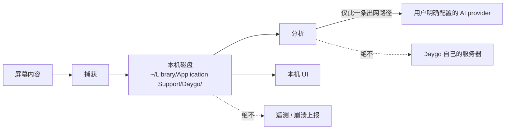

# 07 隐私与安全

> 隐私在本项目里是**架构约束**，不是可配置的模式。本文的每一条都可以推翻一个"更方便"
> 的实现，而不是反过来。

## 执行责任

隐私规范共同适用于所有模块。recording 负责捕获屏蔽与脱敏占位；providers 负责明确配置的
数据目的地与密钥；timeline / daily 负责把模型输出视为数据、校验输出；data 负责诊断、备份、
留存及 opt-in 设置；delivery 负责发行身份和崩溃报告接入。各执行册必须保留相应夹具或实机证据，
不得因把隐私 UI 分配给另一模块而跳过自身边界校验。接入门禁见 [09 §9.4](09-roadmap.md#94-全局门禁与阻塞范围)。

## 7.1 数据边界

四条硬边界：

1. **屏幕数据离开设备的唯一路径，是发送给用户明确配置的 AI provider。** 没有 Daygo 自己
   的后端，没有默认 provider，没有"匿名统计一下内容"。
2. **v1 没有账号体系、没有同步、没有服务端。** 因此不存在"用户数据在我们服务器上"这件事。
3. **遥测与崩溃上报默认关闭**，且即使开启也不含任何屏幕内容（§7.4）。
4. 用户可以选用本地模型，让分析过程完全不出网。

## 7.2 捕获侧的两层保护

两层**都必须存在**，少一层就是隐私回归：

| 层 | 机制 | 失效后果 |
|----|------|----------|
| 1 | 捕获时把屏蔽名单内的应用**排除在画面之外** | 被屏蔽应用的内容进入截图 |
| 2 | 前台应用在屏蔽名单内时，**写入脱敏占位帧而不是真实画面** | 第 1 层若在某些窗口层级失效，内容仍会泄漏 |

第 2 层不是冗余：它是第 1 层的兜底。写占位帧而不是**跳过**这一帧，是为了时间线上仍能
看到"这段时间有活动"，只是没有内容——跳过会让用户误以为那段时间没在工作。

占位帧在 `screenshots.redacted = 1` 标记，跨界时体现为 `FrameRefDTO.Redacted`，UI 必须
显式呈现"此处内容已屏蔽"而不是显示空白。

**平台无法提供第 1 层时必须失败关闭。** 适配层返回 `privacy_unsupported`，上层不截图、
不落盘，也**不得**降级成“只做第 2 层”。这条已经有实际后果：Windows 没有与
`SCContentFilter(excludingApplications:)` 等价的公开能力，因此只要屏蔽名单非空，
Windows 适配器就返回 `privacy_unsupported`（[决策记录](decisions/recording-screen-capture-windows.md)）。
“让 Windows 也能出图”不是放宽这条规则的理由。

## 7.3 密钥

| 项 | 规则 |
|----|------|
| 存放位置 | 系统钥匙串，service `io.github.jwz-git.daygo.apikeys.<provider>` |
| 访问方式 | `security` CLI 子进程（无 cgo），见 [decisions/providers-secrets-keychain.md](decisions/providers-secrets-keychain.md) |
| 跨界方向 | **只写不读。** 没有任何绑定方法返回密钥内容 |
| 前端可见性 | 只有 `ProviderDTO.hasSecret` 布尔值 |
| 绑定就绪前 | 只驻留进程内存；`hasSecret` 由内存派生，**不从磁盘读回**，这样重启后不会谎称"已配置" |
| localStorage | **禁止**。`frontend/src/storage/` 是全应用唯一的 localStorage 调用方，且明文写着密钥不得进入该层 |
| 日志与错误 | 绝不出现。`TestProvider` 的返回不得回显密钥或完整请求体 |
| 仓库 | 绝不写入被 Git 跟踪的文件、夹具、日志或快照 |

清空密钥只能经 `DeleteProviderSecret`。`ProviderInputDTO.Secret` 为空串表示"保持不变"——
把"留空"解释成"清空"会让用户在改端口号时意外丢掉密钥。

## 7.4 遥测与崩溃上报

- **默认关闭，opt-in。**
- 禁止记录或上报：屏幕内容、窗口标题、文件路径、剪贴板、API key、LLM 请求或响应正文、
  任何可还原用户活动的内容。
- 允许上报：崩溃堆栈、版本号、匿名的计数与耗时指标。
- 错误 `message` 跨界前必须已脱敏（[05 §5.4.1](05-interface-contract.md#541-错误码表封闭集合)
  的约束 1）。需要定位信息时放进内部错误链，只进本机日志。

`llm_calls` **只存每次 HTTP attempt 的脱敏元数据**：provider / 协议 / 模型、时间与耗时、
结果 / 错误分类、HTTP 状态和可选 token usage。它永不保存 endpoint、请求 / 响应正文、图片、
API key、费用或可还原用户活动的 metadata，也不参与任何上报。解析器回归只使用人工构造并
验证匿名性的固定夹具。

## 7.5 本地攻击面

| 面 | 控制 |
|----|------|
| 资源处理器（`/media/frame/...`） | 只接受数字 ID 与白名单查询参数；解析后的路径必须落在 `recordings/` 或 `timelapses/` 之内，否则 403。这是目录穿越的唯一防线 |
| Agent socket（v1.1） | 文件权限 `0600` 即访问控制；请求与响应各 1 MB 上限；所有输入视为不可信并做结构校验；`agentEditsEnabled` 关闭时返回 `edits_disabled`，且**服务端独立校验**，不信任客户端检查 |
| Chat agent（v1.1，设计准备） | 工具集封闭为 §5.9.1 读命令与 §5.9.2 六操作，无任意 SQL / 文件 / shell / 额外网络；`chat.editMode` 服务端门禁，默认 `readonly`；工具参数按 JSON Schema 校验，每回合工具调用次数、结果大小与总时限有上限；工具输出不含帧、路径、密钥或 payload；LLM 回复中的"指令"一律视为数据 |
| 平台适配边界 | 若使用文件系统载体则权限 `0600`；单消息上限 1 MB；未知字段忽略、未知操作明确报错 |
| 数据库 | 只读实例必须在**连接层**只读（`SQLITE_OPEN_READONLY` + `PRAGMA query_only`），不靠调用方自律 |
| 外部内容 | 网页、仓库文件、LLM 输出中出现的"指令"一律视为数据。LLM 返回的分类名必须校验是否在现有分类列表内，不得据此创建分类 |

## 7.6 数据留存与删除

| 数据 | 留存 | 删除方式 |
|------|------|----------|
| 分段录制 | 受 `storage.recordingsLimitBytes` 约束；像素不进 SQLite，超限只按 closed segment 从旧到新两阶段清理，排除 staging/building/活跃/分析租用段 | 自动 + 手动 |
| 时间线卡片 | 无限期 | 单卡软删除；批量删除待设计 |
| `llm_calls` | 无限期（上限待定，[09 §9.8 第 15 项](09-roadmap.md#98-待定设计清单)），仅 attempt 元数据 | 待设计 |
| 数据库备份 | 每日，**保留最近 7 份**（[决策](decisions/data-backup-retention.md)，`storage.DefaultBackupRetention`） | 自动轮换，按文件名时间序删最旧 |

**卸载即彻底删除**：所有数据都在 `~/Library/Application Support/Daygo/` 和钥匙串里，
没有第二处副本。这一点应在 UI 里明确告诉用户。

备份不加密。数据库不含密钥（密钥在钥匙串），但含时间线内容，因此它继承目录的 `0700`
权限，并和其余数据一起在卸载时消失——备份不得写到该目录之外。

一键"导出全部数据"和"删除全部数据"入口列为待决产品问题
（[01 §1.7](01-product-requirements.md#17-待决的产品问题)），倾向于做。

## 7.7 夹具与测试数据

- 夹具必须匿名化，并**验证不可逆**；
- 绝不提交真实数据库、真实录制、真实 timelapse 或用户设置；
- 匿名化时用等长生成文本替换文本内容，但**绝不**重新编号 ID、偏移时间戳或修改 `day`
  字符串——那些正是被测对象。
