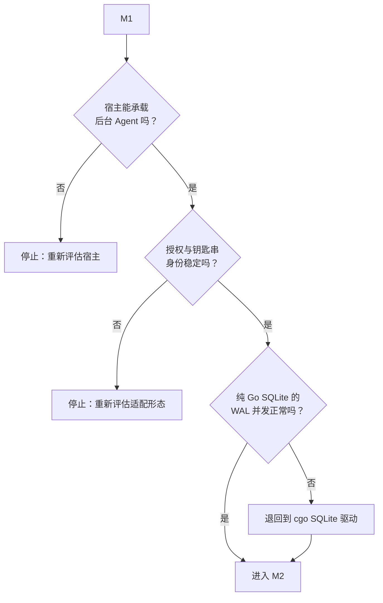

# 09 开发路线图

> 里程碑按**风险从高到低**排序，不按功能从易到难排序。理由见 §9.6：能推翻整个项目前提的
> 问题必须最先问。

## 9.1 里程碑概览

| M | 目标 | 退出条件 |
|---|------|----------|
| **M0** | 桌面外壳与前端骨架 | 应用能启动、能路由、能切主题与语言，设置能持久化 |
| **M1** | 宿主能力验证 + platform 端口 + fake | **证明宿主能承载后台 Agent**，并落盘适配层选型决策 |
| **M2** | 存储与设置真正落地 | schema、迁移、设置与 provider 全链路可用，绑定层接管前端本地存储 |
| **M3** | 捕获与分析 | 连续 7 天自用，时间线由真实捕获与分析产生 |
| **M4** | v1 界面完整 | 时间线 + 每日 + 每周 + 全部设置分区可日常使用 |
| **M5** | 发布 | 签名、公证、自动更新链路打通，首个公开版本 |

## 9.2 M0 — 桌面外壳与前端骨架

**状态：部分完成。**

已落盘：

- Wails v2 宿主 + Vue 3 + TypeScript + Vite 构建链；
- vue-router（hash 模式）与四个页面骨架；
- vue-i18n，`zh-CN` 默认 / `en` 回退，key 结构由 `zh-CN` 提供类型；
- 三态主题（`system`/`light`/`dark`），解析后写 `<html data-dg-appearance>`；
- 设计令牌（浅色 / 深色两套 CSS 自定义属性）；
- Provider 设置界面（自定义 provider，`openai` / `anthropic` 两种协议）；
- 带版本信封的 localStorage 适配层（`frontend/src/storage/`）。

未完成：

- [ ] 前端单元测试运行器（当前无测试框架）；
- [ ] `api/` 目录与错误解析 wrapper（等 M1 的绑定）。

**退出条件**：`npm run typecheck`、`npm run build`、`CGO_ENABLED=0 go build ./...`
全绿，应用能启动并在浅色/深色、中文/英文之间切换且刷新后保持。

## 9.3 M1 — 宿主能力验证与 platform 端口

**这是全项目风险最高的里程碑，必须在任何 UI 扩张之前完成。**

范围：

- [ ] **限时一周的宿主探针**：验证 [06 §6.6](06-native-integration.md#66-选型时要回答的问题)
      的 9 个问题；
- [ ] `internal/platform` 端口定义（接口，无实现）；
- [ ] `internal/platform/fake` 完整实现；
- [ ] `platformtest.Suite` 契约测试套件；
- [ ] `internal/app` 骨架 + `apperr` 错误类型 + 事件常量；
- [ ] 首批绑定：`GetCapabilities`、`GetDayContext`、`GetRecordingState`、
      `GetPermissionState`、`RequestScreenRecordingPermission`、`OpenSystemSettings`；
- [ ] 前端 `api/` wrapper 与错误解析；
- [ ] 签名与公证流水线（用桩适配层打通，不等到 M5）。

**退出条件（硬门禁）**：

1. 关闭最后一个窗口后进程存活，10 分钟后 goroutine 仍在运行（IT-14）；
2. 状态栏项可用，能重新打开窗口；
3. 激活策略可在运行时切换；
4. 干净机器上通过 Gatekeeper 校验；
5. `docs/decisions/M1-native-adapter.md` 落盘，9 个问题逐条有答案。

**任一条失败就停止 UI 扩张，重新评估宿主架构**——不要带着未验证的前提继续往前修。

## 9.4 M2 — 存储与设置

范围：

- [ ] `internal/storage`：连接层、PRAGMA、迁移链、打开与恢复；
- [ ] 全部表的 schema（[03](03-data-model.md)）与 repository；
- [ ] `internal/settings`：类型化访问、规范化与夹取；
- [ ] `internal/timeutil`：4 点边界、时钟串、周边界 + 五时区夹具；
- [ ] 设置、分类、provider 的全部绑定方法；
- [ ] 系统钥匙串读写（`Secrets` 端口的真实实现）；
- [ ] 前端从 localStorage 切到绑定：只改 `stores/` 里的 `hydrate()`/`persist()` 两处函数体，
      组件不动；
- [ ] 写入锁与只读实例降级。

**退出条件**：设置页的每一项都真正落库；provider 密钥进钥匙串且重启后 `hasSecret` 正确；
DB-1 到 DB-9 全绿；`timeutil` 的五时区属性测试全绿。

## 9.5 M3 — 捕获与分析

范围：

- [ ] 平台适配层的真实实现（按 M1 决策）；
- [ ] 捕获状态机、分段轮换、崩溃对账；
- [ ] `internal/analysis`：调度器、分批、空闲判定、流水线、重处理；
- [ ] `internal/ai`：provider 抽象、`openai` 与 `anthropic` 两种协议、重试与回退装饰器、
      输出解析与修复；
- [ ] `ReplaceCardsInRange`（整个存储层风险最高的方法）；
- [ ] 时间线绑定与帧资源处理器；
- [ ] 时间线界面接真实数据。

**退出条件**：连续 7 天自用，[08 §8.6.2](08-testing-strategy.md#862-长时间断言) 的长时间
断言全部通过；捕获连续性无未解释的缺口。

## 9.6 M4 — v1 界面完整

范围：

- [ ] 每日摘要 / 站会；
- [ ] 每周视图（合计与占比；图表形态待产品决定）；
- [ ] 存储、隐私设置分区（磁盘上限、屏蔽名单、已安装应用选择器）；
- [ ] 诊断界面（`GetDiagnostics`）；
- [ ] 日记与目标；
- [ ] 空态、错误态、加载态的完整覆盖；
- [ ] 数据导出与删除入口（若产品决定要做）。

**退出条件**：v1 范围内每个界面都能日常使用；无占位页；全部文案经 i18n 且两种语言完整。

## 9.7 M5 — 发布

范围：

- [ ] 自动更新链路（实现待定设计）；
- [ ] 首次运行引导（授权、provider 配置、分类初始化）；
- [ ] 崩溃上报（opt-in）；
- [ ] 从干净机器安装到升级的完整验收；
- [ ] `daygo` CLI 与 agent socket（可推迟到 v1.1）。

**退出条件**：在从未运行过开发构建的机器上完成"下载 → 安装 → 授权 → 产出第一条时间线"
全流程；一次真实的版本升级验收通过且数据完整保留。

---

## 9.8 待定设计清单

本目录里所有标注 **待定设计** 的条目，集中在这里跟踪。每一条都要有决定者和截止里程碑。

| # | 待定项 | 出处 | 决定者 | 截止 |
|---|--------|------|--------|------|
| 1 | 平台适配层形态（进程内 / 进程外 / 原生宿主） | [06 §6.6](06-native-integration.md#66-选型时要回答的问题) | 工程 | M1 |
| 2 | 屏幕捕获的具体实现方式 | [06 §6.2](06-native-integration.md#62-需要的平台能力清单) 第 5 项 | 工程 | M1 |
| 3 | 系统事件（睡眠/锁屏/屏保）的订阅方式 | 同上第 15 项 | 工程 | M1 |
| 4 | 系统钥匙串的访问方式 | 同上第 21 项 | 工程 | M1 |
| 5 | 状态栏项与激活策略的实现方式 | 同上第 18、19 项 | 工程 | M1 |
| 6 | 适配边界的协议（若为进程外） | [05 §5.8](05-interface-contract.md#58-b5平台适配边界待定设计) | 工程 | M1 |
| 7 | 分段容器与编解码格式 | [03 §3.4](03-data-model.md#34-帧与分段) | 工程 | M2 |
| 8 | 帧解码与视频合成的实现方式 | [06 §6.2](06-native-integration.md#62-需要的平台能力清单) 第 8–10 项 | 工程 | M2 |
| 9 | 自动更新链路 | 同上第 22 项 | 工程 | M5 |
| 10 | 数据库备份保留份数 | [03 §3.6](03-data-model.md#36-维护任务) | 工程 | M2 |
| 11 | 时钟串无法解析时：静默丢弃还是显式提示 | [01 §1.7](01-product-requirements.md#17-待决的产品问题) | 产品 | M3 |
| 12 | 统一重试策略后的用户可观察行为 | 同上 | 产品 | M3 |
| 13 | 每周视图的图表形态 | 同上 | 产品 + 设计 | M4 |
| 14 | 数据导出与删除的一键入口 | 同上 | 产品 | M4 |
| 15 | `llm_calls` 与卡片的留存上限 | [07 §7.6](07-privacy-security.md#76-数据留存与删除) | 产品 | M4 |
| 16 | Chat 是否进入 v1.1 | [01 §1.7](01-product-requirements.md#17-待决的产品问题) | 范围 | v1 后 |

决定落盘到 `docs/decisions/<里程碑>-<主题>.md`，并同步更新对应文档里的"待定设计"标注。
**不要让待定项靠沉默变成既成事实**——某个实现悄悄落盘不等于决策已做。

## 9.9 排序理由

三类风险决定了这个顺序：

前两个是**前提**风险：如果假设不成立，再谨慎的工程实现也救不回来。第三个是**可退**风险：
有明确的后备方案，代价只是一个包引入 cgo。

把它们全部压到 M1，是为了让"这个项目做不成"这件事在投入 UI 重写**之前**就暴露出来。
