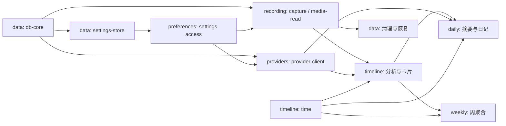

# 09 功能模块开发路线

> 用户功能模块是设计、开发和验收单位。各模块可同时推进，接入顺序由**具体能力**决定，
> 不要求先完成某个完整模块。公共规范仍以 01–08 为准，字段级契约以 05 为准。
> 历史 M0–M5 编号不再用于排期、能力可用性或决策截止点。

## 9.1 模块总表

模块标识用于开发协作，不是发布版本，也不是新的运行时 feature flag。表格顺序不代表开工顺序。
“部分实现”只表示有代码；页面骨架、编译探针和 fake 均不等于用户闭环可用。

> **验收确认（2026-09-22）**：用户在真实 macOS 上实测确认已实现能力均已验收，包括
> G-host 常驻宿主、真实 Provider 闭环、录制到时间线的用户闭环（G-loop）与长期观察
> （G-stability）；实测但未保留逐项运行记录。签名 / 公证、干净机 Gatekeeper 与真实分发 ·
> 升级身份仍缺正式证书材料，按未验收（G-native 分发部分）记录；Windows / Linux 真机矩阵与
> 尚未实现的功能亦仍按各自状态记录。

| 模块 / 执行册 | 用户结果与职责 | 当前实现进度 | 当前验证状态 |
|---|---|---|---|
| [recording 常驻录制](modules/recording.md) | 授权、状态栏、录制暂停、系统事件、隐私屏蔽、分段保存与恢复 | 部分实现：Capture 端口 / fake、macOS 单次截图与 HEVC 帧分段追加（Dayflow 方式，AVAssetWriter + VideoToolbox）、Go recorder、pending 对账与 screenshots 提交（迁移 v15）、应用隐私选择、启动自动录制；状态栏本地化控制、Cmd+Q / Dock 软退出与窗口恢复；09-26 新增 Dock 偏好消费者、状态 / 图标 / 恢复时刻、禁用守卫、脱敏非阻塞反馈、主菜单本地化及收尾失败退出选择；支持 HEVC 硬件段追加与 legacy JPEG 直读回退 | Go / fake 契约与 macOS 真实像素 smoke 通过；截至 09-22 的状态栏观感、G-host、隐私双保护、完整 MC / WC 矩阵及长期观察经用户确认验收（无逐项运行记录）。09-26 增量通过 Go / 原生匿名 smoke / 前端夹具，真实 Wails Dock、语言、十分钟捕获与关机 / 注销回归待验收 |
| [providers AI 接入](modules/providers.md) | Provider、密钥、回退链路由、协议客户端、连接测试与模型列表 | 部分实现：三协议客户端、重试 / 回退、Provider 落库、有序路由链、macOS Keychain、CRUD / 密钥 / 模型列表 / 连接测试绑定与前端 store；旧 localStorage 仅用于一次性迁移 | Go 单元、Secrets fake、匿名 TLS fixture 与一次 macOS 钥匙串 smoke 通过；真实 Provider、同签名重启 / 升级身份与完整 Wails 闭环已于 2026-09-22 经用户确认完成验收（用户确认；无逐项运行记录） |
| [timeline 自动时间线](modules/timeline.md) | 分批分析、卡片、分类、搜索、帧条、编辑和重处理 | 部分实现：时间 / 周边界、卡片与分类 repository、两阶段分析流水线、失败批次重试、卡片编辑 / 删除、分类保存、日视图与失败 / 处理中状态；跨 4 点卡片按日投影、裁剪时长与周明细；帧回放（`GetCardMedia` + `/media/frame` 资源）、周视图、持久化卡片审阅、按卡片来源批次重处理与日历选择已提交 | Go 分批、时间、事务、重试、审阅读回和流水线夹具及前端构建通过；跨 4 点匿名夹具于 2026-09-23 通过，真实历史库已随 2026-09-22 用户实测闭环一并验收（无逐项运行记录）；真实截图 → 真实 Provider → 卡片的 Wails 闭环、帧回放真机表现与 G-loop 已于 2026-09-22 经用户确认完成验收（用户确认；无逐项运行记录）；搜索尚未实现，不在本次验收范围 |
| [daily 每日复盘](modules/daily.md) | 每日摘要、日记、目标和提醒 | 部分实现：日记 / 目标持久化与编辑、日报读写 repository / 绑定 / UI（v13）、`GenerateDailyRecap` 经分析 Provider 生成并覆盖重写、工作流与指标展示 | Go 存储与只读守卫、前端类型 / 构建通过；生成调度、通知、重启读回与 `wails dev` 真机闭环已于 2026-09-22 经用户确认完成验收（用户确认；无逐项运行记录） |
| [weekly 每周复盘](modules/weekly.md) | 周时长、专注时长和分类占比 | 部分实现：周概览 / 分类分布前端切片、真实只读聚合与 `GetWeeklyDashboard` 绑定（周边界周一 4 点对齐已定）、按日明细、洞察与节奏面板（`WeeklyInsightsDTO` / `WeeklyDayDTO`）、开发专用匿名样例 | Go 单元（周边界夹具与属性测试、聚合排除规则、非周一拒绝）、前端类型 / 构建通过；真实卡片周独立验收与跨周长期观察已于 2026-09-22 经用户确认完成（用户确认；无逐项运行记录） |
| [data 数据管理与诊断](modules/data.md) | 数据库基础、锁、维护、磁盘限制、诊断和遥测开关 | 部分实现：db-core、settings-store、diagnostics、checkpoint、备份 / 损坏恢复、磁盘上限消费与分段文件清理；存储设置页已接入 | macOS DB-1–8 与 IT-13 通过（含一小时 DB-8）；清理已支持按 segment_path 整段清理，DB-9 / IT-12 真实宿主长期观察已于 2026-09-22 经用户确认完成验收（用户确认；无逐项运行记录） |
| [preferences 应用偏好](modules/preferences.md) | 外观、语言、设置容器、通用设置与前端接入 | 部分实现：外壳、路由、九语言 i18n、后端外观 / 语言接入、模型输出语言与识别增强设置、统一 UI 可见性与隐藏媒体暂停、macOS Dock 开关 | Go settings 契约、前端 typecheck / unit / build 通过；截至 09-22 已实现的真实 Wails 偏好重启闭环经用户确认（无逐项记录）。全量 DTO / 遥测消费者未完成；09-26 新增 Dock 消费者的 Go 与原生夹具通过，真实切换 / 重启待回归；不再把当时未接入的 Dock 消费者计入历史验收 |
| [delivery 安装与更新](modules/delivery.md) | 身份和分发实验、首次引导、安装、升级、安全重启 | 部分实现：GitHub Actions 已实现发布后自动构建、上传 macOS / Windows 安装器，正式版还生成签名 appcast；应用内 Sparkle / WinSparkle 适配器、设置 UI 和安全收尾已落盘 | Go / 前端 / appcast 夹具通过；发布工作流实现已核对；签名、公证、干净机安装与客户端升级仍缺正式证书材料，属 G-native 未验收 |
| [agent 对外程序化接口](modules/agent.md) | CLI 查询、agent.sock 受控写入、MCP 工具面 | 部分实现：CLI 读命令与 `write` 写命令、`daygo mcp` stdio 服务（五读六写）、宿主在读写实例上监听 `agent.sock` 并经与 chat 同源的共享执行器写入、`agent-writes.log` 来源审计；设置页给出 MCP 配置 / CLI 示例与 socket 状态（`GetAgentConnection`） | Go 协议、CLI 写命令（真实 socket + fake handler）、宿主端到端夹具（默认拒绝 → 开启写入 → `goal:updated` 事件 + 审计 → 关闭再拒绝）与前端单元测试通过；真实 MCP 客户端多日闭环与 search 未完成，属未验收 |
| [chat 应用内对话](modules/chat.md) | 自然语言问答与沙箱内受控增删改查 | 部分实现：多会话纯对话、会话级 Provider / 模型、11 个封闭工具的 agent 循环、只读 / 只读实例双门禁、调用预算 / 取消、`llm_calls` 审计元数据和工具消息 UI | Go 回合、参数校验、门禁、预算、取消及前端回归测试通过；真实 Provider Wails 闭环已于 2026-09-22 经用户确认完成验收（用户确认；无逐项运行记录）；search / status、独立审计日志与诊断计数尚未实现，且 chat v1 不交付 |

### 当前代码证据

**2026-09-26 长期内存切片**：原生单帧资源释放、8 / 4 / 8 MiB 图标 memo 预算、
256 像素缩略图及隐藏媒体释放均已实现；不卸载页面，不调整捕获 / Provider 配置。
`./scripts/gate.sh` 通过（前端 168 项单测；包含真实 SFC 的匿名 host renderer，非真实 WebKit），
macOS 原生 universal 构建及强制重新链接的分段 / 事件映射 smoke 通过。
原生三独立进程 600 次解码内存门禁通过，详细数值见 [recording 执行册](modules/recording.md)。
本轮真实关窗 10 分钟持续捕获、24 小时全进程 A/B 与 14 天 RSS 门禁待验证，
流程见 [内存对照](08-testing-strategy.md#长期内存对照流程2026-09-26)。历史验收不覆盖这些新增行为。

**此前记录的完整无头门禁：2026-09-23，审查问题修复后的未提交工作树，macOS / arm64。**
`./scripts/gate.sh` 全绿（`CGO_ENABLED=0 go build ./...`、`CGO_ENABLED=0 go test ./internal/...`、
`go vet ./...`、`gofmt -l .` 无输出、前端 `typecheck` 与 `build`）；
`GOOS=linux CGO_ENABLED=0 go build ./internal/...` 与 `GOOS=windows CGO_ENABLED=0 go build ./internal/...`
通过；前端 78 项单测通过。Windows Updater 测试源码交叉编译通过，但未在 Windows 真机运行。
**这只是本机无头基线**，不是 Linux 实机 CI、原生集成或长时间证据。

Linux Wails 桌面壳（v2 + GTK3 + WebKit2GTK）已具备初级适配：mac / Linux 窗口选项拆到
`options_<goos>.go`（`options_darwin.go` / `options_linux.go` 及对应 `_other.go`），
Go Core 在 Linux 下与 macOS 等价可用；`scripts/dev-linux.sh` 与 `scripts/build-linux.sh`
按 `pkg-config` 自动选择 `webkit2_41` / `webkit2_40` build tag。Linux Secrets 已按
[Secret Service 决策](decisions/providers-secrets-linux.md) 通过 `secret-tool` 接入；真实桌面钥环由用户确认验收（无逐项运行记录）；
Capture / System 仍返回 `unsupported`；原生形态与发布包已排期，按 §9.8 逐项落决策记录推进。

已落盘并有自动化覆盖：

- [storage](../internal/storage/)：连接与 PRAGMA 回读、迁移链（当前 v17，从 `app_settings`
  逐版增加 cards、recording、providers / chat、daily、analysis、分类种子、日报表、审查流、pending frame_index 与分段均摊）、
  POSIX `flock` / Windows `LockFileEx` 实例锁与只读降级、可观测读写封装、`app_settings` repository、
  cards / categories repository（`ReplaceCardsInRange` 单事务改写与时钟串派生）、
  `Checkpoint` / `Backup`（`VACUUM INTO`，保留 7 份）/ `RestoreFromBackup` / `IntegrityCheck`、
  `Stats`。匿名夹具在 [`testdata/`](../internal/storage/testdata/)。
- [settings](../internal/settings/settings.go)：类型化设置访问、默认值、规范化与夹取、
  `Patch` 的 nil 语义。
- [ai](../internal/ai/)：三种协议客户端（`openai` / `openai_responses` / `anthropic`）、
  统一 `Generate`、重试与粘性回退、脱敏 attempt 观测、JSON 提取与 schema 校验、
  内嵌匿名 PNG 的连接探针；全部用匿名 TLS fixture 验证。
  内部正式绑定方法、临时截图联调绑定（清单见 [05 §5.2.1](05-interface-contract.md#521-按功能能力的可用性)）、
  `apperr` 封闭码表、事件常量与可注入的事件发布、storage → apperr 的单点映射。
- [platform](../internal/platform/)：端口与值类型、Capture fake、
  [四套契约套件](../internal/platform/platformtest/suite.go)（基础 / 授权 / 隐私 / 无显示器）。
- [timeutil](../internal/timeutil/timeutil.go)：凌晨 4 点逻辑日、日历日与逻辑日窗口。

已落盘；其中 macOS 真机能力已于 2026-09-22 经用户实测验收，Windows / Linux 真机矩阵与分发身份仍属**有限验证**：

- [macOS Capture](../internal/platform/darwin/capture.go) + [Swift 实现](../native/darwin/Sources/)：
  做过一次真实截图 smoke（1920×1080 → 1280×720 JPEG）及 Calculator `.app` 身份 + 按 Bundle ID
  回查 smoke；picker 原生面板视觉验收、Capture 契约套件接入、MC 实机矩阵、正式应用 TCC 身份与长期观察已于 2026-09-22 经用户确认完成验收（依据为用户确认，见 §9.1 顶部说明）。
- [Windows Capture](../internal/platform/windows/capture.go) + [DXGI/WGC 实现](../native/windows/Sources/)：
  Windows 11 上原生与 Go cgo 单次 smoke 均得到可解码的 1280×720 非黑 JPEG；DXGI 会跳过
  pointer-only 的全零首帧；非空屏蔽名单在 build 26100+ 改走 WGC 窗口排除，更旧系统失败关闭。
  Edge 基线 / 排除图像已证明后台窗口从画面消失且底层窗口可见；完整 WC 矩阵、光标、长期资源与发布身份已于 2026-09-22 经用户确认完成验收（用户确认；无逐项运行记录）。
  `storage.Open` 已通过 `LockFileEx` 接通写锁/捕获锁、只读降级和进程终止释放 smoke。
  Go 1.25 的 Windows+cgo debug PE 缺陷已在 `scripts/dev.ps1` 局部规避；无 Windows `System`
  适配器时的状态栏调用已守卫。只表示开发 EXE 可启动，不表示 Windows 宿主能力完成。
  共享 recorder 已通过 Wails 测试页完成一次 1 秒间隔、6 帧的真实落盘与 `screenshots` 提交闭环；
  数据库存储路径在 Windows 上也保持规范化的 `staging/...`。Windows 隐私选择与排除已有限接入；完整竞态、受保护内容与长期矩阵已于 2026-09-22 经用户确认完成验收（用户确认；无逐项运行记录）。
  见 [决策记录](decisions/recording-screen-capture-windows.md)。

仍未实现：timeline 搜索；agent 的 CLI / socket / MCP 已有基础实现，但真实 MCP 客户端闭环未验收。其余原列为未完成的验证项——完整常驻
宿主生命周期与 G-host、daily 的自动生成调度与通知、真实 Provider 与 7 / 14 天
长期闭环——已于 2026-09-22 经用户实测验收（无逐项运行记录，见 §9.1 顶部说明）；delivery 的发布自动化与 appcast 已实现，但签名 / 公证与真实分发 · 升级验证仍属 G-native 未验收。
HEVC 分段、`platform.Media`、帧资源处理器和按段清理已经落盘，其真机长期验证亦经用户于 2026-09-22 实测验收（无逐项运行记录）。
前端已有单元测试运行器和大部分生成绑定消费，但
[`api/dto.ts`](../frontend/src/api/dto.ts) 仍保留手写子集，尚未完成单一类型来源收口。
更早期的编译 / 链接探针（[验证门禁](decisions/recording-screen-capture.md#8-验证门禁)）
只证明当时能编译链接，临时源码未入库，不记为真实集成通过。

## 9.2 执行与状态规则

2026-09-26 宿主控制增量：macOS 菜单栏不可用时保留 Dock 恢复入口、激活策略确认 / 重试、
退出前分段收尾失败处理与关机 / 注销意图已接入；Go 夹具与独立原生合成事件 smoke 通过。
真实 G-host 回归与关机 / 注销仍待验收，证据见 [recording](modules/recording.md)。

同日菜单与偏好增量：Dock 保存值驱动策略且重开尊重偏好，状态栏区分只读 / 不可用 / 系统
暂停 / 截图重试与恢复时刻；原生反馈非阻塞，退出收尾失败默认保留应用。20 项主菜单标题与
新文案覆盖九种语言，既有快捷键保留，相同状态快照不重建菜单。共享状态栏 ABI 3 要求静态库 /
DLL 匹配重建；macOS 原生匿名 smoke 通过，Windows DLL / 通知区需 Windows 主机验证。

每个模块使用 [执行册模板](modules/_template.md)，保持实现进度与验证状态分开：
实现进度为“未开始 / 部分实现 / 实现齐备”；验证记录分别列单元、fake 契约、真实集成、
长期观察的通过 / 失败 / 未运行及证据。**“完成”要求实现齐备且该模块的真实用户闭环验收通过。**

每个实现切片先写可观察结果和失败条件，有风险的行为先固定输入与期望，再做最小实现、
契约测试、真实接入。纯前端偏好等无需原生能力的功能可用实际持久化交互验收；
涉及 OS 的行为必须在真实 macOS 上验收。不得用 mock 截图或心跳代替捕获证明。

依赖未实现时可基于公共契约提供测试 fake；它只能证明调用、状态、数据形状和既定行为，
不能证明原生授权、画面隐私、身份、网络可达性、持久化恢复或耗电。生产绑定不返回测试数据，
能力集合只报告真正可用的功能。能力具备独立证据后即可供消费者接入，无须等待负责模块全部完成。

同一共享接口、schema 或设置机制的变更以关注点清晰的提交依次合入；消费者围绕已确认契约
并行开发。破坏性契约修改须同提交更新 05、双侧测试与消费者；禁止各模块私建替代数据库、
复制 DTO 或拥有第二套设置事实来源。

## 9.3 能力接入表

本表是能力与消费者的关系，不是新的串行阶段。能力负责人负责公共边界的统一接入；
业务模块仍交付自身的表、repository、绑定和 UI。所有新表均走统一迁移链。

| 能力 | 唯一负责模块 | 契约与独立验收条件 | 解锁的消费者 |
|---|---|---|---|
| db-core | data | 03 §3.3、05 §5.6.2；连接、PRAGMA、迁移、只读连接、写入与捕获锁；DB-1/2/4/6/7/8、IT-13 对已实现范围通过 | 所有需要持久化的模块；不等维护 UI |
| settings-store | data | `app_settings` repository 在 `internal/storage`；往返、事务、迁移与错误路径通过 | preferences 的类型化访问 |
| settings-access | preferences | 05 §5.6.3；类型化读取、patch、规范化及变更事件契约；持久化接入需 settings-store | recording / providers / daily / data / delivery 的设置 |
| ui-bridge | preferences | 05 §5.5.5；生成 DTO、薄 wrapper、事件订阅与错误解析、前端测试运行器；各功能接入自己的绑定 | 所有界面；G-host 已于 2026-09-22 实测验收，正式扩张已解锁 |
| time | timeline | 03 §3.2/3.5；4 点逻辑日、日历日、时钟串、周边界、五时区夹具与属性测试按子能力验收 | recording 日期消费者、daily / weekly 及查询 |
| host | recording | 06 §6.6；窗口、状态栏、激活策略；G-host 实机证据已于 2026-09-22 实测验收 | 各模块的大规模 UI 扩张；不要求 timeline 已完成 |
| capture | recording | 05 §5.7；单次 Capture fake / 真实契约、隐私双保护、原子 JPEG、pending 对账；真实落库需 db-core | timeline 的帧输入、data 的后续媒体生命周期 |
| media-read | recording | 03 §3.4、05 §5.7；分段格式决策、探测、单帧与批量解码；IT-2/3/4 与崩溃夹具 | timeline 帧条及资源处理器、data 恢复与清理 |
| provider-client | providers | 05 §5.6.4；文本 / 图片 / JSON Schema、三种原生协议（openai / openai_responses / anthropic）、路由、取消、错误与重试、Secrets、纯元数据审计；匿名 TLS HTTP 夹具后再做用户配置服务的真实测试 | timeline 分析、daily 文本生成 |
| cards | timeline | 05 §5.6.2；卡片 / 分类 repository、范围串行化与事务、分类重命名、跳过计数、查询契约 | daily / weekly；不等时间线视觉打磨 |
| notifications | daily | System 通知端口、权限、提醒设置与取消；fake 后真实系统提醒验证 | 每日提醒与首次运行说明 |
| diagnostics | data | GetDiagnostics 及可观测封装；各模块提供匿名计数和耗时，字段与脱敏测试通过 | 所有功能的故障可见性、data 页面 |
| update | delivery | Updater 契约、状态事件、签名身份、收尾后重启、干净机器升级证据 | 完整应用升级 |

`Media.EncodeVideo` 与有界媒体缓存由 timeline 随媒体展示交付；端口仍由 recording 负责协调，
编码格式由共同决策冻结。录制无需等待 timelapse。System 的捕获 / 状态栏 / 自启 / Dock 能力归
recording，通知归 daily；共享类型的变更由 recording 协调，不能分别改出不兼容端口。

### 依赖示意

图中 data 的基础连接与后续维护是不同能力，不形成“data 整模块 ↔ recording 整模块”循环。
UI、平台探针、解析器和聚合逻辑均可使用契约输入独立推进。周模块不等待每日模块完成。

## 9.4 全局门禁与阻塞范围

| 门禁 | 限制的工作 | 仍可推进 | 解锁证据 |
|---|---|---|---|
| G-host 宿主 | 大规模 UI 扩张、宣称常驻录制可用 | 限时一周的宿主探针、核心逻辑、契约与必要验证界面 | 真实 macOS：关窗后至少 10 分钟进程存活且**持续离散捕获**，状态栏重开、激活策略切换；IT-14；心跳仅是前置探针。**已于 2026-09-22 经用户实测验收（无逐项运行记录），大规模 UI 扩张解锁** |
| G-native 原生与身份 | 未决能力的大规模原生实现、对应真实功能验收 | 候选实验、fake、与实现形态无关的消费者 | 06 §6.6 按能力记录结论；屏幕授权 / 钥匙串身份可行性已于 2026-09-22 经用户实测验收（无逐项运行记录）；签名公证、干净机器 Gatekeeper 与真实分发 · 升级身份仍缺正式证书材料，**未验收** |
| G-data 真实数据接入 | 将未验证链路用于真实记录或宣称数据安全 | 匿名夹具、受控集成实验、其他独立能力 | 隐私双保护、唯一 writer / capture owner、连接层只读、pending 对账、幂等提交与媒体恢复；对应 DB / IT / MC 测试。**已于 2026-09-22 经用户实测验收（无逐项运行记录）** |
| G-core 可移植核心 | 合入破坏纯 Go 或 Linux 核心门禁的变更 | 隔离实验、定位失败及重新决策 | 08 §8.8 的构建、测试、契约门禁；SQLite 实验失败不得自动切换为 cgo 驱动（持续性不变式，非一次性验收） |
| G-loop 用户闭环 | 标记录制到自动时间线闭环验收完成 | 单模块验收、故障修复、其他模块开发 | 真实配置 provider，连续 7 天自用，无未解释捕获缺口，失败可见且可操作。**已于 2026-09-22 经用户实测验收（无逐项运行记录）** |
| G-stability 长期稳定性 | 宣称长时间 / 边界稳定性完成 | 模块交付、累计观察和修复 | 08 §8.6.5 的 14 天窗口、跨一次 DST、跨周一分别记录；7 天不能代替这些证据。**长期观察已于 2026-09-22 经用户实测验收（无逐项运行记录）** |

门禁失败记录到对应能力：负责人、失败输入、观察、影响消费者、下一项验证。
G-host 是统一限制 UI 扩张的例外，其余失败只限制相关能力，不重建全项目串行等待。
有限探针允许用隔离的测试目录和匿名数据验证前提；不得在真实用户数据上试迁移。

## 9.5 共享职责与隐私归属

- **存储**：data 维护唯一连接、事务与可观测封装、迁移编号和锁；各功能实现自己的业务
  repository，SQL 始终只在 `internal/storage`。不要求一次创建未来功能的全部表。
- **设置**：data 交付 SQLite repository；preferences 交付类型化访问、生成绑定接入和页面容器；
  功能模块提出自身键、默认值、校验和行为，公共定义同步 03 / 05。按功能迁移旧 localStorage，
  验证落库和重启读回后切换来源，避免两处同时写；失败保持旧来源可恢复。密钥不走这条迁移。
- **基础类型与端口**：消费者侧接口、生成 DTO 和公共端口只有一套。平台 fake 与真实能力随
  使用方交付，不要求先实现所有平台端口。日期能力统一复用 `internal/timeutil`。
- **隐私**：recording 负责捕获双保护；providers 负责明确的数据目的地与密钥；
  timeline / daily 负责模型输出校验；data 负责诊断、备份与留存脱敏；delivery 负责发布身份与
  崩溃上报接入安全。07 的约束适用于所有模块，任何模块不得以“不是我的隐私功能”豁免。

## 9.6 集成检查点与证据

检查点按能力就绪触发，不是版本，也不要求所有模块同时结束。

| 检查点 | 参与能力 | 结果 |
|---|---|---|
| 持久化设置 | db-core + settings-store + settings-access + 一个功能分区 | 保存 → 事件 → 重拉 → 重启读回；无双写、密钥泄漏。Go 侧四段已就绪并通过单元验证；前端功能分区接入与真实重启交互已于 2026-09-22 经用户实测验收（无逐项运行记录） |
| 安全录制 | host + capture + media-read + db-core | IT-1–14 相关路径、MC 矩阵；真实帧可读、可恢复、可清理 |
| 自动时间线 | capture + provider-client + time + cards | 帧 → 分批 → 分析 → 卡片 → UI；G-loop，解析错误计数、重试不重复 |
| 洞察消费 | cards + time，daily 另需文本生成 / 通知 | 每日 / 每周可分别验收；日期、分类和空态正确 |
| 安装与升级 | 已完成的发布范围模块 + update | 干净机器安装授权到首条时间线、真实升级保留数据与身份、停止路径收尾 |

每条证据写日期、commit、环境、命令 / 人工步骤、输入夹具、期望、实际结果及限制；
敏感画面和密钥不入库。模块执行册保存自身证据，公共表链接它，避免多处维护通过状态。
发布只收集已完成模块及验证记录，不决定开工顺序；未经明确要求不生成或发布 release 产物。

## 9.7 需求、接口与测试归属

| 模块 | 用户故事 / 功能需求（01） | 主要接口、数据与测试责任 |
|---|---|---|
| recording | U6/8/10；F-C1–9、F-S5/8、F-L1/2/3 | 录制 / 授权 / System 绑定，screenshots、Capture/Media；IT-1–11/14、MC、WC 候选矩阵；C-1/2/3/4、H-3、M-5 |
| providers | U7；F-S1–4 | Provider / Secrets、协议客户端、providers 表、路由；协议 / 脱敏 / 密钥契约；C-3、M-6 的调用端 |
| timeline | U1/2/3；F-A1–6、F-V1–3、F-S7 | 时间线 / 分类 / 媒体绑定、批次 / observations / 卡片 / llm_calls；08 行为 1–6/8/9、DB-5、资源契约；H-2/4、M-2/4/6 |
| daily | U4；F-V4 | 每日 / 日记 / 目标、通知，03 §3.3.4 的日记与目标数据；日期、文本生成和提醒测试 |
| weekly | U5；F-V5 | WeeklyDashboard、卡片 / 分类只读聚合；08 行为 7、周边界测试 |
| data | U9；F-S6/9 的设置及数据处理 | GetDiagnostics、存储与维护；DB-1–9、IT-12/13；C-4、M-1、L-2，崩溃上报实现协同 delivery |
| preferences | F-V6/7；各功能共用的前端与设置契约 | GetCapabilities、Get/UpdateSettings、DTO / 错误 / 事件接入；主题 / 语言 / 重启读回；L-1 |
| delivery | F-L4；安装引导串联 U1/6/7/8 | Updater、签名、公证、身份与安全升级；C-3、M-3、L-2 |

H-1（UI 范围）归每个界面模块；各模块承担自身的 i18n、空态 / 错误态 / 加载态和取消测试。
05 §5.5.1 给出每个绑定的负责模块与接入条件；05 §5.10.3 的公共契约由能力负责人维护、
消费者执行。UI shell 的遗留测试和 wrapper 归 preferences，不再作为独立阶段。
卡片审阅判定（`card_reviews`）与摘要拇指评分（`card_ratings`）已由 timeline 的卡片审阅流与
详情页接入；其他未有完整用户交互 / 绑定的
目标数据仍归各模块设计跟踪，必须补齐范围与契约后才实现，不能仅因 03 列了表就暴露新功能。

## 9.8 待定设计清单

本清单是尚未定或需追认的设计决策；标 **已决定** 的给出结论与依据。截止点是首次需要该决策的
实现 / 接入动作，不是日历版本。**多平台适配相关项（#1 / #18 / #21 / #24）已提上日程**，
须尽快落各自决策记录并按 G-host / G-native 门禁推进，不再无限期搁置。

| # | 待定项 | 负责模块 / 决定者 | 必须决定的时机与规范 |
|---|---|---|---|
| 1 | 平台适配形态及宿主 | recording / 工程，delivery 协作 | 大规模原生实现前；06 §6.6、G-host/G-native |
| 2 | 屏幕捕获方式 | recording / 工程 | **已决定**：macOS 用 ScreenCaptureKit 离散单帧截图（`CaptureOnce`，无持续流），Windows 用 DXGI/WGC，见 [v2 实现与调用](decisions/recording-screen-capture-v2.md) 与 [跨平台规格](decisions/recording-screen-capture.md)；适配形态本身仍是 #1 |
| 3 | 系统事件订阅方式 | recording / 工程 | 恢复状态机真实接入前；06 §6.2 |
| 4 | 钥匙串访问方式与身份 | providers / 工程，delivery 协作 | **访问方式已决定**：macOS 用 `security` CLI，Windows 用 Credential Manager，Linux 用 Secret Service / `secret-tool`，见 [macOS 决策](decisions/providers-secrets-keychain.md) 与 [Linux 决策](decisions/providers-secrets-linux.md)；签名、升级与真实桌面身份行为仍属 G-native |
| 5 | 状态栏与激活策略 | recording / 工程 | G-host 已于 2026-09-22 实测验收；正式形态仍待定，需尽快落决策记录 |
| 6 | 适配协议（若进程外） | recording / 工程 | 两侧实现前；05 §5.8 |
| 7 | 分段容器与编码格式 | recording / 工程 | **已决定**：Dayflow 式 HEVC 帧段（捕获时直接追加，免 JPEG staging），见 [decisions/recording-frame-segments-hevc.md](decisions/recording-frame-segments-hevc.md)；按其 §5 切片实现，G-host 已于 2026-09-22 实测验收 |
| 8 | 帧解码与视频合成 | recording / 工程协调，timeline 消费 | 分别在 media-read / EncodeVideo 实现前；06 §6.2 |
| 9 | 自动更新链路 | delivery / 工程 | **GitHub Actions 发布自动化已实现**：Release 发布后补齐两端安装器；正式版在资产齐备并签名后上传 appcast。客户端仍采用 macOS Sparkle 2 / Windows WinSparkle + NSIS，见 [macOS 决策](decisions/delivery-auto-update.md)与 [Windows 决策](decisions/delivery-auto-update-windows.md)；真实升级状态单列于 delivery |
| 10 | 数据库备份保留份数 | data / 工程 | **已决定：7 份**，见 [decisions/data-backup-retention.md](decisions/data-backup-retention.md) |
| 11 | 解析失败的提示与处置体验 | timeline / 产品 | 时间线失败交互实现前；禁止静默丢弃已是硬约束 |
| 12 | 统一重试后的用户可观察行为 | timeline / 产品，providers 协作 | 重试入口与策略接入前 |
| 13 | 每周丰富图表与 DTO 子模型 | weekly / 产品 + 设计 | 热力图、应用关系或流向图进入范围前；现有聚合首屏不扩 DTO，见 05 §5.11 |
| 14 | 导出与批量删除入口 | data / 产品 | 新入口实现前；不据此自动扩大 v1 范围 |
| 15 | llm_calls 与卡片留存上限 | data / 产品 | 相关留存策略实现前；07 §7.6 |
| 16 | 已实现的 Chat 是否进入 v1.1 | delivery / 范围 | v1 明确不交付；v1 发布后评估后续范围，实现与验证状态见 [modules/chat](modules/chat.md) |
| 17 | apiRevision 的生产检查 | preferences / 工程 | 前后端版本不一致处理接入前；05 §5.10 |
| 18 | Windows 发布范围 | delivery / 范围，recording 提供证据 | **已排期，发布门槛未清空**。DXGI/WGC 单次真实像素 smoke、通知区/系统事件实现、`LockFileEx` 实例锁及 NSIS 验收入口已落盘（[决策记录](decisions/recording-screen-capture-windows.md)）。进入发布前仍需：[WC](08-testing-strategy.md#863-wc真实-windows-捕获矩阵) 其余项、[WD](08-testing-strategy.md#864-wd真实-windows-分发矩阵)、DB-8、捕获指示、长期资源与真实分发身份全部通过 |
| 19 | 每日摘要 / 日记 summary 的生成触发、刷新与失败交互 | daily / 产品 + 工程 | 生成切片实现前；若新增绑定先补 05 与双侧契约，不假定现有查询方法就是生成入口 |
| 20 | 多显示器是否恢复"跟随光标的活跃显示器" | recording / 产品 + 工程 | 多显示器支持进入范围前；当前冻结为系统主显示器（[04 §4.1.2](04-data-flow.md#412-只截一块显示器系统主显示器)），改动会给端口加字段和跨调用状态 |
| 21 | Windows 截图是否合成鼠标指针 | recording / 工程 | **已决定**：ABI 将 `ShowsCursor` 定为平台尽力而为；Windows v1 不合成指针（Desktop Duplication 不含指针），置位记为 no-op 且文档化，指针合成留作后续可选增强。见 [Windows 决策记录 §3](decisions/recording-screen-capture-windows.md#3-与-macos-的差异四条不能忽略) |
| 22 | MCP 传输与进程模型（stdio 子进程 vs 宿主内 HTTP；工具粒度与审计来源标记随之一并定） | agent / 工程，delivery 协作 | **传输已决定**：stdio 子进程（`daygo mcp`），读走只读 DB、写走 `agent.sock`；工具粒度=逐命令映射（读=timeline/card/daily/weekly/categories，写=六操作），来源标记随之落（`source` 字段，默认 `agent.sock`，MCP 标 `mcp`）。见 [决策记录](decisions/agent-mcp-transport.md) 与 [05 §5.9.3](05-interface-contract.md#593-mcp-服务器)。基础实现（CLI 读 / bridge 写通道 / `daygo mcp` 骨架）已落；真实客户端多日闭环属 G 级未验收 |
| 23 | Chat 会话模型、流式输出、消息留存与 provider 路由 | chat / 产品 + 工程 | **会话模型、流式、provider 路由已决定**：多会话、原子消息、会话级 provider 选择（必选，新会话默认路由链首位，不回退），见 [decisions/chat-session-model.md](decisions/chat-session-model.md)；消息留存与审计来源标记仍待定，与 #15 / #22 一并定 |
| 24 | Linux 适配器形态 | recording / 工程，delivery 协作 | **已排期**。Linux 桌面壳与构建入口已有初级适配；Secrets 已决定使用 Secret Service / `secret-tool`，见 [Secret Service 决策](decisions/providers-secrets-linux.md)。Capture / System / 状态栏与发布包形态见 [Linux 截图决策](decisions/recording-screen-capture-linux.md)（X11 vs Wayland、Portal 接口及 deb / rpm / AppImage 取舍，逐项决策中）|
| 25 | Windows 终端 CLI 入口（发布构建为 `-H windowsgui` GUI 子系统，终端无输出；候选：随安装包附带控制台子系统的 `daygo-cli.exe`，或维持仅 MCP） | agent / 工程，delivery 协作 | **待定设计**（2026-09-25 用户确认暂缓）。当前 Windows 设置页只提供 MCP 配置、不展示 CLI；决策前不改安装包内容。见 [agent 执行册](modules/agent.md) |

决定写入 `docs/decisions/<module>-<topic>.md`，记录候选、实验、结果、边界与回退，
同步相应公共规范。无证据不标为已决定。捕获旧文档路径仅保留历史跳转。

## 9.9 开始与结束一次工作

1. 选择功能模块及具体能力，读执行册与引用的公共规范，检查代码事实及阻塞条件。
2. 写出本次输入、可观察结果、失败条件和最小切片；有风险先补匿名夹具。
3. 按契约实现并验证；共享边界的小提交依次合入，其他模块按已确认契约继续推进。
4. 更新模块证据、能力接入状态与待决项；保持“fake 通过”和“真实集成通过”分开。
5. 完成一个内部一致、可独立验证的成果后提交；报告模块 / 能力、命令及结果、限制与回退。

不为贴合功能执行册而迁移现有代码目录；功能模块是协作单位，02 的技术分层仍然适用。
