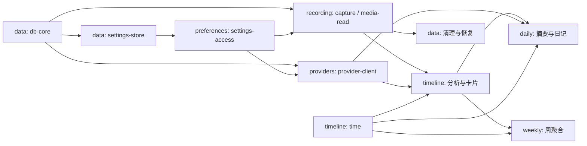

# 09 功能模块开发路线

> 用户功能模块是设计、开发和验收单位。各模块可同时推进，接入顺序由**具体能力**决定，
> 不要求先完成某个完整模块。公共规范仍以 01–08 为准，字段级契约以 05 为准。
> 历史 M0–M5 编号不再用于排期、能力可用性或决策截止点。

## 9.1 模块总表

模块标识用于开发协作，不是发布版本，也不是新的运行时 feature flag。表格顺序不代表开工顺序。
“部分实现”只表示有代码；页面骨架、编译探针和 fake 均不等于用户闭环可用。

| 模块 / 执行册 | 用户结果与职责 | 当前实现进度 | 当前验证状态 |
|---|---|---|---|
| [recording 常驻录制](modules/recording.md) | 授权、状态栏、录制暂停、系统事件、隐私屏蔽、分段保存与恢复 | 部分实现：端口、Capture fake、绑定骨架 | 部分单元 / fake 契约通过；真实集成未验收 |
| [providers AI 接入](modules/providers.md) | Provider、密钥、主备路由、协议客户端和连接测试 | 部分实现：前端配置及无密钥本地存储 | 类型检查通过；真实集成未验收 |
| [timeline 自动时间线](modules/timeline.md) | 分批分析、卡片、分类、搜索、帧条、编辑和重处理 | 部分实现：时间函数、日期绑定、页面骨架 | 已有时间函数单元通过；闭环未验收 |
| [daily 每日复盘](modules/daily.md) | 每日摘要、日记、目标和提醒 | 仅页面骨架，功能未开始 | 未验收 |
| [weekly 每周复盘](modules/weekly.md) | 周时长、专注时长和分类占比 | 仅页面骨架，功能未开始 | 未验收 |
| [data 数据管理与诊断](modules/data.md) | 数据库基础、锁、维护、磁盘限制、诊断和遥测开关 | 部分实现：db-core、settings-store、diagnostics、checkpoint 与备份 | 单元与并发 smoke 通过；1 小时 DB-8、清理与诊断 UI 未运行 |
| [preferences 应用偏好](modules/preferences.md) | 外观、语言、设置容器、通用设置与前端接入 | 部分实现：外壳、路由、主题、i18n、本地偏好、settings-access | 类型检查与 Go 单元通过；前端绑定持久化未验收 |
| [delivery 安装与更新](modules/delivery.md) | 身份和分发实验、首次引导、安装、升级、安全重启 | 部分实现：开发构建链 | 原生身份、签名、公证、更新未验收 |

### 当前代码证据

2026-09-10 本机基线（代码 commit `b059a76`，macOS / Darwin arm64）：`CGO_ENABLED=0 go test ./...` 与
`npm --prefix frontend run typecheck` 通过。这不是 Linux 实机、macOS 原生集成或长时间证据。

- [端口](../internal/platform/ports.go)、[值类型](../internal/platform/types.go)、
  [Capture fake](../internal/platform/fake/capture.go)、[契约套件](../internal/platform/platformtest/suite.go)、
  [macOS Capture](../internal/platform/darwin/capture.go) 与
  [截图 v2 调用说明](decisions/recording-screen-capture-v2.md) 已落盘；fake 的其他四个端口尚未实现。
- 真实 macOS 单次调用已生成并解码 JPEG；隐私实机矩阵、正式应用装配和长期观察未验收。
- [绑定骨架](../internal/app/backend.go)、错误和事件已有测试；权限调用在无适配层时返回
  `native_unavailable`。写入 / 捕获所有权目前没有真实锁实现。
- [时间函数及测试](../internal/timeutil/timeutil_test.go) 覆盖已有日期边界；时钟串派生、周边界
  与完整属性测试仍待交付。
- [前端 DTO](../frontend/src/api/dto.ts) 仍是手写子集；
  `api/` 已存在，但生成绑定接入、错误 wrapper、前端单元测试运行器尚未完成。
- 原生捕获、业务数据库、分析与 AI 服务、常驻生命周期均未实现。
  [历史编译探针](decisions/recording-screen-capture.md#81-已完成的本机编译探针)
  仅证明当时的编译与链接，临时源码未入库，不记为当前真实集成通过。

## 9.2 执行与状态规则

每个模块使用 [执行册模板](modules/_template.md)，保持实现进度与验证状态分开：
实现进度为“未开始 / 部分实现 / 实现齐备”；验证记录分别列单元、fake 契约、真实集成、
长期观察的通过 / 失败 / 未运行及证据。**“完成”要求实现齐备且该模块的真实用户闭环验收通过。**

每个实现切片先写可观察结果和失败条件，有风险的行为先固定输入与期望，再做最小实现、
契约测试、真实接入。纯前端偏好等无需原生能力的功能可用实际持久化交互验收；
涉及 OS 的行为必须在真实 macOS 上验收。不得用 mock 截图或心跳代替捕获证明。

依赖未实现时可基于公共契约提供测试 fake；它只能证明调用、状态、数据形状和既定行为，
不能证明原生授权、画面隐私、身份、网络可达性、持久化恢复或耗电。生产绑定不返回测试数据，
能力集合只报告真正可用的功能。能力具备独立证据后即可供消费者接入，无须等待负责模块全部完成。

同一共享接口、schema 或设置机制的变更以关注点清晰的提交依次合入；消费者围绕已确认契约
并行开发。破坏性契约修改须同提交更新 05、双侧测试与消费者；禁止各模块私建替代数据库、
复制 DTO 或拥有第二套设置事实来源。

## 9.3 能力接入表

本表是能力与消费者的关系，不是新的串行阶段。能力负责人负责公共边界的统一接入；
业务模块仍交付自身的表、repository、绑定和 UI。所有新表均走统一迁移链。

| 能力 | 唯一负责模块 | 契约与独立验收条件 | 解锁的消费者 |
|---|---|---|---|
| db-core | data | 03 §3.3、05 §5.6.2；连接、PRAGMA、迁移、只读连接、写入与捕获锁；DB-1/2/4/6/7/8、IT-13 对已实现范围通过 | 所有需要持久化的模块；不等维护 UI |
| settings-store | data | `app_settings` repository 在 `internal/storage`；往返、事务、迁移与错误路径通过 | preferences 的类型化访问 |
| settings-access | preferences | 05 §5.6.3；类型化读取、patch、规范化及变更事件契约；持久化接入需 settings-store | recording / providers / daily / data / delivery 的设置 |
| ui-bridge | preferences | 05 §5.5.5；生成 DTO、薄 wrapper、事件订阅与错误解析、前端测试运行器；各功能接入自己的绑定 | 所有界面；正式扩张受 G-host 约束 |
| time | timeline | 03 §3.2/3.5；4 点逻辑日、日历日、时钟串、周边界、五时区夹具与属性测试按子能力验收 | recording 日期消费者、daily / weekly 及查询 |
| host | recording | 06 §6.6；窗口、状态栏、激活策略；G-host 实机证据 | 各模块的大规模 UI 扩张；不要求 timeline 已完成 |
| capture | recording | 05 §5.7；单次 Capture fake / 真实契约、隐私双保护、原子 JPEG、pending 对账；真实落库需 db-core | timeline 的帧输入、data 的后续媒体生命周期 |
| media-read | recording | 03 §3.4、05 §5.7；分段格式决策、探测、单帧与批量解码；IT-2/3/4 与崩溃夹具 | timeline 帧条及资源处理器、data 恢复与清理 |
| provider-client | providers | 05 §5.6.4；文本 / 图片 / JSON Schema、三种原生协议（openai / openai_responses / anthropic）、路由、取消、错误与重试、Secrets、纯元数据审计；匿名 TLS HTTP 夹具后再做用户配置服务的真实测试 | timeline 分析、daily 文本生成 |
| cards | timeline | 05 §5.6.2；卡片 / 分类 repository、范围串行化与事务、分类重命名、跳过计数、查询契约 | daily / weekly；不等时间线视觉打磨 |
| notifications | daily | System 通知端口、权限、提醒设置与取消；fake 后真实系统提醒验证 | 每日提醒与首次运行说明 |
| diagnostics | data | GetDiagnostics 及可观测封装；各模块提供匿名计数和耗时，字段与脱敏测试通过 | 所有功能的故障可见性、data 页面 |
| update | delivery | Updater 契约、状态事件、签名身份、收尾后重启、干净机器升级证据 | 完整应用升级 |

`Media.EncodeVideo` 与有界媒体缓存由 timeline 随媒体展示交付；端口仍由 recording 负责协调，
编码格式由共同决策冻结。录制无需等待 timelapse。System 的捕获 / 状态栏 / 自启 / Dock 能力归
recording，通知归 daily；共享类型的变更由 recording 协调，不能分别改出不兼容端口。

### 依赖示意

图中 data 的基础连接与后续维护是不同能力，不形成“data 整模块 ↔ recording 整模块”循环。
UI、平台探针、解析器和聚合逻辑均可使用契约输入独立推进。周模块不等待每日模块完成。

## 9.4 全局门禁与阻塞范围

| 门禁 | 限制的工作 | 仍可推进 | 解锁证据 |
|---|---|---|---|
| G-host 宿主 | 大规模 UI 扩张、宣称常驻录制可用 | 限时一周的宿主探针、核心逻辑、契约与必要验证界面 | 真实 macOS：关窗后至少 10 分钟进程存活且**持续离散捕获**，状态栏重开、激活策略切换；IT-14；心跳仅是前置探针 |
| G-native 原生与身份 | 未决能力的大规模原生实现、对应真实功能验收 | 候选实验、fake、与实现形态无关的消费者 | 06 §6.6 按能力记录结论；屏幕授权 / 钥匙串身份与升级、签名公证和干净机器 Gatekeeper 可行性须提前验证；缺设备或身份材料记阻塞 |
| G-data 真实数据接入 | 将未验证链路用于真实记录或宣称数据安全 | 匿名夹具、受控集成实验、其他独立能力 | 隐私双保护、唯一 writer / capture owner、连接层只读、pending 对账、幂等提交与媒体恢复；对应 DB / IT / MC 测试 |
| G-core 可移植核心 | 合入破坏纯 Go 或 Linux 核心门禁的变更 | 隔离实验、定位失败及重新决策 | 08 §8.8 的构建、测试、契约门禁；SQLite 实验失败不得自动切换为 cgo 驱动 |
| G-loop 用户闭环 | 标记录制到自动时间线闭环验收完成 | 单模块验收、故障修复、其他模块开发 | 真实配置 provider，连续 7 天自用，无未解释捕获缺口，失败可见且可操作 |
| G-stability 长期稳定性 | 宣称长时间 / 边界稳定性完成 | 模块交付、累计观察和修复 | 08 §8.6.2 的 14 天窗口、跨一次 DST、跨周一分别记录；7 天不能代替这些证据 |

门禁失败记录到对应能力：负责人、失败输入、观察、影响消费者、下一项验证。
G-host 是统一限制 UI 扩张的例外，其余失败只限制相关能力，不重建全项目串行等待。
有限探针允许用隔离的测试目录和匿名数据验证前提；不得在真实用户数据上试迁移。

## 9.5 共享职责与隐私归属

- **存储**：data 维护唯一连接、事务与可观测封装、迁移编号和锁；各功能实现自己的业务
  repository，SQL 始终只在 `internal/storage`。不要求一次创建未来功能的全部表。
- **设置**：data 交付 SQLite repository；preferences 交付类型化访问、生成绑定接入和页面容器；
  功能模块提出自身键、默认值、校验和行为，公共定义同步 03 / 05。按功能迁移旧 localStorage，
  验证落库和重启读回后切换来源，避免两处同时写；失败保持旧来源可恢复。密钥不走这条迁移。
- **基础类型与端口**：消费者侧接口、生成 DTO 和公共端口只有一套。平台 fake 与真实能力随
  使用方交付，不要求先实现所有平台端口。日期能力统一复用 `internal/timeutil`。
- **隐私**：recording 负责捕获双保护；providers 负责明确的数据目的地与密钥；
  timeline / daily 负责模型输出校验；data 负责诊断、备份与留存脱敏；delivery 负责发布身份与
  崩溃上报接入安全。07 的约束适用于所有模块，任何模块不得以“不是我的隐私功能”豁免。

## 9.6 集成检查点与证据

检查点按能力就绪触发，不是版本，也不要求所有模块同时结束。

| 检查点 | 参与能力 | 结果 |
|---|---|---|
| 持久化设置 | db-core + settings-store + settings-access + 一个功能分区 | 保存 → 事件 → 重拉 → 重启读回；无双写、密钥泄漏。Go 侧四段已就绪并通过单元验证；检查点通过仍需前端接入一个功能分区并做真实重启交互 |
| 安全录制 | host + capture + media-read + db-core | IT-1–14 相关路径、MC 矩阵；真实帧可读、可恢复、可清理 |
| 自动时间线 | capture + provider-client + time + cards | 帧 → 分批 → 分析 → 卡片 → UI；G-loop，解析错误计数、重试不重复 |
| 洞察消费 | cards + time，daily 另需文本生成 / 通知 | 每日 / 每周可分别验收；日期、分类和空态正确 |
| 安装与升级 | 已完成的发布范围模块 + update | 干净机器安装授权到首条时间线、真实升级保留数据与身份、停止路径收尾 |

每条证据写日期、commit、环境、命令 / 人工步骤、输入夹具、期望、实际结果及限制；
敏感画面和密钥不入库。模块执行册保存自身证据，公共表链接它，避免多处维护通过状态。
发布只收集已完成模块及验证记录，不决定开工顺序；未经明确要求不生成或发布 release 产物。

## 9.7 需求、接口与测试归属

| 模块 | 用户故事 / 功能需求（01） | 主要接口、数据与测试责任 |
|---|---|---|
| recording | U6/8/10；F-C1–9、F-S5/8、F-L1/2/3 | 录制 / 授权 / System 绑定，screenshots、Capture/Media；IT-1–11/14、MC、WC 候选矩阵；C-1/2/3/4、H-3、M-5 |
| providers | U7；F-S1–4 | Provider / Secrets、协议客户端、providers 表、路由；协议 / 脱敏 / 密钥契约；C-3、M-6 的调用端 |
| timeline | U1/2/3；F-A1–6、F-V1–3、F-S7 | 时间线 / 分类 / 媒体绑定、批次 / observations / 卡片 / llm_calls；08 行为 1–6/8/9、DB-5、资源契约；H-2/4、M-2/4/6 |
| daily | U4；F-V4 | 每日 / 日记 / 目标、通知，03 §3.3.4 的日记与目标数据；日期、文本生成和提醒测试 |
| weekly | U5；F-V5 | WeeklyDashboard、卡片 / 分类只读聚合；08 行为 7、周边界测试 |
| data | U9；F-S6/9 的设置及数据处理 | GetDiagnostics、存储与维护；DB-1–9、IT-12/13；C-4、M-1、L-2，崩溃上报实现协同 delivery |
| preferences | F-V6/7；各功能共用的前端与设置契约 | GetCapabilities、Get/UpdateSettings、DTO / 错误 / 事件接入；主题 / 语言 / 重启读回；L-1 |
| delivery | F-L4；安装引导串联 U1/6/7/8 | Updater、签名、公证、身份与安全升级；C-3、M-3、L-2 |

H-1（UI 范围）归每个界面模块；各模块承担自身的 i18n、空态 / 错误态 / 加载态和取消测试。
05 §5.5.1 给出每个绑定的负责模块与接入条件；05 §5.10.3 的公共契约由能力负责人维护、
消费者执行。UI shell 的遗留测试和 wrapper 归 preferences，不再作为独立阶段。
`timeline_review_ratings` 等未有完整用户交互 / 绑定的目标数据归 timeline 设计跟踪，
必须补齐范围与契约后才实现，不能仅因 03 列了表就暴露新功能。

## 9.8 待定设计清单

状态均为**待定设计**。截止点是首次需要该决策的实现 / 接入动作，不是日历版本。

| # | 待定项 | 负责模块 / 决定者 | 必须决定的时机与规范 |
|---|---|---|---|
| 1 | 平台适配形态及宿主 | recording / 工程，delivery 协作 | 大规模原生实现前；06 §6.6、G-host/G-native |
| 2 | 屏幕捕获方式 | recording / 工程 | 扩大真实接入或标记“已决定”前；[v2 实现与调用](decisions/recording-screen-capture-v2.md)、[实验规格](decisions/recording-screen-capture.md) |
| 3 | 系统事件订阅方式 | recording / 工程 | 恢复状态机真实接入前；06 §6.2 |
| 4 | 钥匙串访问方式与身份 | providers / 工程，delivery 协作 | 真实密钥接入前；Secrets、G-native |
| 5 | 状态栏与激活策略 | recording / 工程 | G-host 验收前 |
| 6 | 适配协议（若进程外） | recording / 工程 | 两侧实现前；05 §5.8 |
| 7 | 分段容器与编码格式 | recording / 工程 | 分段落盘真实实现前；03 §3.4 |
| 8 | 帧解码与视频合成 | recording / 工程协调，timeline 消费 | 分别在 media-read / EncodeVideo 实现前；06 §6.2 |
| 9 | 自动更新链路 | delivery / 工程 | 宿主形态确定前验证可行性，Updater 实现前定方案 |
| 10 | 数据库备份保留份数 | data / 工程 | **已决定：7 份**，见 [decisions/data-backup-retention.md](decisions/data-backup-retention.md) |
| 11 | 解析失败的提示与处置体验 | timeline / 产品 | 时间线失败交互实现前；禁止静默丢弃已是硬约束 |
| 12 | 统一重试后的用户可观察行为 | timeline / 产品，providers 协作 | 重试入口与策略接入前 |
| 13 | 每周图表与 DTO 子模型 | weekly / 产品 + 设计 | 周视图实现前；05 §5.11 |
| 14 | 导出与批量删除入口 | data / 产品 | 新入口实现前；不据此自动扩大 v1 范围 |
| 15 | llm_calls 与卡片留存上限 | data / 产品 | 相关留存策略实现前；07 §7.6 |
| 16 | Chat 是否进入后续版本 | delivery / 范围 | 首个公开版本后评估；v1 不实现 |
| 17 | apiRevision 的生产检查 | preferences / 工程 | 前后端版本不一致处理接入前；05 §5.10 |
| 18 | Windows 发布范围 | delivery / 范围，recording 提供证据 | 明确产品范围且 WC 隐私 / 指示门禁通过后；保留候选研究 |
| 19 | 每日摘要 / 日记 summary 的生成触发、刷新与失败交互 | daily / 产品 + 工程 | 生成切片实现前；若新增绑定先补 05 与双侧契约，不假定现有查询方法就是生成入口 |

决定写入 `docs/decisions/<module>-<topic>.md`，记录候选、实验、结果、边界与回退，
同步相应公共规范。无证据不标为已决定。捕获旧文档路径仅保留历史跳转。

## 9.9 开始与结束一次工作

1. 选择功能模块及具体能力，读执行册与引用的公共规范，检查代码事实及阻塞条件。
2. 写出本次输入、可观察结果、失败条件和最小切片；有风险先补匿名夹具。
3. 按契约实现并验证；共享边界的小提交依次合入，其他模块按已确认契约继续推进。
4. 更新模块证据、能力接入状态与待决项；保持“fake 通过”和“真实集成通过”分开。
5. 完成一个内部一致、可独立验证的成果后提交；报告模块 / 能力、命令及结果、限制与回退。

不为贴合功能执行册而迁移现有代码目录；功能模块是协作单位，02 的技术分层仍然适用。
