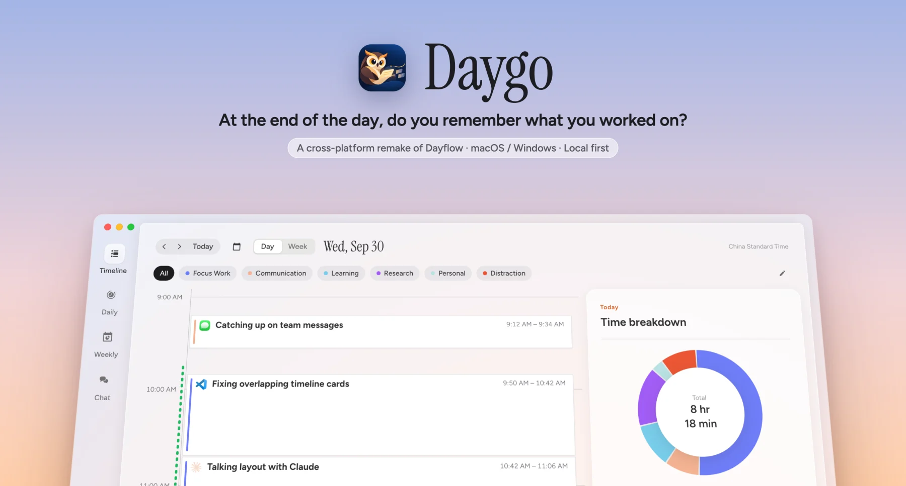
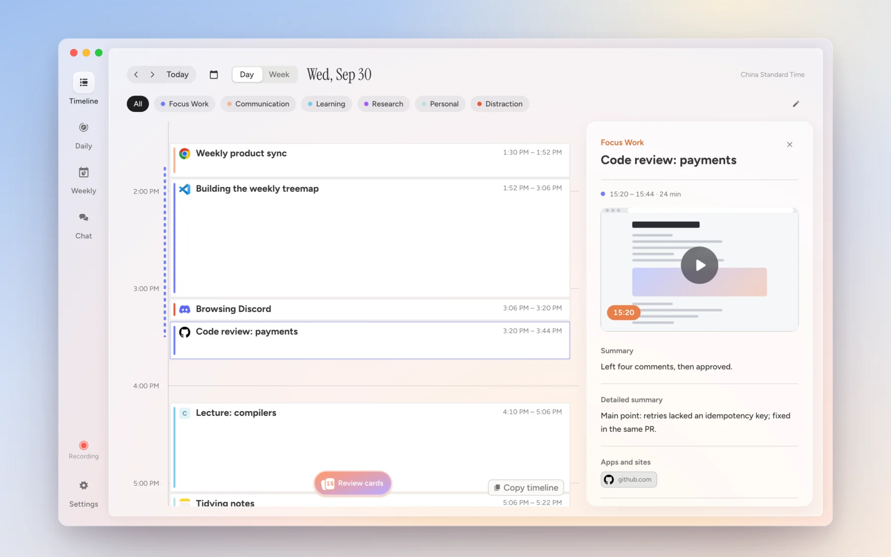
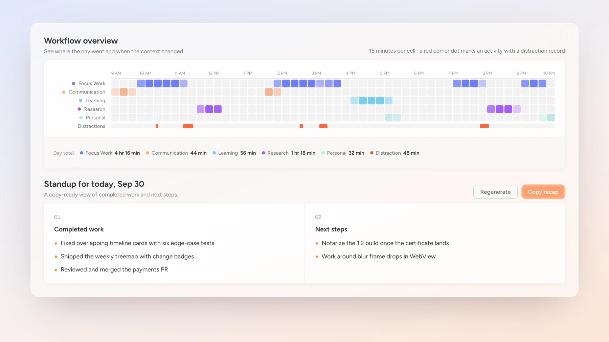
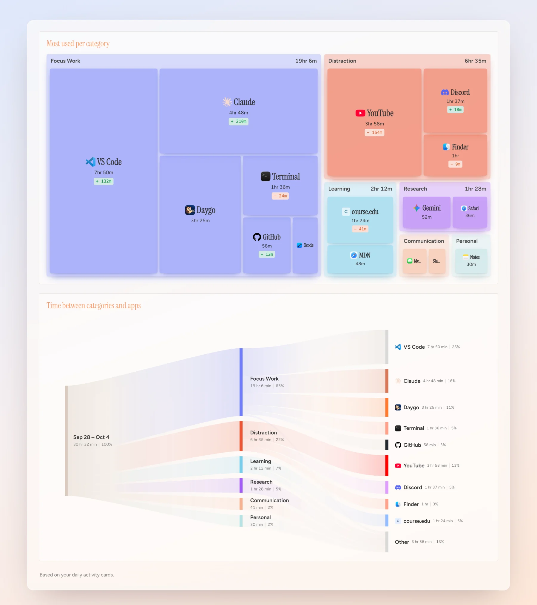
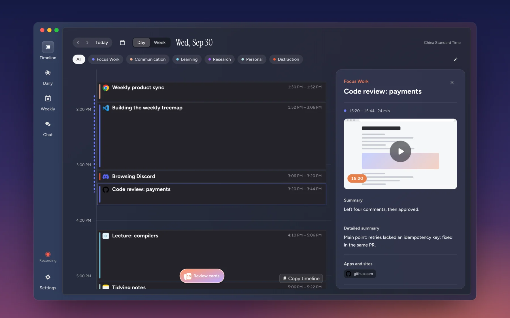

<p align="center">
  
</p>

<p align="center">
  <a href="https://github.com/Jwz-git/Daygo/releases/latest"></a>
  
  
  <a href="../LICENSE"></a>
  
</p>

<p align="center">
  <a href="https://github.com/Jwz-git/Daygo/releases/latest"><b>Descargar</b></a> ·
  <a href="https://jwz-git.github.io/Daygo/"><b>Sitio oficial</b></a> ·
  <a href="../docs/README.md">Documentación de diseño</a>
</p>

<p align="center">
  <a href="../README.md">简体中文</a> · <a href="README.zh-Hant.md">繁體中文</a> · <a href="README.en.md">English</a> · <a href="README.ja.md">日本語</a> · <a href="README.ko.md">한국어</a> · <a href="README.de.md">Deutsch</a> · <a href="README.fr.md">Français</a> · <strong>Español</strong> · <a href="README.pt-BR.md">Português (Brasil)</a>
</p>

<p align="center"><strong>Registra tu trabajo en pantalla. Repasa tu día.</strong></p>

Daygo es una herramienta de registro y revisión del trabajo para macOS y Windows. Toma capturas de pantalla a intervalos en segundo plano y utiliza el proveedor de IA que elijas para organizar la actividad en una **cronología, una revisión diaria y un resumen semanal**, útiles para reuniones de seguimiento, retrospectivas y recordar detalles del trabajo.

**Capturas puntuales · Almacenamiento local · IA a tu elección · Interfaz en nueve idiomas**

[Descarga e instalación](#descarga-e-instalación) · [Primeros pasos](#primeros-pasos) · [Vista de las funciones](#vista-de-las-funciones) · [Privacidad y datos](#privacidad-y-datos) · [Contribuir al desarrollo](#contribuir-al-desarrollo)

## Descarga e instalación

Elige el instalador de tu plataforma en los [Assets de la última versión estable](https://github.com/Jwz-git/Daygo/releases/latest):

| Plataforma | Sistema y arquitectura | Instalador |
|---|---|---|
| macOS | macOS 14+, Apple Silicon (arm64) | `Daygo-<versión>-arm64.dmg` |
| Windows | Windows 11 24H2+ (build 26100+), x64 (amd64) | `Daygo-<versión>-amd64-installer.exe` |

macOS es la plataforma principal de desarrollo; Windows cuenta con un instalador x64. Todavía no hay instaladores publicados para otras arquitecturas ni para Linux. El código fuente puede ir por delante de la versión publicada. Consulta el [estado de los módulos](../docs/09-roadmap.md#91-模块总表) y los registros de firma, notarización e instalación en [Distribución y actualizaciones](../docs/modules/delivery.md).

## Primeros pasos

1. **Instala y concede permisos**: inicia Daygo. En macOS, permite la captura de pantalla y reinicia cuando la aplicación lo solicite.
2. **Configura la IA**: añade la URL del servicio, la clave API y el modelo en los ajustes. Guarda y abre «Prueba del modelo» para comprobar una respuesta con texto o una imagen.
3. **Elige cómo registrar**: configura el intervalo de captura, las aplicaciones bloqueadas y el límite de disco; después, activa el registro.
4. **Revisa los resultados**: cuando termine el primer lote de análisis, consulta las tarjetas y las imágenes originales en la cronología y edita lo que necesites. Las páginas diaria y semanal permiten repasar tu actividad.

Daygo no incluye un servicio de IA ni créditos. El análisis automático requiere reconocimiento de imágenes y salidas estructuradas para los protocolos configurados. Recibir una respuesta en la página de prueba no verifica todo el proceso de análisis. Los modelos locales también necesitan estas capacidades.

## Vista de las funciones

<sub>Las capturas siguientes utilizan datos de ejemplo anónimos.</sub>

### Cronología automática

Daygo captura la pantalla principal a intervalos y la IA crea tarjetas con horarios, títulos, resúmenes y categorías. Abre una tarjeta para consultar las imágenes originales, o edita, elimina y vuelve a procesar los resultados.



### Revisión diaria

Repasa el flujo de trabajo del día y genera un resumen para la reunión de seguimiento con lo destacado, las tareas terminadas y los obstáculos. Añade tu propia perspectiva con un diario y objetivos diarios.



### Revisión semanal

Repasa la semana mediante el flujo de trabajo, el mapa de concentración y distracción, las proporciones por categoría, las aplicaciones más utilizadas y los flujos de tiempo. El tiempo total registrado excluye la categoría System.



### Registro en segundo plano y personalización

| Función | Descripción |
|---|---|
| Registro en segundo plano | El registro continúa al cerrar la ventana; puedes abrirla desde la barra de menús de macOS o el área de notificación de Windows |
| Pausa y reanudación | Pausa durante 15 / 30 / 60 minutos o indefinidamente; las pausas temporizadas finalizan automáticamente |
| Eventos del sistema | La captura se pausa durante la suspensión, el bloqueo y el salvapantallas; los eventos del sistema no reactivan un registro desactivado manualmente |
| Ajustes de captura | Intervalos de 1 / 5 / 10 / 20 / 30 / 60 segundos, 10 por defecto; altura de 720 / 1080 píxeles, 1080 por defecto |
| Servicios de IA | OpenAI Chat Completions, OpenAI Responses y Anthropic Messages; varios modelos por proveedor y una cadena de respaldo ordenada |
| Aspecto y categorías | Tema claro / oscuro / del sistema; nombres, orden y colores de categorías editables; inicio al iniciar sesión e icono del Dock de macOS |

La interfaz admite chino simplificado, chino tradicional, inglés, japonés, coreano, alemán, francés, español y portugués de Brasil.

<details>
<summary>Ver el modo oscuro</summary>

<p></p>

</details>

Los días de la cronología, el diario y los objetivos empiezan a las **4:00 de la hora local**. Los resúmenes de reunión usan días naturales. Por eso, una actividad nocturna puede pertenecer a fechas distintas según la vista.

## Privacidad y datos

- **Almacenamiento local**: las capturas, cronologías, el diario, los ajustes y la base de datos permanecen en tu dispositivo. Daygo no tiene un servidor propio, cuentas ni servicio de sincronización.
- **Tú eliges el destino**: los datos de pantalla solo salen del dispositivo hacia un servicio de IA que hayas configurado explícitamente. Un modelo local compatible puede realizar el análisis en tu dispositivo. Los servicios de terceros tratan los datos según sus propias políticas de privacidad.
- **Bloqueo de aplicaciones y protección del primer plano**: las aplicaciones bloqueadas se excluyen de las capturas. Si una aplicación bloqueada está en primer plano, Daygo guarda una imagen de sustitución sin su contenido. Se mantienen ambas protecciones.
- **Almacén de credenciales del sistema**: las claves API se guardan únicamente en el Llavero de macOS o Windows Credential Manager. La interfaz puede escribirlas, pero no leerlas. No se incluyen en la base de datos, localStorage ni mensajes de error.

El registro utiliza capturas puntuales y evita un flujo continuo de grabación de pantalla. El análisis de uso y los informes de fallos están desactivados por defecto; su envío todavía no está implementado.

La desinstalación conserva los datos y las credenciales del usuario. Consulta los límites completos en [Privacidad y seguridad](../docs/07-privacy-security.md).

## Contribuir al desarrollo

Go gestiona la lógica de producto y las escrituras en la base de datos. Las capacidades de cada plataforma se aíslan mediante interfaces; Vue accede a Go a través de los enlaces Wails generados. `test` es la rama de desarrollo y `main` la rama estable.

El desarrollo en macOS requiere Go, Node.js/npm y Xcode Command Line Tools. Consulta la versión de Go en [go.mod](../go.mod) y los requisitos de Node.js en el [script de desarrollo](../scripts/dev.sh).

```bash
git clone --branch test https://github.com/Jwz-git/Daygo.git
cd Daygo
./scripts/gate.sh   # Preparación, compilación, pruebas Go / frontend y revisión de documentación
```

El script de verificación prepara los artefactos frontend y los enlaces Wails en el orden necesario. Los comandos por plataforma están en [Entradas de los scripts](../scripts/README.md); las reglas de diseño y contribución, en la [documentación de diseño](../docs/README.md) y [AGENTS.md](../AGENTS.md).

Comunica los problemas mediante una [Issue](https://github.com/Jwz-git/Daygo/issues) con el sistema, la versión de la aplicación, los pasos para reproducirlos y errores sin información sensible. No subas capturas reales, bases de datos ni claves API.

## Licencia

Publicado bajo [MIT License](../LICENSE).

<sub>Inspirado en <a href="https://github.com/JerryZLiu/Dayflow">Dayflow</a> (MIT, © 2025 Jerry Liu).</sub>
